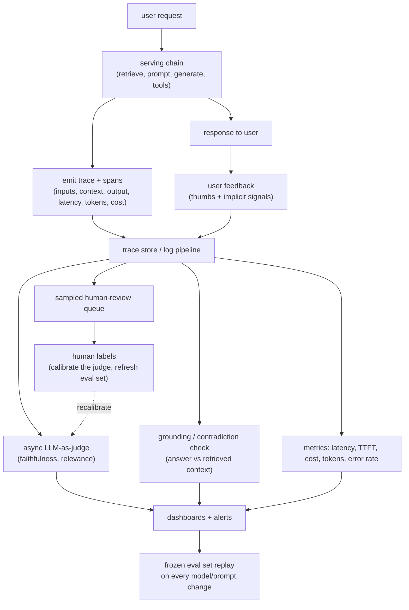

# Chapter 12: Production Monitoring and Observability

Your LLM application is live and taking real traffic. There are no labels on production requests, nobody is grading the answers, and next week someone is going to swap the model and edit the prompt. How do you know it is still working today, and how do you catch a hallucination spike or a quality regression after that change, before your users catch it for you? This is the question this final chapter answers, and it is the one every offline muscle you have built so far leaves you unprepared for.

The trap is that the discipline everyone trains, "run the suite, read the score," does not exist online. Production has no ground truth, so you cannot compute accuracy the way you did before you shipped. What you can do instead is instrument every call into structured traces, proxy quality with cheap automatic checks (an LLM-as-judge for faithfulness, a grounding check against retrieved context), and sample real traffic into a human-review queue. The senior framing, and the through-line of this chapter, is that evaluation does not stop at the deploy gate. Online it becomes a continuous, sampled, proxy-driven activity rather than a one-time pass or fail.

In this chapter, we will separate the two points in time where the same discipline applies, the pre-ship gate and the live signal, and show how they connect. We will design the trace as the atomic unit of observability, build an online quality signal without labels and calibrate it against humans, make hallucination detection concrete as a grounding check against logged context, read user feedback for the biased signal it is, and catch regressions after a model or prompt change with continuous replay, canary, shadow, and drift monitoring. Along the way we open three validated reference architectures: the generation model whose outputs you monitor, the small embedding model that powers the cheap grounding and drift checks, and the lightweight encoder you can train once as a faithfulness or safety detector.

In this chapter, we will cover the following main topics:

- Why online monitoring is a different problem from offline evaluation
- The data flow: cheap synchronous traces, expensive asynchronous checks
- What to log: traces, spans, and the full chain
- Online quality without ground truth, and calibrating the judge
- Hallucination detection in production
- User-feedback loops and their biases
- Regression, canary, shadow, and drift after a change
- Guardrails, safety, cost, and latency dashboards
- Bottlenecks, failure modes, and what breaks

## Technical requirements

To follow along you need a modern web browser to open the validated reference graphs used as figures in this chapter. These are not screenshots: they are shape-checked architecture graphs from the Neurarch model zoo, and each one opens live in the editor so you can inspect real dimensions layer by layer. Monitoring is an infrastructure discipline, not a model-architecture one, so the graphs that matter here are the model you are monitoring and the small models that power the checks watching it. Tracing them makes the cost of "observe the system" concrete, because every judge call and grounding check is itself a model with a bill.

The three architectures we open in this chapter are:

- **Llama-3 8B**, the served generation model whose outputs you monitor: [open it live](https://www.neurarch.com/?import=https://raw.githubusercontent.com/neurarch-ai/awesome-llm-model-zoo/main/architectures/llama3-8b/model.json)
- **all-MiniLM-L6**, the small embedding model behind grounding and drift checks: [open it live](https://www.neurarch.com/?import=https://raw.githubusercontent.com/neurarch-ai/awesome-llm-model-zoo/main/architectures/all-minilm-l6/model.json)
- **BERT-base**, a lightweight encoder you can train once as a faithfulness or safety detector: [open it live](https://www.neurarch.com/?import=https://raw.githubusercontent.com/neurarch-ai/awesome-llm-model-zoo/main/architectures/bert-base/model.json)

The full collection of 92 validated reference graphs lives in the [Model Zoo repository](https://github.com/neurarch-ai/awesome-llm-model-zoo), with a browsable [gallery](https://neurarch-ai.github.io/awesome-llm-model-zoo). It is built by [Neurarch](https://www.neurarch.com).

Conceptually you will also want to be aware of the tooling classes we name but do not install here: an OpenTelemetry-style tracing pipeline with GenAI semantic conventions, a trace or log store, a dashboarding and alerting layer, and a human-review queue. No datasets are required to read the chapter; the running example is a live LLM application, RAG or agentic, taking real production traffic with no labels attached.

## Why online monitoring is a different problem from offline evaluation

Before we draw any boxes, we scope the problem, because the answers change the design. Three questions decide how much you instrument, how fast you alert, and whether you block.

The first is **what kind of app it is**. A RAG system, an agent with tools, and a single-shot completion each log different things and fail differently. RAG lets you check grounding against the retrieved context; an agent needs step-level traces, one per tool call; a classifier can be spot-audited cheaply. The second is **the cost of a bad answer**. A wrong medical or billing answer is a page at 3am; a bland chat reply is a line on a weekly dashboard. This sets your sampling rate, your alert latency, and whether you block a response or merely record it. Ask, too, whether delayed ground truth arrives later, a suggestion accepted, a ticket reopened, code that compiled, because that is free labeled data even though it lags. The third is **change cadence and budget**. Prompts edited daily and models swapped monthly need automatic regression catching, not a human remembering to look. And judging every request with an LLM roughly doubles the bill, so you will sample: decide up front how much you can spend observing versus serving.

From those answers we can write the requirements this system has to meet. On the functional side, we need to capture a full trace per request (the chain, every tool call, inputs, outputs, retrieved context, latency, tokens, cost); produce an online quality signal without labels (automatic proxy scores plus a sampled human-review queue); detect hallucinations by checking answers against the context they should be grounded in; collect explicit and implicit user feedback onto the trace; and detect regressions and drift after a change automatically, alerting on guardrail and safety events in production, not just at ingress. On the non-functional side, the constraints are sharp: **low overhead**, so instrumentation adds no meaningful serving latency and heavy scoring runs asynchronously off the hot path, sampled on a well-chosen slice rather than exhaustively; **trustworthy proxies**, so any automatic score is calibrated against human labels or it is a number that lies with confidence; and **fast to alert**, so a hallucination spike surfaces in minutes to hours, not at the next release review.

The requirement that quietly reframes everything is the second non-functional one. An automatic score that nobody has checked against a human is not a measurement, it is a confident guess, and if you page on it or gate deploys on it you have wired a broken instrument into your control loop. We flag it here and return to it, because the difference between a monitoring system that works and one that lies is almost entirely whether the proxy was calibrated.

The cleanest way to hold the whole chapter in your head is to see monitoring as the same discipline as pre-ship evaluation, applied at a different point in time. Pre-ship eval runs a **frozen labeled set** through a candidate and gates the deploy: it has ground truth and it answers "is this change safe to ship." Live monitoring runs on **real, unlabeled traffic** and answers "is the shipped system still healthy right now." Pre-ship is a gate you pass once; monitoring is a signal you watch continuously. They connect both ways: bad-looking production traces get labeled back into the frozen set, so tomorrow's gate catches today's surprise, and the judge rubric you validated offline is the one you reuse online. Keep that pairing in mind, because every section below is either producing a signal, calibrating it, or looping it back.

## The data flow: cheap synchronous traces, expensive asynchronous checks

There is one architectural rule that makes production monitoring viable, and an interviewer listens for it specifically: the serving path emits a trace synchronously and cheaply, and everything expensive, the judge, the grounding check, the safety re-scan, the human sampling, runs asynchronously off a stream of those traces so it never slows a user's request.

*Figure 12.1: The trace-and-monitor loop, serving emits cheap traces synchronously while all expensive scoring runs async off the stream*

Two things in this diagram carry the whole design. The expensive checks (`J`, `G`, `H`) hang off the trace store `Q`, not off the serving chain `S`, so no user waits for a judge. And the human labels `L` loop back to **calibrate** the proxy `J` rather than dead-ending as an audit. The rest of the chapter walks these nodes in the order a request flows through them, pausing where a node hides a real design decision.

## What to log: traces, spans, and the full chain

A metric tells you something is wrong; a trace tells you where. So we log at the grain of a distributed trace: one trace per request, one span per step.

For a RAG request that means a span for the query rewrite, one for the retrieval call (carrying the documents and their scores), one for the assembled prompt, one for the generation, and one for post-processing. For an agent it means one span per tool call, with the arguments, the result, and the error state. The single most valuable field is the retrieved context, because without it you cannot later ask "was the answer grounded." At each hop we capture inputs and outputs verbatim, plus per-span latency, token counts split into prompt and completion, model id, prompt version, and dollar cost. Cost and tokens are span attributes, not a separate accounting system bolted on the side. Everything is stitched on a shared trace id so a single request fanned across retrieval, reranking, tool calls, and generation reconstructs into one readable timeline. Using OpenTelemetry-style spans with GenAI semantic conventions means this flows into the observability stack you already run rather than a bespoke silo. One caution to set up front: verbatim prompts carry user secrets, so retention, redaction, and access control are day-one concerns, not cleanup.

It helps to open the model whose behavior all of this is logging. The latency, tokens-per-request, and time-to-first-token you write onto every span are not free-floating numbers, they are properties of a specific graph.

*Figure 12.2: Llama-3 8B, the served generation model whose per-token latency and cost you log on every trace*

You can [open this graph live](https://www.neurarch.com/?import=https://raw.githubusercontent.com/neurarch-ai/awesome-llm-model-zoo/main/architectures/llama3-8b/model.json) and trace its attention and feed-forward stack to see where the per-token cost comes from. The KV cache you read at every decode step, whose size sets the memory floor and therefore the achievable batch size, has bytes

$$\text{KV bytes} = 2 \times n_{\text{layers}} \times n_{\text{kv}} \times d_{\text{head}} \times n_{\text{seq}} \times b$$

where the leading $2$ counts $K$ and $V$, $n_{\text{kv}}$ is the number of KV heads, $d_{\text{head}}$ the per-head dimension, $n_{\text{seq}}$ the sequence length, and $b$ the bytes per element. That is the graph-level reason a long-context request shows up on your dashboards as higher memory pressure and a fatter tail latency: the cost you are observing is a property of this architecture, not of your logging.

## Online quality without ground truth, and calibrating the judge

With no labels, we estimate quality from proxies, ordered by increasing cost.

The workhorse is an **LLM-as-judge on sampled traffic**. We run a judge over a sample of traces, scoring faithfulness (is the answer supported by the retrieved context), answer relevance (does it address the question), and any task-specific rubric. This is the main online quality signal, but it carries every bias it had offline, position, verbosity, self-preference, and it is an unvalidated instrument until you prove otherwise. So before trusting or alerting on a judge score, we **calibrate it against humans**: collect a few hundred human labels on real samples and measure agreement. A convenient chance-corrected agreement statistic is Cohen's kappa,

$$\kappa = \frac{p_o - p_e}{1 - p_e}$$

where $p_o$ is the observed agreement rate between judge and human and $p_e$ is the agreement expected by chance. A $\kappa$ near $1$ means the judge tracks human labels; a $\kappa$ near $0$ means it is agreeing no better than a coin flip, and you fix the rubric before you page anyone on it. The reason this loop never ends is that the judge scales but drifts, while humans are truth but do not scale. So **human-review sampling** is permanent, not a one-off audit: humans are the ground truth you cannot afford on every request, so you sample a slice into a review queue, and those labels do double duty, measuring real quality on that slice and serving as the rolling calibration set that keeps the judge honest.

When an LLM judge is too slow or too costly to run on every sampled trace, you can distill the check into a small trained encoder. A fine-tuned classifier can score contradiction, groundedness, or a safety category at a fraction of the cost of a generative judge, because it runs once through an encoder and a small head rather than autoregressively generating a verdict.

*Figure 12.3: BERT-base, a lightweight encoder you fine-tune once into a faithfulness or safety detector and run online at scale*

You can [open this graph live](https://www.neurarch.com/?import=https://raw.githubusercontent.com/neurarch-ai/awesome-llm-model-zoo/main/architectures/bert-base/model.json) and trace its encoder-plus-head shape. Reading that graph next to the Llama-3 8B graph in Figure 12.2 makes the economics obvious: the detector is small enough to run on far more traffic than the generation model it watches, which is exactly why you reserve the expensive LLM judge for flagged or low-feedback traces and let the cheap encoder cover the broad middle.

## Hallucination detection in production

The most actionable online check, and what the opening question is really about, is grounding: does the answer follow from the context actually retrieved.

The discipline is to **check against the retrieved context, not the world**. You logged the retrieved documents, so per claim you can ask: supported by, contradicted by, or absent from the context. An answer that asserts facts not in its context is ungrounded even if those facts happen to be true, because the system had no basis for producing them. Concretely, we decompose the answer into atomic claims and score each for entailment against the context, using an NLI model or a cheap LLM judge. A low-cost first pass is claim-to-passage similarity: embed the claim and the candidate passage and score their cosine similarity,

$$\text{sim}(a, p) = \frac{a \cdot p}{\|a\|\,\|p\|}$$

where $a$ is the answer-claim embedding and $p$ the passage embedding, flagging a claim whose best passage similarity falls below a threshold as unsupported, and treating contradiction separately from mere absence. We then trend a per-response groundedness score and alert on the delta, not on single events. And we apply this only where it makes sense: for RAG and tool-augmented answers "supported by context" is the right bar, but open creative generation has no context to check, so there we fall back to the judge and to user feedback. Say which regime you are in.

The embedding step in that first-pass grounding check, and the drift check in the next section, both lean on a small text encoder rather than the generation model. Opening it shows why it is cheap enough to run on far more traffic.

*Figure 12.4: all-MiniLM-L6, the small embedding model behind claim-to-passage grounding and input-distribution drift*

You can [open this graph live](https://www.neurarch.com/?import=https://raw.githubusercontent.com/neurarch-ai/awesome-llm-model-zoo/main/architectures/all-minilm-l6/model.json) and trace how it pools per-token hidden states into a single vector. That pooled vector is the object you compare with cosine similarity for a first-pass grounding score, and the same vector, aggregated over a window of traffic, is what you watch for input drift. One small model powers two of the cheapest and most useful checks in the whole system.

## User-feedback loops and their biases

Users are a free, high-volume, but biased signal. The senior move is to name the bias rather than trust the thumbs.

**Explicit feedback**, thumbs, a star rating, a "report" button, is cheap but sparse and skewed. A tiny self-selected fraction of users ever clicks it, and that fraction is biased toward the very angry and the very pleased. Treat it as directional, not as a percentage, and never read the absence of a thumb as satisfaction. **Implicit signals** are noisier but far denser and, in a sense, more honest: did the user accept the answer, copy it, edit it heavily, immediately rephrase (a retry, which usually means the first answer failed), abandon the session, or escalate to a human. A high edit rate or a high retry rate is a quality alarm ringing with no thumbs attached at all. We attach every signal, explicit and implicit, to the trace, and we feed downvoted and heavily-edited responses into both the human-review queue and the frozen eval set, because those are the highest-yield cases you own: real production failures, already surfaced by users, ready to become tomorrow's regression test.

## Regression, canary, shadow, and drift after a change

A model swap or a prompt edit is exactly when quality silently moves, and the entire point of monitoring is to catch that move without a human remembering to look.

The bridge from pre-ship eval is to **replay a frozen eval set continuously**, on a schedule and on every model or prompt change, so a regression shows against a fixed baseline before it reaches most users. The deploy gate does not run once; it runs forever. On top of that, a **canary** routes a small slice of live traffic, say 5 percent, to the candidate and compares its proxy scores, feedback, latency, and cost against the control, so a regression that hid from the offline set still surfaces on real traffic at low blast radius. A **shadow** deployment runs the candidate on the same requests without showing users its output, then diffs the two, which is zero user risk at the cost of double inference, but it measures output divergence rather than user reaction, so you pair it with a canary rather than trusting it alone.

Underneath all of this sits **drift**, of two kinds that are easy to conflate. Input drift is the traffic changing under you, new topics, new languages, longer documents, and you track it by comparing input embeddings (from the same small encoder in Figure 12.4) against a reference window. Output drift is quality decaying while inputs stay stable, a rising ungrounded rate, falling judge scores, more retries. The relationship is directional: input drift predicts trouble, output drift confirms it. Watching both tells you not just that quality moved but whether the cause was the world changing or your system decaying.

## Guardrails, safety, cost, and latency dashboards

Two more dashboards round out the picture, and both catch regressions the quality metrics miss.

**Safety monitoring is continuous, not just at ingress.** The guardrails on your serving path fire on live traffic, so we log every decision as a span attribute and trend the firing rates. A jump in jailbreak hits, PII-leak blocks, or refusal rate is one of three things: an attack, a genuine regression, or an over-eager filter that has started degrading good traffic. We also sample allowed traffic into a safety re-scan, because the dangerous case is the harmful output that no guardrail caught, and by definition it is not in the blocked set. **Cost, latency, tokens, and TTFT are first-class dashboards**, built from span attributes into per-model and per-route views: latency percentiles at p50, p95, and p99 (never the mean, which hides the tail), time-to-first-token as the thing users actually feel in a streaming UI, tokens per request, cost per request and per user, and error and timeout rates. These catch the regression that quality metrics are blind to. A "drop-in better model" that doubles TTFT or triples cost per request is a regression even if its answers are slightly better, and only these dashboards will tell you.

## Bottlenecks and scaling

As traffic and corpus grow, five bottlenecks surface in a predictable order. Each maps onto a node in Figure 12.1, and the fix in each row is the same senior instinct: move expensive work off the hot path and sample it rather than run it exhaustively.

| Bottleneck | Cause | Fix |
|---|---|---|
| Instrumentation slows serving | Heavy scoring on the request path | Emit the trace cheaply and synchronously; run judge, grounding, and safety re-scan async off the stream |
| Judging cost | LLM judge on every request doubles the bill | Sample; use a smaller validated judge; reserve full judging for flagged or low-feedback traces |
| Log volume and cost | Verbatim inputs and outputs on every span at scale | Sample retention, tier storage, redact and truncate; keep full fidelity only on flagged traces |
| Human review does not scale | Auditing everything is impossible | Stratified, uncertainty-based sampling into the queue, not uniform random |
| Proxy disagrees with reality | Uncalibrated judge | Label a rolling human sample, recalibrate, pin judge and prompt versions; alert on rates and deltas, not single events |

## Failure modes, safety, and evaluation

An observability system has its own failure modes, and each one is a way the monitoring quietly lies to you.

- **Trusting an uncalibrated judge.** It becomes the number everyone watches, and because nobody checks it against a human it can be systematically wrong, rewarding verbose, confident, ungrounded answers, and you never find out. Keep a rolling human sample and report judge-human agreement (the $\kappa$ from earlier) as a first-class metric, not a footnote.
- **Sampling that misses the tail.** Uniform random sampling spends the human budget on common easy cases and almost never sees the rare failure, so you conclude quality is great while a bad slice burns. Stratify and oversample the suspicious: low or negative feedback, high edit or retry rate, low judge or retrieval score, guardrail near-misses, new input clusters, plus a uniform baseline for reference. And do not read thumbs as an accuracy rate; cross-check the self-selected sliver against implicit behavior and the judge before believing a trend.
- **Silent guardrail degradation.** A filter that starts blocking good traffic (a rising refusal rate) is a regression quality metrics miss, because blocked answers never get scored. Monitor refusal and block rates, not just harmful output.
- **The observability store is your largest pool of unredacted user data.** Redact and gate access to it, or the monitoring system becomes the incident it was built to prevent.
- **The offline-online gap.** The frozen eval set says healthy while production feedback says otherwise, because the set went stale. Refresh it continuously from flagged traces, closing the loop that Figure 12.1 draws from human labels back to the eval replay.

## Summary

In this chapter we treated production monitoring as evaluation that never stops. We began by scoping the problem and drawing the line between pre-ship evaluation, a gate you pass once against a frozen labeled set, and live monitoring, a signal you watch continuously on real unlabeled traffic, and we showed how the two loop back into each other. We built the trace as the atomic unit of observability, one trace per request and one span per step carrying inputs, outputs, retrieved context, latency, tokens, and cost, and we insisted on the one architectural rule that makes it viable: emit traces cheaply and synchronously, run every expensive check asynchronously off the stream. We estimated quality without labels using an LLM-as-judge, calibrated it against a rolling human sample so it measures rather than guesses, and distilled it into a cheap trained encoder for scale. We made hallucination detection concrete as a grounding check against logged context, read user feedback for the biased signal it is, and caught post-change regressions with continuous frozen-eval replay, canary, shadow, and the two kinds of drift. We opened three validated reference architectures, Llama-3 8B as the served model whose cost and latency you log, all-MiniLM-L6 as the cheap encoder behind grounding and drift, and BERT-base as the detector you train once, to make the point that every check watching your system is itself a model with a bill. Finally we walked the failure modes that make a monitoring system lie: the uncalibrated judge, the sampling that misses the tail, the silently degrading guardrail, and the eval set that went stale.

This chapter also closes the book. Across twelve chapters we have gone from serving retrieval-augmented generation through embeddings, evaluation, safety, inference optimization, and finally to watching the whole thing run in production, which is the discipline that ties all the others together, because a system you cannot observe is a system you cannot trust. If you have read this far, you have the full arc of an LLM system-design interview and, more usefully, the mental model to run these systems for real. The natural next step is the companion volume, the classic-ML system design book, which applies the same scope-requirements-tradeoffs-failure-modes discipline to recommendation, ranking, search, forecasting, and the tabular and vision systems that still make up most of production machine learning. The LLM stack you have just finished sits on top of that older stack, and the two books together are meant to be read as one map of the field.

## Questions

1. What is benchmark contamination and overfitting to an eval set, and how do you guard against each?
2. When you fine-tune an LLM on a small task dataset, how does overfitting actually show up in the training and validation curves, and what is your first line of defense?
3. When you fine-tune a model that already went through RLHF or instruction tuning, how do you keep it from drifting off its aligned behavior?
4. Why does over-optimizing a reward model degrade true performance, and what is the Goodhart failure at work?
5. Why do practitioners monitor the running KL divergence as the primary health signal during RLHF, and what do a spiking, a near-zero, and a steadily climbing KL each tell you?
6. How does length bias in a reward model arise, and how do you detect and mitigate it?
7. How does label noise affect an LLM fine-tune, and how do you make training robust to it?
8. Why is a sampled generation non-reproducible unless you log the seed and the sampling settings?
9. Why can greedy decoding, which deterministically selects the argmax, still produce different tokens across runs on a GPU?

## Further reading

Each of the following is a first-party engineering writeup that ships the patterns in this chapter. Read them for what an interview answer skips: who the system serves, the product design, the eval bar, and the deployment shape.

- [Detect hallucinations in your RAG LLM applications (Datadog)](https://www.datadoghq.com/blog/llm-observability-hallucination-detection/): flags ungrounded or contradictory outputs against retrieved context in production RAG apps. *(product design)*
- [Detecting hallucinations with LLM-as-a-judge (Datadog)](https://www.datadoghq.com/blog/ai/llm-hallucination-detection/): how they built and benchmarked an LLM-as-judge faithfulness detector. *(eval bar)*
- [Improving LLMs in Production With Observability (Honeycomb)](https://www.honeycomb.io/blog/improving-llms-production-observability): spans capture input, output, errors, latency, tokens, and user feedback for their Query Assistant. *(deployment)*
- [Genie: Uber's Gen AI On-Call Copilot (Uber)](https://www.uber.com/us/en/blog/genie-ubers-gen-ai-on-call-copilot/): a production copilot streaming user-feedback ratings, hallucination and relevancy evals to dashboards. *(product design)*
- [Monitor LLMs in production with Grafana Cloud, OpenLIT, and OpenTelemetry (Grafana Labs)](https://grafana.com/blog/ai-observability-llms-in-production/): dashboards for token usage, per-call cost, latency percentiles, and time-to-first-token. *(deployment)*
- [The agent improvement loop starts with a trace (LangChain)](https://www.langchain.com/blog/traces-start-agent-improvement-loop): collecting and enriching production traces of agent tool calls to find failures and prevent regressions. *(deployment)*
- [Instrumenting User Insights for your AI Copilot (Twilio Segment)](https://www.twilio.com/en-us/blog/insights/ai/instrumenting-user-insights-for-your-ai-copilot/): instruments prompts, responses, and engagement signals into product analytics for a live copilot. *(product design)*
- [Evidently AI ML system design database](https://www.evidentlyai.com/ml-system-design): the broadest curated index, 800 case studies from 150-plus companies, for going beyond the cases listed here.
