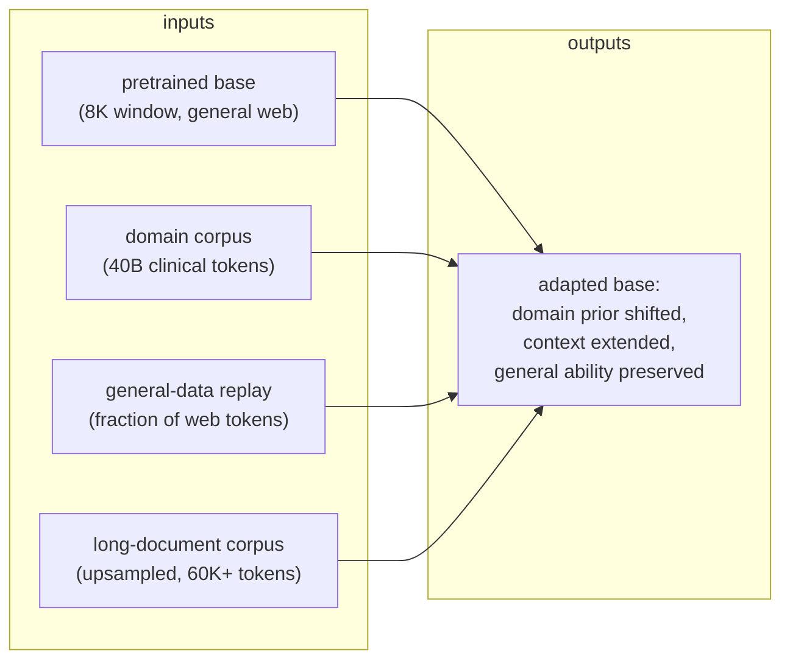

# 2. Two axes

The previous section surfaced two requirements that look related but are
mechanically independent. Before reaching for any tool, name them clearly.

## The adaptation axis: domain knowledge

The base model was trained on the general web. It underrepresents clinical
vocabulary, abbreviations, note-taking style, and diagnostic reasoning. The input
to domain adaptation is a base model plus a large in-domain corpus. The output is
a base model that has shifted its prior toward the clinical distribution, without
forgetting the general reasoning the web gave it.

The objective does not change: it is still next-token cross-entropy. What changes
is the corpus, the learning-rate schedule, and the data-mixing ratio. No new loss
function, no new architecture.

**The risk on this axis is catastrophic forgetting.** The optimizer that converged
on the general web will overwrite those minima if given no gradient signal
rewarding them. General benchmarks go down silently while the domain benchmark
goes up visibly. The fix is replay: keep some fraction of general data in the
training mix so the old minima stay under gradient pressure.

## The length axis: context window

The base was pretrained at 8K tokens. Its positional encoding was never shown
angles corresponding to positions beyond that range. Feeding it a 60K-token
document does not automatically work: the model sees rotation angles it was never
trained on and produces garbage past its real window. Setting
`max_position_embeddings` to 128000 in the config does nothing except increase a
number.

The input to context extension is a base model plus a positional-encoding
rescaling recipe plus a corpus of genuinely long documents. The output is a base
model that attends coherently across the full extended length.

**The risk on this axis is short-context regression.** The simplest rescaling
(uniform position interpolation) compresses all frequency dimensions equally,
including the high-frequency ones that carry local ordering of adjacent tokens.
The extended model gets worse at 2K prompts. Every better method (NTK-ABF, YaRN,
LongRoPE) is a way to spare those high-frequency dimensions while rescaling the
low-frequency ones that carry long-range position.

## The input and output of the whole pipeline

## Why the axes are independent

A model can have a correct domain prior and a broken context window. It can have a
large context window and no domain knowledge. Extending context does not teach a
domain and domain tuning does not lengthen the window. Solving one problem with
the tool for the other is the tell of a shallow answer.

In practice the two passes often run sequentially: domain adaptation first, then
context extension (Code Llama's recipe), or they interleave in one continued-
training phase (Qwen2.5). Either way, you reason about each axis separately,
apply its failure-mode guard, and gate on its own eval before declaring success.

## What the interviewer is listening for

- Can the candidate name both axes without prompting?
- Do they recognize that "just keep training" on domain data does not give long
  context, and "just raise the max position" does not give domain knowledge?
- Do they proactively mention the failure mode of each axis (forgetting vs
  short-context regression) before being asked?

Naming both axes and their distinct failure modes in the first two minutes of an
answer signals that the candidate has designed this before, or has thought
carefully about the structure of the problem.
