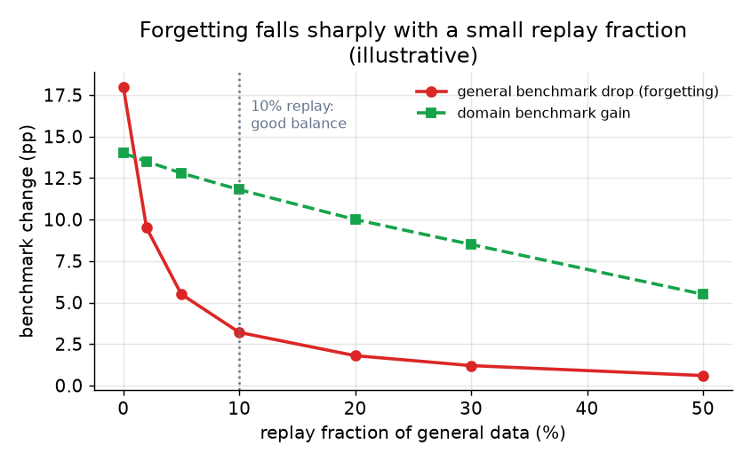

# 3. Continued pretraining

## Domain-adaptive pretraining (DAPT)

Domain-adaptive pretraining keeps the self-supervised next-token objective and
swaps the corpus: instead of the broad web, you feed medical text, legal filings,
a private codebase, or a specialized language, so the base shifts its prior toward
the domain's distribution. The canonical evidence (Gururangan et al., "Don't Stop
Pretraining") is that a second phase of in-domain pretraining lifts downstream
domain tasks across biomedical, CS, news, and reviews, and that a task-adaptive
phase stacks on top of it.

The minimum effective scale is billions of tokens of reasonably clean in-domain
text. Below that threshold the model overfits the small set and forgets more than
it learns. If you have tens of thousands of documents, reach for retrieval or a
small SFT run instead.

## Catastrophic forgetting and replay

The central risk is catastrophic forgetting: optimize hard on a narrow domain and
the model's general reasoning, instruction-following, and fluency outside the
domain quietly erode. The weights that encoded broad ability drift to fit the new
distribution.

*General benchmark drop (red, left axis) falls steeply once replay exceeds about
5 percent of the training mix. Domain benchmark gain (green) falls only modestly
as replay rises. A 10 percent replay fraction is a practical balance point.
Illustrative; real numbers depend on the domain and model size.*

**Replay is the primary defense.** Mix a fraction of general data back into the
domain corpus so the gradient never fully forgets the old objective. Even a few
percent of replayed general tokens sharply cuts forgetting while barely slowing
domain gain (Mila, "Simple and Scalable Strategies to Continually Pre-train").
The reason it works: forgetting happens when the optimizer overwrites old minima
because nothing in the current batch rewards keeping them. Interleaving general
data keeps those minima under gradient pressure.

## The learning-rate re-warm schedule

The base model finished its pretraining schedule at a near-zero, fully decayed
learning rate. Three options, and only one works:

- **Resume at the decayed floor.** Gradients are too small to learn the new
  domain. The run stalls.
- **Resume at the original peak.** Too large a perturbation. Converged weights
  are blown away and the model forgets everything.
- **Re-warm from the floor to a modest peak, then re-decay.** This is the correct
  move. The modest peak is a fraction of the original pretraining peak, large
  enough to make progress but small enough to protect converged representations.

The re-warm peak is the single most important hyperparameter: it is the direct
knob trading forgetting against domain learning. The Mila work shows that
re-warming plus re-decaying plus a small replay fraction lets continued pretraining
match a full from-scratch retrain at a fraction of the compute.

A useful late-training refinement: as the learning rate decays toward zero in the
final phase, upsample the highest-quality and most domain-relevant data. The same
"annealing" trick that frontier pretrains use at the tail of the main run applies
here at smaller scale.

## Adapters as a bounded alternative

LoRA and QLoRA freeze the base and learn a low-rank delta added to the weight
matrices. Because the base weights literally cannot move, forgetting is bounded
by construction. This is their key advantage over full continued pretraining.

The tradeoff is a lower ceiling on how much domain prior the adapter can absorb.
A small adapter cannot reroute the model's whole distribution; it can shift its
behavior at inference but not rewrite the base's factual prior or vocabulary
deeply. For a large distributional shift, want full continued pretraining with
replay; for a lighter nudge or a strict forgetting budget, a LoRA adapter is safer
and cheaper.

## When to use which

| Reach for | When | Instead of |
|---|---|---|
| Full continued pretraining (DAPT) with replay | A broad distributional shift (a domain or language) with billions of in-domain tokens | SFT alone, which teaches format not prior; or DAPT without replay, which forgets |
| LoRA or QLoRA adapters | A lighter domain nudge where forgetting must be bounded by construction and cost is constrained | Full DAPT for a large distributional shift; adapters hit a ceiling there |
| Supervised fine-tuning (SFT) | The gap is a narrow behavior or format needing thousands of examples | A broad domain shift needing a new register, vocabulary, or factual prior |
| Retrieval-augmented generation (RAG) | The gap is a fixed corpus of facts the model should look up | A domain where the model needs a new style, register, or low-level factual density |
| From-scratch pretraining | No open base exists in the target distribution at all | Any setting where an adaptable base exists; from scratch is lab-scale cost |
| General-data replay (always) | Any full continued-pretraining run where general benchmarks must not regress | Omitting replay and then asserting the forgetting was acceptable without measuring |

**Tools.** Full continued pretraining and the re-warm/re-decay schedule are run on PyTorch (Meta) with distributed-training frameworks such as DeepSpeed (Microsoft) or Megatron-LM (NVIDIA), driven through Hugging Face Transformers trainers. LoRA and QLoRA adapters come from the PEFT library plus bitsandbytes for the quantized-base case, and SFT is orchestrated with TRL or Axolotl on the same stack. RAG as the non-training alternative is built with a vector index such as FAISS (Meta) plus an embedding model rather than any weight update. Replay is simply a data-mixing step in the training pipeline, not a separate library.

**Worked example.** A document-AI team needs a base model fluent in dense legal filings, and it has billions of tokens of clean in-domain text. Because that is a broad distributional shift in register and vocabulary, it chooses full continued pretraining with replay over SFT, which would teach format but not the new prior, and over a LoRA adapter, which would hit a ceiling on how much of the distribution it can absorb. It mixes in a general-data replay fraction so overall benchmarks do not silently regress, and re-warms the learning rate from the decayed floor to a modest peak rather than resuming at the floor (which stalls) or the original peak (which erases the base). Had the team instead only needed the model to look up a fixed set of statutes, it would have reached for RAG rather than training at all, and for a lighter behavioral nudge under a strict forgetting budget it would have used a QLoRA adapter. It gates promotion on the full general-eval suite run before and after, not on the domain gain alone.

## Measuring success: do not just report the domain gain

Run the full general-evaluation suite before and after. A DAPT run that lifts the
domain benchmark by five points and drops MMLU by four is usually a net loss for a
product, and you only see it if you gate on the regression. Forgetting is silent
inside the domain slice; it shows up only when you look outside it.

The recipe: fix the regression bar up front (as the requirements dialogue did),
run the full suite after DAPT, and promote the adapted base only if it passes the
gate. Repeat the measurement after every tuning change.
