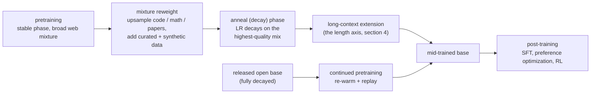
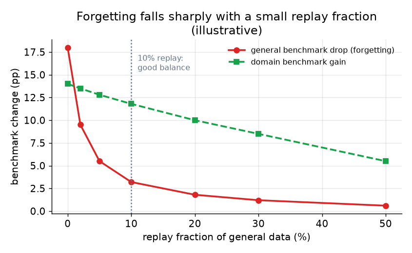
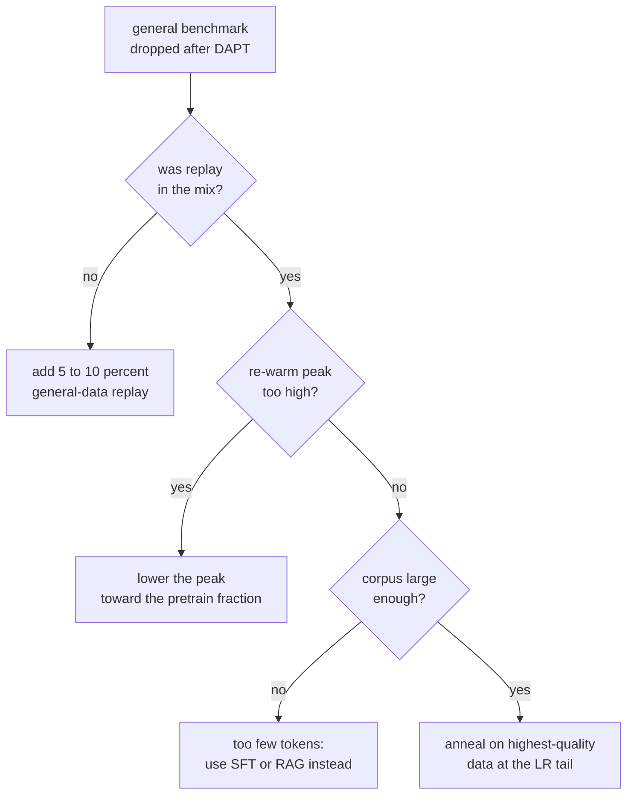

# 3. The mid-training phase

## What "mid-training" means now

The stage between pretraining and post-training used to be called "continued
pretraining" and treated as an optional extra. It is now a named phase with its own
budget, its own data, and its own evals: token counts intermediate between
pretraining and post-training, spent on changing the data distribution rather than
the objective, with the goals of domain and language expansion, long-context
extension, quality upgrade through curated and synthetic data, and preparing the
model for post-training ([A Survey on LLM Mid-Training](https://arxiv.org/abs/2510.23081)).

Two very different teams do it, and interviews conflate them.

| | Lab-side mid-training | Practitioner-side continued pretraining |
|---|---|---|
| Starting point | Your own base, mid-run, optimizer state intact | Someone else's released base, fully decayed |
| Main knob | The data mixture and its schedule | The domain corpus plus a replay fraction |
| Learning rate | Still in the stable phase; you control the decay | Must be re-warmed from the floor and re-decayed |
| Token budget | Hundreds of billions, a meaningful slice of the run | Billions, a rounding error next to pretraining |
| Typical goal | Capability seeding, quality upgrade, long context, RL readiness | Domain prior, register, vocabulary, longer window |
| Failure mode | A mixture that helps one eval and quietly costs another | Catastrophic forgetting of general ability |


```mermaid
flowchart LR
  PT["pretraining<br/>stable phase, broad web mixture"] --> MIX["mixture reweight<br/>upsample code / math / papers,<br/>add curated + synthetic data"]
  MIX --> ANN["anneal (decay) phase<br/>LR decays on the<br/>highest-quality mix"]
  ANN --> LC["long-context extension<br/>(the length axis, section 4)"]
  LC --> BASE["mid-trained base"]
  BASE --> POST["post-training<br/>SFT, preference optimization, RL"]
  OPEN["released open base<br/>(fully decayed)"] --> DAPT["continued pretraining<br/>re-warm + replay"]
  DAPT --> BASE
```

The rest of this section walks the lab-side knobs first, because they explain why
the practitioner-side recipe looks the way it does, then the DAPT mechanics that
most product teams actually run.

## The data mixture is the main knob

Mid-training changes what the model sees, not how it learns. A mixture is a set of
sampling weights over domains, and the weights are a design decision with measurable
consequences: high-value scarce domains (code, math, papers, target languages) get
upsampled well above their natural web frequency, noisy web text gets downsampled,
and curated or synthetic data enters at ratios chosen per objective. Learned
approaches exist for setting those weights rather than guessing them, by training a
small proxy model and reweighting domains by where it is furthest from a reference
([DoReMi](https://arxiv.org/abs/2305.10429)).

The practical problem is that a full run per candidate mixture is unaffordable. The
answer is the **microanneal**: take a checkpoint from the stable phase, run a short
decay on the candidate mixture, and read the eval delta as a cheap estimate of what
that mixture would do at scale. OLMo 2 systematizes this, and publishes the
mid-training mixture itself (Dolmino) as an artifact separate from the pretraining
corpus ([2 OLMo 2 Furious](https://arxiv.org/abs/2501.00656)).

The same trick inverts into a **data-quality probe**: when you cannot tell whether a
small specialized corpus is worth including, anneal with it and without it and
compare. Llama 3 used annealing runs in exactly this way to judge small
domain-specific datasets ([The Llama 3 Herd of Models](https://arxiv.org/abs/2407.21783)).
That reframing is worth stating in an interview: annealing is not only a training
schedule, it is the cheapest experiment you have for valuing a dataset.

## The anneal, and why the schedule has a stable phase

Cosine decay commits you to a horizon: the schedule is defined by the total token
count, so you cannot stop early, and you cannot branch. The warmup-stable-decay
family fixes that by holding the learning rate constant for most of training and
decaying only at the end, which makes every point in the stable phase a legitimate
branch point and puts most of the loss improvement inside a short, cheap decay
([MiniCPM](https://arxiv.org/abs/2404.06395)).

That shape is what makes mid-training practical as an engineering process:

- **Branch, do not restart.** One stable-phase checkpoint feeds many decay runs
  (different mixtures, different context lengths, different capability targets).
- **Spend quality where it counts.** The decay phase is where the model is most
  plastic per token, so the best data belongs there rather than smeared across the
  whole run.
- **Average at the tail.** Averaging several checkpoints near the end of the decay
  is a standard, nearly free variance reduction on the final base.

## Capability injection and RL readiness

The newest reason mid-training gets its own budget is that it decides whether
post-training will work at all. Reasoning-style data (long chain-of-thought
traces, QA-formatted problems, verified solutions) introduced during mid-training
changes how much reinforcement learning can add later: work comparing model
families found that high-quality math corpora plus long-CoT QA data during
mid-training substantially raise the ceiling that RL reaches afterwards, and that
the divergence between base families under identical RL recipes traces back to what
they saw in this phase ([OctoThinker](https://arxiv.org/abs/2506.20512)).

Two consequences to state explicitly, because both are common interview follow-ups.
First, **instruction-shaped data before SFT is deliberate, not leakage of
post-training into pretraining**: pre-mixing a modest fraction of instruction and QA
formatting makes the later SFT run cheaper and more stable. Second, **that same
practice is where benchmark contamination enters most easily**, since curated QA and
synthetic reasoning data resemble benchmark items by construction, so the
decontamination pass has to run against the mid-training mixture too, not only the
pretraining corpus (see [benchmarking, section 4](../benchmark-eval/04-contamination-and-validity.md)).

## Mid-training evals: what should move, and when

The phase has its own measurement discipline, distinct from both pretraining loss
curves and post-training preference scores.

| Signal | Reads on | Why it belongs here |
|---|---|---|
| Few-shot capability benchmarks (code, math, domain) | The injected capability | The thing the mixture was changed to buy |
| Full general suite, before and after | Forgetting | A mixture that lifts one axis and drops another is a net loss |
| Long-context retrieval and aggregation (RULER-style) | The length axis | Extension is usually done in this phase, so it is measured in this phase |
| Loss on a held-out slice per domain | Whether a domain weight is doing anything | Cheap, continuous, and available before any benchmark moves |
| Post-training probe (short SFT plus a small RL run) | RL readiness | The only signal that catches "the base is fine but will not respond to RL" |

The last row is the one people miss. A base can look healthy on every static
benchmark and still be a poor starting point for reinforcement learning, and the
only way to find out before committing the post-training budget is to run a small
probe.

## Domain-adaptive pretraining (DAPT)

Domain-adaptive pretraining keeps the self-supervised next-token objective and
swaps the corpus: instead of the broad web, you feed medical text, legal filings,
a private codebase, or a specialized language, so the base shifts its prior toward
the domain's distribution. The canonical evidence (Gururangan et al., "Don't Stop
Pretraining") is that a second phase of in-domain pretraining lifts downstream
domain tasks across biomedical, CS, news, and reviews, and that a task-adaptive
phase stacks on top of it.

The minimum effective scale is billions of tokens of reasonably clean in-domain
text. Below that threshold the model overfits the small set and forgets more than
it learns. If you have tens of thousands of documents, reach for retrieval or a
small SFT run instead.

## Catastrophic forgetting and replay

The central risk is catastrophic forgetting: optimize hard on a narrow domain and
the model's general reasoning, instruction-following, and fluency outside the
domain quietly erode. The weights that encoded broad ability drift to fit the new
distribution.



*General benchmark drop (red, left axis) falls steeply once replay exceeds about
5 percent of the training mix. Domain benchmark gain (green) falls only modestly
as replay rises. A 10 percent replay fraction is a practical balance point.
Illustrative; real numbers depend on the domain and model size.*

**Replay is the primary defense.** Mix a fraction of general data back into the
domain corpus so the gradient never fully forgets the old objective. Even a few
percent of replayed general tokens sharply cuts forgetting while barely slowing
domain gain (Mila, "Simple and Scalable Strategies to Continually Pre-train").
The reason it works: forgetting happens when the optimizer overwrites old minima
because nothing in the current batch rewards keeping them. Interleaving general
data keeps those minima under gradient pressure.

## The learning-rate re-warm schedule

The base model finished its pretraining schedule at a near-zero, fully decayed
learning rate. Three options, and only one works:

- **Resume at the decayed floor.** Gradients are too small to learn the new
  domain. The run stalls.
- **Resume at the original peak.** Too large a perturbation. Converged weights
  are blown away and the model forgets everything.
- **Re-warm from the floor to a modest peak, then re-decay.** This is the correct
  move. The modest peak is a fraction of the original pretraining peak, large
  enough to make progress but small enough to protect converged representations.

```python
import math
def rewarm_lr(step, warmup, total, peak):   # modest peak = a fraction of the original pretrain peak
    if step < warmup:
        return peak * step / warmup                    # linear re-warm up from the decayed floor
    p = (step - warmup) / (total - warmup)             # 0..1 progress through the re-decay phase
    return 0.5 * peak * (1 + math.cos(math.pi * p))    # cosine re-decay back toward zero
# e.g. rewarm_lr(step=100, warmup=100, total=1100, peak=3e-5) -> 3e-05 (peak reached at warmup end)
```

The re-warm peak is the single most important hyperparameter: it is the direct
knob trading forgetting against domain learning. The Mila work shows that
re-warming plus re-decaying plus a small replay fraction lets continued pretraining
match a full from-scratch retrain at a fraction of the compute.

A useful late-training refinement: as the learning rate decays toward zero in the
final phase, upsample the highest-quality and most domain-relevant data. The same
"annealing" trick that frontier pretrains use at the tail of the main run applies
here at smaller scale.

## Adapters as a bounded alternative

LoRA and QLoRA (the Q is quantization: storing the frozen base weights in fewer
bits to save memory) freeze the base and learn a low-rank delta added to the weight
matrices. Because the base weights literally cannot move, forgetting is bounded
by construction. This is their key advantage over full continued pretraining.

The tradeoff is a lower ceiling on how much domain prior the adapter can absorb.
A small adapter cannot reroute the model's whole distribution; it can shift its
behavior at inference but not rewrite the base's factual prior or vocabulary
deeply. For a large distributional shift, want full continued pretraining with
replay; for a lighter nudge or a strict forgetting budget, a LoRA adapter is safer
and cheaper.

## Compare and contrast: continued pretraining vs supervised fine-tuning

Both are "train the model some more on my data," which is why they get
conflated: same trainer, same hardware, often the same library. The mechanics
that differ are the objective's target and the shape of the data, and those
two differences drive everything else.

| Dimension | Continued pretraining (DAPT) | Supervised fine-tuning (SFT) |
|---|---|---|
| Further gradient updates on a pretrained base | Yes | Yes |
| Risks forgetting, needs a general-eval gate | Yes (mitigated by replay) | Yes (milder; fewer steps, narrower shift) |
| Objective | Next-token loss on every token of raw text | Loss on the response tokens given a prompt (prompt tokens masked) |
| Data shape | Unlabeled documents, billions of tokens | Prompt-response pairs, thousands to low millions of examples |
| What moves in the model | The broad prior: vocabulary, register, factual density | The conditional behavior: format, style, task compliance |
| Typical schedule | Re-warm to a modest peak, long re-decay, replay mix | Short run at a small learning rate, few epochs |

The difference changes the design at one question: is the gap in what the
model knows or in how it responds? If the model lacks the domain's prior, no
volume of SFT pairs will supply it, and if the model merely answers in the
wrong format, a DAPT run is an expensive way to not fix that.

## When to use which

| Reach for | When | Instead of |
|---|---|---|
| Full continued pretraining (DAPT) with replay | A broad distributional shift (a domain or language) with billions of in-domain tokens | SFT alone, which teaches format not prior; or DAPT without replay, which forgets |
| LoRA or QLoRA adapters | A lighter domain nudge where forgetting must be bounded by construction and cost is constrained | Full DAPT for a large distributional shift; adapters hit a ceiling there |
| Supervised fine-tuning (SFT) | The gap is a narrow behavior or format needing thousands of examples | A broad domain shift needing a new register, vocabulary, or factual prior |
| Retrieval-augmented generation (RAG) | The gap is a fixed corpus of facts the model should look up | A domain where the model needs a new style, register, or low-level factual density |
| From-scratch pretraining | No open base exists in the target distribution at all | Any setting where an adaptable base exists; from scratch is lab-scale cost |
| General-data replay (always) | Any full continued-pretraining run where general benchmarks must not regress | Omitting replay and then asserting the forgetting was acceptable without measuring |

**Provenance.** The adapter path is LoRA (Microsoft, 2021) and its quantized form QLoRA (University of Washington, 2023); the no-train alternative is RAG (Meta FAIR, 2020). The distributed full-training stack draws on ZeRO (Microsoft) and Megatron-LM (NVIDIA).

**Tools.** Full continued pretraining and the re-warm/re-decay schedule are run on PyTorch (Meta) with distributed-training frameworks such as DeepSpeed (Microsoft) or Megatron-LM (NVIDIA), driven through Hugging Face Transformers trainers. LoRA and QLoRA adapters come from the PEFT library plus bitsandbytes for the quantized-base case, and SFT is orchestrated with TRL or Axolotl on the same stack. RAG as the non-training alternative is built with a vector index such as FAISS (Meta) plus an embedding model rather than any weight update. Replay is simply a data-mixing step in the training pipeline, not a separate library.

**Worked example.** A document-AI team needs a base model fluent in dense legal filings, and it has billions of tokens of clean in-domain text. Because that is a broad distributional shift in register and vocabulary, it chooses full continued pretraining with replay over SFT, which would teach format but not the new prior, and over a LoRA adapter, which would hit a ceiling on how much of the distribution it can absorb. It mixes in a general-data replay fraction so overall benchmarks do not silently regress, and re-warms the learning rate from the decayed floor to a modest peak rather than resuming at the floor (which stalls) or the original peak (which erases the base). Had the team instead only needed the model to look up a fixed set of statutes, it would have reached for RAG rather than training at all, and for a lighter behavioral nudge under a strict forgetting budget it would have used a QLoRA adapter. It gates promotion on the full general-eval suite run before and after, not on the domain gain alone.

## Measuring success: do not just report the domain gain

Run the full general-evaluation suite before and after. A DAPT run that lifts the
domain benchmark by five points and drops MMLU by four is usually a net loss for a
product, and you only see it if you gate on the regression. Forgetting is silent
inside the domain slice; it shows up only when you look outside it.

The recipe: fix the regression bar up front (as the requirements dialogue did),
run the full suite after DAPT, and promote the adapted base only if it passes the
gate. Repeat the measurement after every tuning change.

## Implementation and training pitfalls

Continued pretraining rarely fails on the domain metric; it fails on the things
you did not measure. Almost every failure here is forgetting, a mis-set learning
rate, or a corpus too small for the objective, and the loss curve plus a full
general-eval run before and after are the two diagnostics that surface all of them.


*Four shapes a training run takes: healthy convergence (train and val fall together), overfitting (val turns up, early-stop there), learning rate too high (loss oscillates or diverges), and underfitting (loss stays high and flat). Illustrative.*

| Problem | Symptom | Fix |
|---|---|---|
| Catastrophic forgetting | domain metric rises but general benchmarks quietly drop | mix 5 to 10 percent general-data replay back into the domain corpus, and gate on the full general suite run before and after |
| Resuming at the decayed floor LR | loss barely moves, the run stalls | re-warm the learning rate from the floor to a modest peak, then re-decay |
| Resuming at the original peak LR | loss spikes, converged base ability is erased | cap the re-warm peak at a fraction of the original pretraining peak |
| Corpus too small (well under a billion tokens) | model memorizes the narrow set and forgets more than it learns | reach for SFT or RAG instead, or gather more in-domain text before DAPT |
| Loss spike mid-run | sudden divergence from a bad batch or too-high peak | gradient clipping at norm 1.0, lower the re-warm peak, rewind to the last good checkpoint and skip the batch |
| Reporting only the domain gain | domain up a few points, general down more, a net product loss | fix the regression bar up front and block promotion on it, not on the domain slice alone |
| Adapter over-scoped for a broad shift | LoRA plateaus and cannot absorb a new register or vocabulary | use full DAPT with replay for broad distributional shifts; keep adapters for lighter nudges under a forgetting budget |

When a general benchmark regresses after DAPT, this is the order to check:


```mermaid
flowchart TD
  A["general benchmark<br/>dropped after DAPT"] --> B{"was replay<br/>in the mix?"}
  B -->|no| C["add 5 to 10 percent<br/>general-data replay"]
  B -->|yes| D{"re-warm peak<br/>too high?"}
  D -->|yes| E["lower the peak<br/>toward the pretrain fraction"]
  D -->|no| F{"corpus large<br/>enough?"}
  F -->|no| G["too few tokens:<br/>use SFT or RAG instead"]
  F -->|yes| H["anneal on highest-quality<br/>data at the LR tail"]
```

The through-line: a domain win you did not pay for in general ability is usually an
unmeasured forgetting loss, so distrust any DAPT result that only reports the domain slice.
