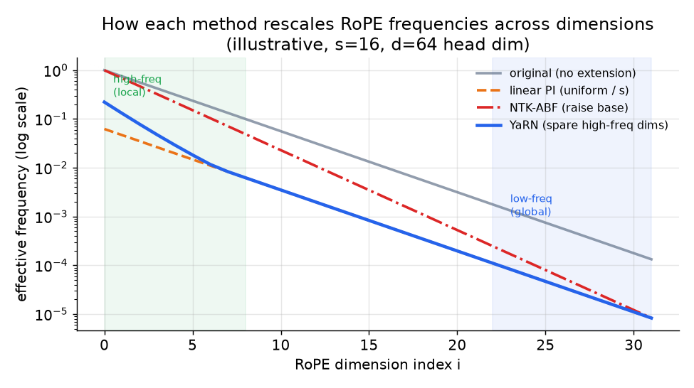

# 4. Context extension

## Why RoPE is the key

Modern bases use Rotary Position Embeddings (RoPE). Each dimension pair $i$ in a
head is rotated by an angle proportional to the token position times a
per-dimension frequency. The query-key dot product then depends only on the
relative offset between positions, not their absolute values, which is what makes
context extension cheap: you can rescale those frequencies without retraining from
scratch. A learned absolute positional table (GPT-2) cannot extend this way; the
table is a fixed-size lookup with no notion of positions beyond its length.

## The math that separates the four methods

RoPE assigns dimension pair $i$ (of $d$ per head) the frequency and per-position
angle:

$$\theta_i = b^{-2i/d}, \qquad \phi_i(m) = m \cdot \theta_i, \qquad i = 0, 1, \dots, \tfrac{d}{2} - 1$$

with base $b$ (commonly 10000). Let the length scale be
$s = L_{\text{new}} / L_{\text{orig}}$.

---

**Linear position interpolation (PI, Chen et al. 2023)** divides every frequency
uniformly by $s$, equivalently compressing position indices so position
$L_{\text{new}}$ maps into the range the model already understands:

$$\theta_i^{\text{PI}} = \frac{\theta_i}{s} \qquad \text{(same factor for all } i\text{)}$$

A short continued-training run (roughly a thousand steps) recovers quality. The
problem is that dividing all frequencies by the same factor crowds the
high-frequency dimensions that encode local ordering. Adjacent positions become
harder to distinguish, and short-context quality drops.

```python
def rope_freqs_pi(d, s, base=10000.0):        # d: per-head dim, s = L_new / L_orig
    theta = [base ** (-2 * i / d) for i in range(d // 2)]   # original per-dim RoPE freqs
    return [t / s for t in theta]             # linear PI divides every freq by the same s
# rope_freqs_pi(4, s=8)[0] -> 0.125  (theta_0 = 1.0, uniformly compressed by s=8)
```

---

**NTK-aware / Adjusted Base Frequency (ABF, Code Llama)** scales the RoPE base
instead of the positions. Raising the base from $b$ to $b'$ produces a
non-uniform rescale: low-frequency dimensions (large $i$) move a lot, high-
frequency dimensions (small $i$) move less:

$$b' = b \cdot s^{d/(d-2)}, \qquad \theta_i^{\text{ABF}} = (b')^{-2i/d} = \theta_i \cdot s^{-2i/(d-2)}$$

Code Llama raises the base from 10000 to 1000000. Trained on 16K-token sequences,
the model then extrapolates usably to inputs up to 100K tokens, because the
non-uniform rescale preserves local resolution better than uniform PI. Little or
no fine-tuning is needed for moderate extension.

---

**YaRN (Nous Research)** makes the non-uniformity explicit and principled. It
classifies each RoPE dimension by how many full rotations its wavelength completes
across the original context length: low-frequency (long-wavelength) dimensions get
interpolated (divided by $s$), high-frequency (short-wavelength) ones are left
near-unscaled to preserve local ordering, and a ramp $\gamma_i$ blends the middle
band:

$$\theta_i^{\text{YaRN}} = \gamma_i \cdot \theta_i + (1 - \gamma_i) \cdot \frac{\theta_i}{s}, \qquad \gamma_i \in [0,1]$$

where $\gamma_i = 1$ keeps the dimension unscaled (high frequency) and
$\gamma_i = 0$ fully interpolates it (low frequency). YaRN then adds a softmax
temperature correction to counter the entropy increase a longer sequence causes:

$$\text{Attn} = \text{softmax}\!\left(\frac{q^{\top} k}{t \sqrt{d}}\right), \qquad \frac{1}{\sqrt{t}} = 0.1 \ln s + 1$$

The payoff: context extension to 64K and 128K at roughly 0.1 percent of the
original pretraining tokens, with far less short-context quality loss than uniform
PI. YaRN became the default aggressive-extension recipe.

---

**LongRoPE (Microsoft)** generalizes YaRN to a fully searched, per-dimension
rescale vector $\{\lambda_i\}$ found by evolutionary search rather than a
closed-form ramp:

$$\theta_i^{\text{LongRoPE}} = \frac{\theta_i}{\lambda_i}, \qquad \{\lambda_i\} = \arg\min_{\lambda}\; \text{PPL}\!\left(\text{model}_\lambda,\; \text{long text}\right)$$

Extension is progressive (for example 8x, fine-tune, then extend again to reach
2M+ tokens), and a short-context recovery step swaps back to a smaller scaling
for short inputs so the extended model does not regress on ordinary-length text.
The lesson: the optimal rescaling is non-uniform and input-length dependent, which
is why the most aggressive extensions search it rather than derive it.

---

**ALiBi (Train Short, Test Long)** takes a different approach entirely: instead of
rescaling RoPE, it adds a linear distance penalty $-m \cdot |i - j|$ directly to
the pre-softmax attention logits, where $m$ is a per-head slope. No positional
encoding is added to the embeddings. A model trained with ALiBi at short context
extrapolates to longer inputs at test time without fine-tuning. The trade is that
ALiBi is not a RoPE model, so it does not apply to existing RoPE bases; it is an
architectural choice made at pretraining time, not a retrofit.

---



*How each method rescales RoPE frequencies across dimension index $i$ (log scale).
The original frequencies (gray) span many orders of magnitude: high-frequency
dimensions (small $i$, left) encode local ordering; low-frequency dimensions
(large $i$, right) carry global position. Linear PI (orange) divides all by the
same $s$, crowding local dimensions. NTK-ABF (red) is non-uniform by construction
via the base change. YaRN (blue) explicitly spares the high-frequency end.
Illustrative, $s = 16$, $d = 64$.*

## Long-context data: the binding constraint after rescaling

Rescaling RoPE tells the model how to represent long positions; continued training
on genuinely long inputs teaches it to use them. Three data principles:

- **Upsample long documents.** The web is dominated by short pages. A naive mix
  gives the model almost no gradient signal past a few thousand tokens. Upsample
  books, long code files, legal and scientific documents, and multi-document
  concatenations so a real fraction of every batch spans the target length.
- **Real long-range dependencies, not packed short docs.** Concatenating unrelated
  short documents to fill a 128K window teaches the model that distant tokens are
  irrelevant. Long-range dependencies in training must be real (a single long
  document) or synthetic and targeted (facts inserted early and queried late).
- **Staged length increase.** Llama 3 extends from 8K to 128K in six increments.
  Each stage consolidates before the next. This is cheaper (shorter sequences
  early) and more stable than one giant-length run.

## When to use which

| Reach for | When | Instead of |
|---|---|---|
| Naive extrapolation (raise max position) | Never. Listed only to reject it. | Every other option; this produces garbage past the real window |
| Linear position interpolation (PI) | A simple baseline or tiny extension where some local-resolution loss is tolerable | Calling it equivalent to YaRN; it blurs high-frequency dimensions |
| NTK-aware / ABF (raise the RoPE base) | Moderate extension (up to roughly 8x) with little or no fine-tuning (Code Llama, Yi) | Uniform PI, which sacrifices local resolution for the same gain |
| YaRN (non-uniform + attention temperature) | Aggressive extension to 128K+ at roughly 0.1 percent of pretraining tokens with minimal short-context loss | Plain NTK-ABF when the softmax-temperature correction is needed for quality |
| LongRoPE (searched per-dimension rescale) | Extreme length (2M+) where a per-dimension searched rescale is worth the search cost and the short-context recovery step | Hand-set ramp bands, which cannot find the best per-dim rescale that far out |
| ALiBi | A new architecture where you want train-short-test-long without any fine-tuning or rescaling | An existing RoPE base; ALiBi is not a RoPE model and requires a different pretraining |

**Tools.** The RoPE rescaling methods (linear PI, NTK-aware/ABF, YaRN, LongRoPE) are exposed as configuration options in Hugging Face Transformers RoPE-scaling settings and applied at model-load or continued-training time on PyTorch (Meta); the continued-training run itself uses the same DeepSpeed (Microsoft) or Megatron-LM (NVIDIA) stack as domain adaptation. YaRN and LongRoPE also have reference implementations from their authors that you can drop into the attention layer. Serving an extended-context model with the rescaled positions is handled by vLLM and SGLang, which read the RoPE-scaling config. ALiBi is not a retrofit and must be chosen at pretraining time in the model architecture itself.

**Worked example.** A document-AI team has a strong RoPE base and needs to push its context from a few thousand tokens to 128K to ingest whole contracts. Naive extrapolation is off the table because it produces garbage past the real window, and plain linear PI would blur the high-frequency dimensions that encode local ordering, hurting short-context quality. For a modest jump they might have used NTK-aware ABF with little fine-tuning, but at 128K they choose YaRN because its non-uniform rescale plus the softmax-temperature correction reaches the target at a tiny fraction of pretraining tokens with minimal short-context loss. They only reach for LongRoPE's searched per-dimension rescale if they later need extreme multi-million-token windows where the search cost pays off. Crucially they pair the rescaling with continued training on genuinely long documents (upsampled, with real long-range dependencies, staged in length increments) rather than assuming the frequency change alone teaches the model to use the new positions. ALiBi is not an option here because the base is already a RoPE model.
