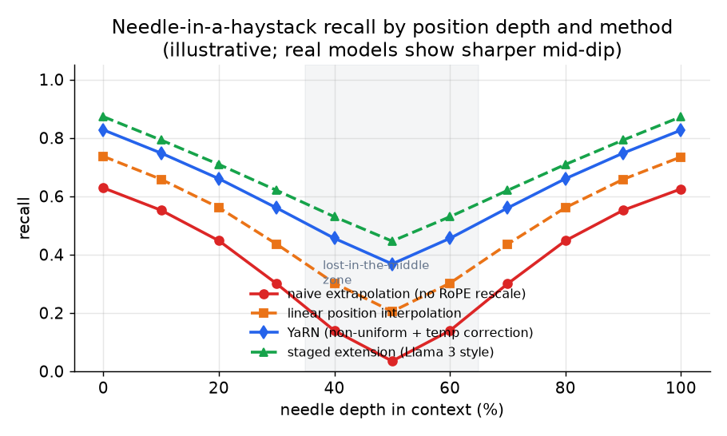

# 5. Evaluation

The most common integrity failure in continued pretraining and long-context work
is declaring victory on a weak eval. A model can pass the easy test and be broken
on anything real. This section names each eval, explains what it actually measures,
and explains what it misses.

## Forgetting checks: the general-benchmark gate

Before running any domain eval, run the full general-benchmark suite on the
adapted base and compare to the base before adaptation. The suite should include
at least a general reasoning benchmark (MMLU), a math benchmark (GSM8K), and an
instruction-following task (MT-Bench or similar). The requirement set in section 1
fixed a two-point regression budget; this gate enforces it.

Each benchmark in the suite has a specific scoring protocol.

**MMLU (Massive Multitask Language Understanding)** measures multiple-choice accuracy
across 57 academic subjects including mathematics, law, medicine, and history. Input:
a question with four labeled options (A-D). Output: the selected option letter. Score:
fraction of correct selections; report at 5-shot unless comparing against a baseline
that used 0-shot (keep the shot count consistent across comparisons).

**GSM8K** measures accuracy on grade-school math word problems requiring multi-step
arithmetic reasoning. Input: a word problem in natural language. Output: the final
numeric answer, extracted by regex from a chain-of-thought response (the model is
prompted to reason step by step and end with a final answer line). Score: exact match
on the numeric value over the 1319-problem test set.

**MT-Bench** measures multi-turn instruction-following quality as rated by an LLM
judge (GPT-4). Input: an 80-question, two-turn benchmark spanning writing, reasoning,
coding, and math. The judge model sees each question and response and outputs a score
of 1-10 using a structured rubric. Score: mean across all 80 questions (8 categories,
10 each). Do not substitute a cheaper judge model without recalibrating against the
original GPT-4 scores.

**What it measures.** Whether the optimizer overwrote the broad knowledge and
reasoning the base already had.

**What it misses.** It only catches forgetting you measure. If you skip a
benchmark because you think the domain will not affect it, you will not see the
forgetting there. Run the full suite.

**Common mistake.** Running only the domain benchmark and reporting the gain.
Forgetting is silent inside the domain slice; it shows up only outside it.

## Needle-in-a-haystack (NIAH): the smoke test

Hide a single fact ("the needle") at a random depth in a long filler context
("the haystack") and ask the model to retrieve it. This is the minimum bar for a
long-context claim.



*Recall at each depth in the context window, for four approaches. Naive
extrapolation (red) degrades sharply everywhere. Linear PI (orange) is better but
shows the "lost-in-the-middle" dip, visible in the shaded zone. YaRN (blue) and
staged extension in the Llama 3 style (green) maintain high recall across most
depths, though the mid-context gap never fully disappears. Illustrative.*

**What it measures.** Single-hop retrieval of one verbatim fact, and where in the
window recall breaks.

**How it is scored.** Recall is computed cell-by-cell on a (context-length,
insertion-depth) grid. For each cell, $N$ independent trials are run; the needle is
placed at that depth fraction (e.g., 10%, 50%, 90%) inside a context of that total
length. A trial is counted correct if the model's response contains the planted string
(exact or normalized match).

$$\text{NIAH recall}(L,\, d) = \frac{\text{correct retrievals at length } L \text{ and depth } d}{N}$$

```python
def niah_recall(correct, n):   # correct retrievals out of n trials at a fixed (length L, depth d) cell
    return correct / n         # fraction recalled in this grid cell
# e.g. niah_recall(correct=17, n=20) -> 0.85
```

Report as a two-dimensional heatmap. A single averaged number hides the mid-context
dip that is the primary failure mode, and any long-context claim that omits the
recall-by-depth plot is concealing the distribution.

**What it misses.** Multi-hop reasoning, aggregation across the span, and
multi-needle retrieval. A model can pass NIAH and still miss facts at arbitrary
depth once more than one needle is involved, or once the task requires reasoning
rather than lookup.

**The lost-in-the-middle problem.** Recall is not uniform across the window.
Models attend best to the beginning and end and worst to the middle, so a fact at
50 percent depth is the hardest to retrieve. Report recall as a function of depth,
not a single averaged number. Any long-context claim without a recall-by-depth
plot is hiding the distribution.

## RULER: the real long-context gate

NVIDIA's RULER extends NIAH into categories that actually stress long context:

- **Multiple needles.** Several facts hidden in the haystack; the model must
  retrieve all of them.
- **Multi-hop variable tracing.** Variable chains where the model must follow
  references across the window to find the final value.
- **Aggregation.** Counting, listing, or summarizing entities distributed across
  the span.
- **Long-context question answering.** QA that requires reading and integrating
  multiple passages across the full length.

RULER's finding is blunt: most models that claim 32K or more degrade sharply well
before their advertised length. The effective context is routinely far shorter
than the configured one. Passing NIAH and declaring 128K is the most common weak-
eval mistake in long-context work.

**What it measures.** Whether the model can actually reason across the window, not
just find one thing.

**How it is scored.** Each category (retrieve, trace, aggregate, QA) is scored by
exact or normalized match on the expected output. The aggregate RULER score is
accuracy averaged across all categories and context lengths. The **effective context
length** is the longest window at which aggregate accuracy stays above a fixed
threshold, commonly 85 percent of the accuracy at a short reference length (e.g.,
4k tokens). A model that claims 128k but crosses that threshold at 32k has an
effective context of 32k regardless of its configured maximum.

**What it misses.** Open-domain generalization beyond the synthetic tasks. RULER
uses controlled synthetic data, so a model that fits the RULER distribution might
still fail on real long-document tasks. Gate on RULER first; follow up with real
task evals before production launch.

## Perplexity on long documents: a continuous training signal only

Long-context perplexity on held-out long documents is cheap to compute during
training and gives a useful continuous signal for detecting obvious failures.
Perplexity is the exponentiated mean negative log-likelihood per token (roughly,
how surprised the model is by each token; lower means less surprised):

$$\text{PPL} = \exp\!\left(-\frac{1}{N}\sum_{i=1}^{N}\log p(x_i \mid x_{\lt i})\right)$$

```python
from math import exp
def perplexity(nll_per_token):        # nll_per_token: list of -log p(x_i | x_<i), in nats
    mean_nll = sum(nll_per_token) / len(nll_per_token)
    return exp(mean_nll)              # exp of the mean negative log-likelihood
# e.g. perplexity([0.5, 1.0, 1.5]) -> 2.718281828459045  (mean nll = 1.0, so exp(1) = e)
```

Input: a held-out token sequence at the target length. Output: per-token
log-probabilities. Lower is better. For cross-tokenizer comparison use
**bits-per-byte (BPB)**, which divides total NLL in bits by the number of UTF-8
bytes and is tokenizer-invariant:

$$\text{BPB} = \frac{1}{B}\sum_{i=1}^{N}\bigl(-\log_2 p(x_i \mid x_{\lt i})\bigr)$$

```python
def bits_per_byte(nll_bits, n_bytes):   # nll_bits: list of -log2 p(x_i | x_<i), one per token
    return sum(nll_bits) / n_bytes      # total bits of the sequence / its UTF-8 byte count
# e.g. bits_per_byte([2.0, 3.0, 3.0], n_bytes=4) -> 2.0
```

where $B$ is the total UTF-8 byte count of the sequence. But it saturates: a model can have fine long-context perplexity and still fail RULER,
because next-token loss is dominated by local prediction (predicting the next word
given the previous sentence is easy and cheap). Perplexity measures fluency at
length; it does not measure use of the context.

Gate training on perplexity for early stopping and stability. Gate promotion to
post-training on RULER-style retrieval and aggregation tasks and a recall-by-depth
measurement.

## When to use which

| Reach for | When | Instead of |
|---|---|---|
| Full general-benchmark suite (MMLU, GSM8K, MT-Bench) | After every DAPT run, before promoting the adapted base | Skipping it and asserting no forgetting; forgetting is silent in the domain slice |
| NIAH with a recall-by-depth plot | As the minimum smoke test for any long-context claim | Averaging recall over depth and hiding the mid-context dip |
| RULER multi-hop and aggregation | Before declaring an effective context length; only RULER separates real from configured | Passing NIAH only, which is single-hop and edge-anchored |
| Long-context perplexity | As a continuous training signal; cheap and useful for early stopping | As the primary gate for promotion; it saturates and does not catch broken retrieval |
| Domain benchmark (held-out domain data) | To measure what DAPT gained | As the only post-DAPT eval; always pair it with the general regression gate |

**Provenance.** The general-benchmark harness is lm-evaluation-harness (EleutherAI) and the multi-hop long-context gate is RULER (NVIDIA), as detailed below. What these gates probe is context extension built on RoPE (RoFormer, Su et al., 2021) rescaling from the previous section.

**Tools.** The general-benchmark suite runs on lm-evaluation-harness (EleutherAI), which bundles MMLU and GSM8K with fixed shot counts and scoring; MT-Bench uses an LLM judge, so keep the judge model consistent when you re-run it. Long-context gates use RULER (NVIDIA) for multi-needle, multi-hop, and aggregation tasks, and a needle-in-a-haystack harness for the recall-by-depth smoke test. Perplexity and bits-per-byte are computed directly in the PyTorch (Meta) training loop as a continuous signal. All of these models load through Hugging Face Transformers, and serving the long-context model for eval is handled by vLLM or SGLang.

**Worked example.** A document-AI team that just finished continued pretraining and context extension must decide whether to promote the adapted base. It first runs the full general-benchmark suite (MMLU, GSM8K, MT-Bench) rather than only the domain benchmark, because forgetting is silent inside the domain slice and only shows up outside it, and it gates on a fixed regression budget. For the long-context claim it treats needle-in-a-haystack as a smoke test only, reporting a recall-by-depth plot to expose the lost-in-the-middle dip instead of a single averaged number. It then gates the real effective-context length on RULER's multi-hop and aggregation tasks, since a model can pass single-hop NIAH and still degrade far below its configured 128K. Long-context perplexity is used only as a continuous early-stopping signal during training, never as the promotion gate, because it saturates while retrieval is still broken.
