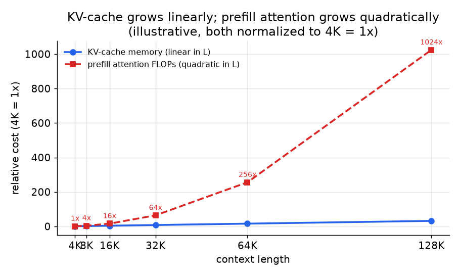

# 6. Serving and scaling

## Long context is a serving problem, not just a modeling one

A base model that reads 128K tokens is not a product until it can be served. The
two costs of long context have different shapes, and a complete answer separates
them.

*KV-cache memory grows linearly with context length (blue). Prefill attention
FLOPs grow quadratically (red), so extending from 8K to 128K multiplies attention
compute by 256x. Both are normalized to 4K = 1x. Illustrative.*

**Prefill attention is quadratic in length.** Self-attention computes an
$L \times L$ score matrix, so both compute and, naively, memory scale as $L^2$.
FlashAttention makes the memory linear by never materializing the full matrix in
HBM, but the compute stays quadratic. An 8x longer prefill is roughly 64x the
attention FLOPs. Long prompts are prefill-bound even before decoding begins.

**The KV cache is linear in length.** During decoding you cache $K$ and $V$ for
every past token, so KV-cache memory grows as:

$$M_{\text{kv}} = 2 \cdot n_{\text{layers}} \cdot n_{\text{kv}} \cdot d_{\text{head}} \cdot L \cdot b \cdot s_{\text{bytes}}$$

where $b$ is batch size and $s_{\text{bytes}}$ is bytes per element. At 128K tokens
this memory cost dominates VRAM and caps batch size. Grouped-query attention (GQA,
small $n_{\text{kv}}$), KV quantization, and paged attention matter far more at
long context than at short.

**The two combine badly.** A 128K-context product is simultaneously prefill-bound
on long prompts and KV-bound on batch size. Solving one without the other leaves
the other binding.

## Architectural levers at long context

- **Grouped-query attention (GQA).** Shrinks $n_{\text{kv}}$ by sharing K and V
  heads across groups of Q heads. Llama 3's GQA is what makes 128K serveable at a
  real batch size. Multi-query attention (MQA) is the limit case: one K/V head for
  all Q heads.
- **FlashAttention.** Fused, IO-aware attention kernel that avoids materializing the
  full $L \times L$ matrix. Reduces the memory-bandwidth cost of prefill but not the
  FLOP count.
- **Sliding-window attention (Mistral).** Caps each token's attention span at a
  fixed window $w$, bounding the quadratic cost to $O(L \cdot w)$ instead of
  $O(L^2)$. Trades some global reach for a bounded serving cost.
- **Paged attention (vLLM).** Pages the KV cache rather than pre-allocating a
  contiguous buffer, allowing fine-grained memory sharing and preventing OOM on
  heterogeneous batch lengths.
- **KV quantization.** Quantizes cached K and V tensors to 8-bit or 4-bit,
  reducing KV memory at a small quality cost.

## Bottlenecks table

| Bottleneck | First sign | Fix | Tradeoff |
|---|---|---|---|
| Quadratic prefill (long prompts) | Prefill latency dominates; long requests starve batch | FlashAttention, chunked prefill, sliding-window attention | Sliding window trades global reach for cost |
| KV-cache OOM | Batch size collapses at long context or OOM at high concurrency | GQA / MQA (smaller $n_{\text{kv}}$), KV quantization, paged attention | Small quality hit; GQA needs to be baked in at pretraining |
| Short-context regression | Users with short prompts see quality drop after extending | Non-uniform RoPE scaling (YaRN), dual-scaling recovery (LongRoPE) | More complex schedule and possibly a separate serving path for short vs long |
| Lost-in-the-middle retrieval | Mid-document facts missed even though length is "supported" | Synthetic mid-depth training data, position-aware eval, RAG for corpora | No complete fix; must measure recall by depth and set user expectations |
| Training cost of long-context passes | Long sequences dominate batch time and cost | Staged length increase (short sequences early), sequence packing with padding masks | Earlier stages are cheaper; must validate each stage before extending further |
| Contamination in domain corpus | Domain benchmark inflates post-DAPT | Decontaminate domain corpus and long-context data against all evals before training | Extra data-engineering work; worth it to trust the numbers |

## Long context and retrieval compose, they do not replace each other

Long context handles one big document the model must reason over whole. It does
not scale to a corpus: quadratic prefill and linear KV cost are paid per query and
per token, recall decays toward the middle, and the model reprocesses everything
on every request. RAG retrieves the few relevant chunks from a corpus and feeds
them to the model. The two compose: extend for the single large document; retrieve
over the corpus. Extending context to replace retrieval is a common and wrong
answer.
