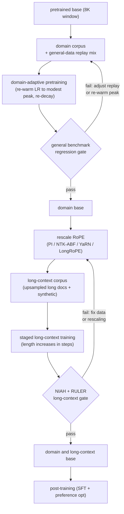

# 9. Summary

## One-page recap

- **Name the two axes before you design.** Domain adaptation (DAPT) and context
  extension are independent problems with different failure modes and different
  tools. Solving one with the other's tool is the first tell of a shallow answer.

- **Continued pretraining is a controlled re-entry, not "just keep training."**
  The base finished fully decayed. Re-warm the learning rate to a modest peak,
  re-decay, and replay a fraction of general data. Those three choices prevent the
  two ways a DAPT run fails: stalling at the decayed floor and catastrophic
  forgetting at the original peak.

- **Catastrophic forgetting is silent.** It shows up outside the domain slice, so
  the only way to detect it is to run the full general-evaluation suite before and
  after, not just the domain benchmark. Gate on the regression; do not assert it.

- **Naive extrapolation fails.** Setting max position to 128K without rescaling
  RoPE frequencies produces garbage past the original window. Extension is a
  rescale plus a training run on genuine long documents, staged in length.

- **Uniform interpolation is the baseline, not the goal.** Every better method
  (NTK-ABF, YaRN, LongRoPE) is a way to scale low-frequency (global) dimensions
  while sparing high-frequency (local) ones, because the model must still
  distinguish position $m$ from position $m+1$ while learning to reach position
  $m+100000$.

- **NIAH is a smoke test; RULER is the gate.** Needle-in-a-haystack is single-hop
  retrieval often anchored at the edge. RULER's multi-hop, aggregation, and multi-
  needle tasks reveal the effective context, which is almost always shorter than
  the configured one. Report recall as a function of depth to catch the lost-in-
  the-middle decay.

- **Long context is a serving-systems cost.** Prefill attention is quadratic in
  length; the KV cache is linear. GQA, KV quantization, FlashAttention, and paged
  attention are mandatory at 128K. Budget both before shipping the length.

- **Long context and retrieval compose.** Long context for one big document; RAG
  for a corpus. They are not substitutes.

## The whole pipeline on one page

## Test yourself

1. A DAPT run lifts the domain benchmark by eight points. What else must you
   check before promoting the adapted base, and where is the forgetting most
   likely to hide?

2. A colleague sets `max_position_embeddings` to 200000 in the config. What will
   happen at inference on a 150K prompt, and what two steps actually produce a
   working 150K model?

3. Explain in one sentence each why uniform position interpolation hurts short
   prompts, why NTK-ABF helps, and why YaRN is better still.

4. You have NIAH results showing 95 percent recall at 128K. An engineer says
   "long context works." What additional eval do you run before agreeing, and
   what specific failure mode are you checking for?

5. Your 128K model OOMs on a 64-token batch during decoding. Name two serving
   techniques that address this without reducing the context window.

6. A user asks whether to use long context or RAG for a 500-document knowledge
   base. What is the right answer, and why?

## Further reading

- Dense reference (all mechanisms, math, case studies):
  [topics/15-continued-pretraining-and-long-context.md](../../topics/15-continued-pretraining-and-long-context.md)
- Per-company teardowns (Llama 3, Code Llama, YaRN, LongRoPE, Yi, Qwen2.5, Mila):
  see the teardown entries in [tools/teardowns/15.md](../../tools/teardowns/15.md)
- Side-by-side mechanism comparison and quadrant chart:
  [tools/comparisons/15.md](../../tools/comparisons/15.md)
