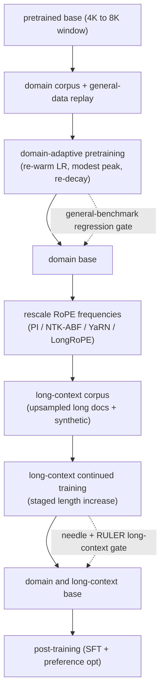

# Continued Pretraining and Long-Context Adaptation

> **Style note.** This chapter teaches first. It borrows the thinking of a
> structured system-design interview (clarifying requirements, framing the
> two axes, deep-diving each mechanism, evaluating, serving, and finishing with
> interview Q and A) without copying any particular format. On top of that it
> keeps what this repo adds: real production case studies with first-party links,
> a "when to use which" table per method group, worked figures (mermaid and
> matplotlib), and an interview Q and A. Split into one file per section so no
> single file gets long.

An interviewer rarely says "implement YaRN." They say **"you have a strong open
base model. Your product needs it to know a specialized domain and to read
documents far longer than the 8K window it was pretrained at. Walk me through how
you adapt the base without wrecking what it already knows."** That is continued
pretraining and long-context extension: two independent adaptations that sit in
the cheap, high-leverage gap between a base model and an aligned chat model. This
chapter builds both end to end, and shows how Meta, Nous Research, Microsoft, 01.AI,
Alibaba, and the Mila group actually do it.

## Sections

1. [Clarifying the requirements](01-clarifying-requirements.md) -- the dialogue that scopes the problem.
2. [Two axes](02-two-axes.md) -- the adaptation axis (domain) and the length axis; input and output.
3. [Continued pretraining](03-continued-pretraining.md) -- DAPT, LoRA, replay against forgetting, and the LR schedule.
4. [Context extension](04-context-extension.md) -- PI, NTK-ABF, YaRN, LongRoPE, ALiBi; KaTeX for the math.
5. [Evaluation](05-evaluation.md) -- needle-in-a-haystack, RULER, forgetting checks; what each measures.
6. [Serving and scaling](06-serving-and-scaling.md) -- memory cost at length, bottlenecks table.
7. [How teams do it in production](07-how-teams-do-it-in-production.md) -- Meta, Nous, Microsoft, 01.AI, Alibaba, Mila.
8. [Interview Q and A](08-interview-qa.md) -- commonly asked, tricky, and commonly answered wrong.
9. [Summary](09-summary.md) -- one-page recap, mermaid, test-yourself, further reading.

## The whole pipeline on one page

Read the sections in order the first time; they build on each other. Each section
opens with the question an interviewer actually asks, then answers it.
