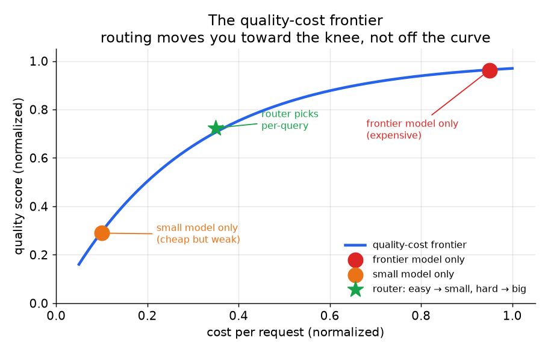

# 1. Clarifying the requirements

Before designing anything, pin down what the system must do. Here is a typical
exchange. Every question either removes work or changes the lever you reach for.

**Candidate:** Is this an interactive product (users waiting for an answer) or
a bulk job like nightly summarization?
**Interviewer:** Interactive chat. Users expect a response in under two seconds.

**Candidate:** Do we have a quality metric today, or are we working from vibes?
**Interviewer:** We have an LLM-as-a-judge eval set, about 500 labeled examples
with expected answer quality scores.

**Candidate:** Where does the money go right now? Is the bill driven by long
input prompts, long generations, or sheer request volume?
**Interviewer:** Mostly input tokens. We do RAG and we pull 20 retrieved chunks
into every prompt, most of which turn out irrelevant.

**Candidate:** Is the traffic uniform, or do some queries clearly need the
frontier model while others would be fine with a smaller one?
**Interviewer:** Very mixed. Simple lookups and greetings dominate by count; a
tail of reasoning and code-generation queries are genuinely hard.

**Candidate:** What quality regression is acceptable on the easy majority to
achieve cost savings on them?
**Interviewer:** We could tolerate a 2-point drop (out of 100) on simple queries
if the hard tail holds. The hard tail cannot regress at all; it is the
revenue-driving use case.

**Candidate:** Any constraints on adding models or infra? Are we on API pricing
or self-hosting?
**Interviewer:** API pricing only for now. No GPUs to manage.

Let us summarize. **We need to cut the input-token bill on a mixed-intent
interactive RAG product.** The input cost driver suggests context trimming and
prompt compression as first-order levers. The mixed-intent traffic suggests a
router or cascade to direct simple queries to a cheap model. The latency SLO
rules out a two-call cascade on the hot path unless the first call is fast
enough; a pre-call router may fit better. API-only pricing means quantization
and batching are off the table: the levers are routing, caching, compression,
and right-sizing.

Two consequences fall out immediately, and stating them early is most of the
signal in this interview question:

- **You cannot set a quality knob without measuring quality.** Every lever has
  a threshold, and every threshold trades cost against quality at a point you can
  only find with an eval set. The first thing this system needs, before any
  routing or caching, is that quality number. Here we have it; if we did not, the
  first deliverable would be building it.
- **The dominant cost driver decides the first lever to try.** Input-heavy RAG
  (long prompts, redundant chunks) is cut by trimming and compression before
  routing buys much. Output-heavy generation (long answers) is cut by model size.
  High-QPS classification is cut by right-sizing. Read the bill before
  designing the fix.

*The quality-cost frontier. Every lever moves a query left along the frontier
(lower cost for the same quality) rather than off it. The routing point sits at
the knee: easy queries go to the cheap model, hard queries go to the frontier
model, and the blend lands better than either model alone. Illustrative.*
