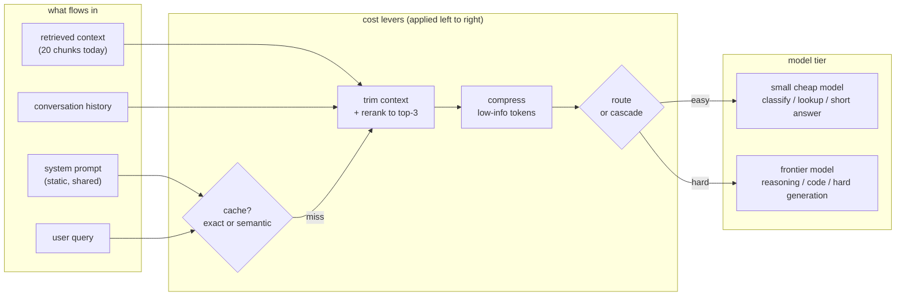

# 2. Frame the system

## Where the tokens and dollars go

An LLM API bill has three terms. Which one dominates determines which lever you
pull first.

| Cost driver | What it means | Who it hits hardest | First lever |
|---|---|---|---|
| Input tokens | Tokens in the prompt: system message, retrieved context, conversation history | RAG systems (long retrieved chunks), multi-turn chat (growing history), agents (long tool outputs) | Trim context, compress prompt, cache whole responses |
| Output tokens | Tokens generated in the response | Long-form generation, agents writing code or plans | Smaller model for short answers, streaming truncation, structured output |
| Request count | Number of API calls, regardless of length | High-QPS classification, embeddings re-generated per request | Route to a smaller model, cache exact or semantic hits, batch |

Read the bill. Optimizing input when output dominates, or output when the bill
is driven by request volume, is free work that saves nothing.

## The system in one picture

The interesting decisions are all **upstream of the model call**: whether to
serve a cached response, how many tokens reach the model, and which model they
reach. By the time a token crosses the API boundary you have already paid for
it.

## A practical cost model

Let the per-request expected cost be:

$$\mathbb{E}[C] = h \cdot c_{\text{hit}} + (1-h)\bigl(c_{\text{embed}} + f_{\text{small}} \cdot c_{\text{small}} + f_{\text{big}} \cdot c_{\text{big}}\bigr)$$

where $h$ is the cache hit rate, $c_{\text{hit}}$ is the (tiny) cost of a cache
lookup, $c_{\text{embed}}$ is the cost of computing the query embedding on a
miss, and $f_{\text{small}} + f_{\text{big}} = 1 - h$ is how the remaining
traffic splits across the two tiers.

The formula shows the order to attack: raise $h$ (caching) before tuning
$f_{\text{small}}$ (routing), and reduce $c_{\text{small}}$ or
$c_{\text{big}}$ (compression, right-sizing) only after the routing fractions
are good.

## What this chapter builds next

The next four sections are one lever each, in the order you would typically
apply them:

1. **Routing and cascades** (section 03): send easy queries to the cheap tier
   before the expensive one ever fires.
2. **Caching and compression** (section 04): eliminate or shorten the prompt
   before any model sees it.
3. **Right-sizing** (section 05): ensure the "cheap tier" is as cheap as it can
   be for the task, through model selection, quantization, or distillation.
4. **Serving and gateway** (section 06): make all of the above enforceable,
   observable, and resilient in production.

They compose. A request first hits the cache, then is compressed, then routed;
the fractions shrink at each step so the frontier model only touches the hard
tail.
