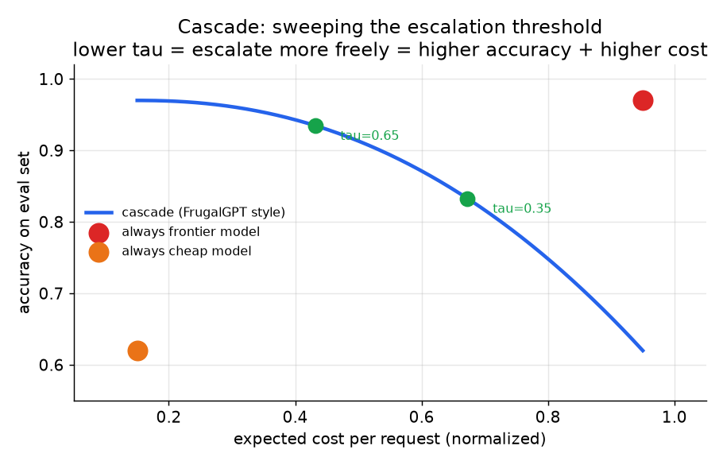
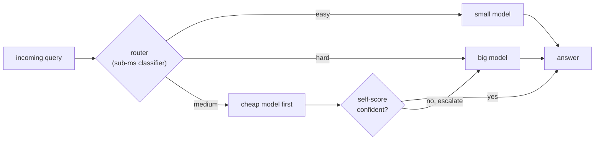

# 3. Routing and cascades

A router or cascade is the same idea applied at two different points in time:
send easy queries to the cheap model, and only spend frontier-model money on the
hard ones. The difference is **when** the decision is made: before any generation
(router) or after the cheap model has already tried (cascade).

## Routers: decide blind, before the call

A router is a small, fast prediction made before any expensive model call. It
classifies the incoming query as easy or hard (or maps it to a tier) and
dispatches accordingly. Three flavors, each with a different data requirement:

- **Heuristic / regex layer.** Greetings, exact lookups, fixed-template requests
  go to a small model by pattern match. Zero training cost; brittle on anything
  outside the patterns.
- **Classifier router.** A fine-tuned small model (or an LLM-as-a-judge
  pipeline) labels a training set with difficulty or category, then a lightweight
  classifier maps query text to tier. Anyscale uses a fine-tuned classifier that
  routes by query complexity between closed and open models.
- **Preference router.** Trains on human preference data (which model did people
  prefer on which query) to predict the cheap model's win probability.
  RouteLLM is the canonical example: it routes a small fraction of traffic to the
  strong model while retaining most of its quality, achieving about 85% cost cut.

The expected savings from a router are:

$$S = f_{\text{weak}} \cdot (c_{\text{big}} - c_{\text{small}}) - c_{\text{router}}$$

where $f_{\text{weak}}$ is the fraction of traffic the weak model handles at the
quality bar, and $c_{\text{router}}$ is the router's own per-call cost. The
router must be strictly cheaper than the cheapest model it gates; a frontier call
just to route eats the savings.

```python
def router_savings(f_weak, c_big, c_small, c_router):
    # f_weak: fraction of traffic the weak model handles at the quality bar
    # savings = big-vs-small gap captured on that fraction, minus router overhead
    return f_weak * (c_big - c_small) - c_router
# router cost must stay well below c_small; e.g. router_savings(0.5, 10.0, 2.0, 0.25) -> 3.75
```

The router's **honest limitation**: it decides once, blind, before seeing any
answer, so it cannot know when it was wrong. A router tuned on old traffic will
mis-route newly-hard queries silently: cost looks great, quality quietly drops on
exactly the queries that matter.

## Cascades: decide after the cheap model answers

A cascade runs the cheap model first, scores its own answer's reliability, and
escalates to a pricier model only when that score is low. Unlike a router, it
looks at a real answer before deciding to spend more, so it can catch its own
mistakes. The FrugalGPT paper instantiates exactly this and matches GPT-4 quality
at up to 98% lower cost by training a scorer to predict answer reliability.

The expected cost of a two-stage cascade:

$$\mathbb{E}[C] = c_1 + (1 - p_1) \cdot c_2$$

where $c_1$ is the cheap model's call cost, $p_1$ is the probability its answer
passes the scorer, and $c_2$ is the frontier model cost. A three-stage cascade
adds a third term: $(1-p_1)(1-p_2) c_3$.

```python
def cascade_cost(costs, pass_probs):    # costs[i]: stage i call cost; pass_probs[i]: P(stage i answer accepted)
    total, reach = 0.0, 1.0             # reach = probability we run this stage
    for i, c in enumerate(costs):
        total += reach * c              # pay for stage i only if we reached it
        reach *= (1 - pass_probs[i])    # continue only if stage i's answer was rejected
    return total
# cascade_cost([1.0, 10.0], [0.7, 1.0]) -> 4.0  (= c1 + (1 - p1) * c2 = 1 + 0.3 * 10)
```



*Sweeping the escalation threshold tau. Low tau escalates freely (high quality,
high cost); high tau accepts cheap-model answers more often (low cost, lower
quality on the hard tail). The knee is the operating point to ship. Illustrative.*

The cascade's load-bearing piece is the **confidence signal**. Roughly in order
of trustworthiness:

1. **Verifiable ground truth.** Does the SQL run? Does the code compile? Does
   the citation exist? This is a real test, so escalation is precise.
   Verifiable tasks are the cascade's sweet spot.
2. **Trained reliability scorer.** A model trained to predict whether the cheap
   answer is correct (what FrugalGPT trains). Better than raw log-probabilities.
3. **Model self-consistency or self-critique.** Sample the cheap model twice and
   compare; low agreement suggests low confidence. Softer signal.
4. **Log-probabilities.** (The model's own token-level confidence scores, the
   log of each predicted token's probability.) Reported by the model but often
   miscalibrated on open-ended text. The weakest signal; treat with caution.

The failure mode is a miscalibrated cutoff: too eager to accept quietly degrades
quality; too eager to escalate and you pay for both models on everything.
Calibrate on held-out data and re-check as traffic shifts.

## Router vs cascade: the latency trade

| | Router | Cascade |
|---|---|---|
| When it decides | Before any generation | After the cheap model answers |
| Latency | Single model's latency (cheap) | Cheap model + scorer, then optionally frontier |
| Can catch own mistakes | No: decides blind | Yes: scores a real answer |
| Best fit | Tight latency SLO, real difficulty signal | Latency slack available; verifiable task |
| Key failure mode | Mis-routes newly-hard queries silently | Miscalibrated cutoff pays for both models |

They compose. Route first to divide traffic into buckets, then run a cascade
within the "medium difficulty" bucket where the routing signal is weakest. Easy
queries get the cheap model directly; hard queries escalate directly; the middle
range gets the cascade to decide on real evidence.



*Route only where the signal is strong (easy and hard); spend the extra cascade call only on the uncertain middle bucket.*

## When to use which

| Reach for | When | Instead of |
|---|---|---|
| Heuristic / regex router | Traffic has clear, stable pattern classes (greetings, lookup, template) | A classifier, whose training cost is unjustified if patterns are simple |
| Classifier router (Anyscale, IBM) | Traffic splits clearly into easy vs hard, you have labels or a judge pipeline | A preference router, which needs preference data you may not have |
| Preference router (RouteLLM) | You have comparative preference data (Chatbot Arena style) and need to generalize to new model pairs | A classifier, which must be retrained per model pair |
| Cascade scorer (FrugalGPT) | Latency slack available and the task is verifiable or scoreable | A blind router, when you need to catch wrong cheap-model answers |
| Router then cascade | Mixed traffic with a medium-difficulty bucket where routing is uncertain | Applying cascade everywhere (two calls on simple queries is wasteful) |

**Provenance.** These carry their origins in the table itself: the classifier router is the Anyscale and IBM line, the preference router is RouteLLM, and the cascade scorer is FrugalGPT. They are systems-layer routing techniques rather than model-architecture methods, so no foundational-model attribution applies.

**Tools.** RouteLLM is the reference open-source preference router and ships trained matrix-factorization and BERT-based routers. LiteLLM and its proxy expose model routing, fallbacks, and tiered dispatch across providers behind one API, which is a convenient place to hang a heuristic or classifier router. Classifier routers are typically small fine-tunes built on Hugging Face Transformers, and a heuristic layer is often just regex plus a rules engine in front of the same gateway. Cascade scorers along the lines of FrugalGPT are usually custom-trained reliability models; for verifiable tasks the "scorer" is the real check itself (a SQL execution, a compiler, a test runner) rather than a learned model.

**Worked example.** A chat product sees a flood of greetings and canned FAQ lookups mixed with a long tail of genuinely hard reasoning questions, and it must answer under a tight latency SLO. Because the easy classes are stable and pattern-shaped, the team puts a heuristic regex router in front to send greetings and template requests straight to the small model at zero training cost, avoiding a classifier whose training would be unjustified for such simple patterns. For the remaining ambiguous traffic they add a classifier router since they can label difficulty with a judge pipeline, rather than a preference router that would need comparative data they do not collect. They skip a cascade on the hot path because the latency budget has no slack for a cheap-model-then-scorer round trip, and reserve a cascade only for an offline batch queue where a verifiable code-generation task lets them escalate on a real compile-or-run signal.

## Implementation and training pitfalls

Routers and cascades are cost mechanisms, so their failures show up as money and
quiet quality loss, not as errors. The recurring traps are a router that costs more
than it saves, a cutoff calibrated once and never re-checked, and escalation on a
signal the model cannot actually trust.

| Problem | Symptom | Fix |
|---|---|---|
| Router costs more than it saves | savings go negative after router overhead | keep the router strictly cheaper than the cheapest model it gates (heuristic or a small classifier) |
| Miscalibrated cascade cutoff | either quality drops or you pay for both models on everything | calibrate the escalation threshold on held-out data and re-check as traffic shifts |
| Stale router on drift | cost looks great, quality quietly drops on newly-hard queries | monitor per-slice quality and retrain the router on fresh traffic |
| Over-trusting log-probabilities | confident-looking cheap answers are wrong yet not escalated | prefer a verifiable check or a trained reliability scorer over raw log-probabilities |
| Cascade on easy traffic | two calls on trivially simple queries waste money | route easy and hard directly, cascade only the uncertain middle bucket |
| Self-consistency cost blowup | sampling N times multiplies spend with little quality gain | add repeated sampling only where a real success signal justifies it |
| No per-request cost ceiling | one pathological query runs every stage at max cost | cap total spend per request and fall back or truncate at the ceiling |
| Escalating on a saturated signal | logprob or self-consistency is flat on the hard tail | use ground-truth verification where the task allows (does the SQL run, does the code compile) |

The through-line: a router or cascade only saves money if its own decision is cheaper
and better-calibrated than the model it gates, so measure the net savings and the
per-slice quality together, never the headline cost alone.
