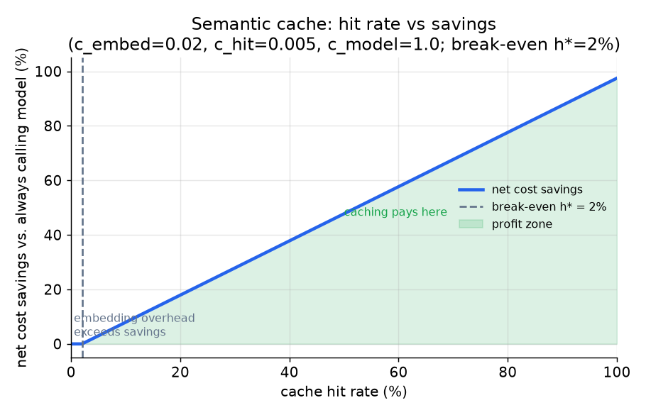
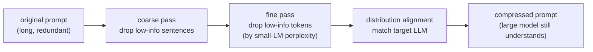
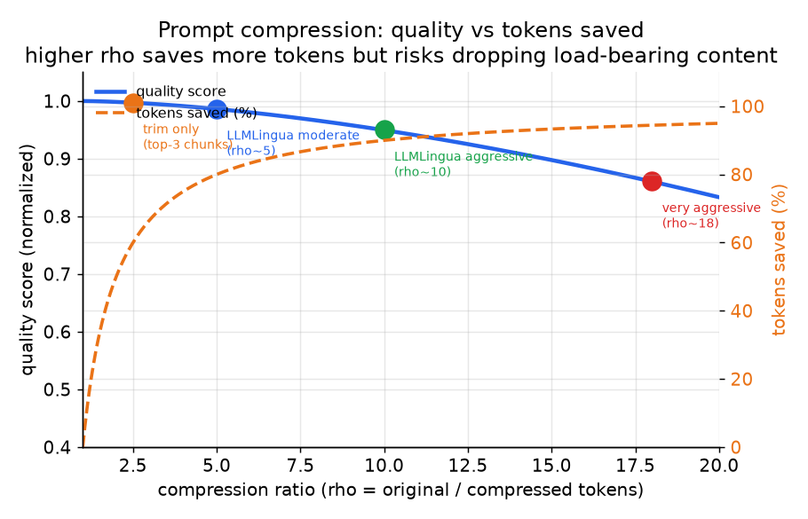

# 4. Caching and compression

The cheapest LLM call is the one you never make. Caching eliminates the call;
compression shrinks it. Both act upstream of the model and compose with routing.

## Semantic caching

An **exact cache** keys on the normalized prompt string (plus model and params)
and returns a stored response on a hit. Risk is zero (identical input, identical
answer) but hit rate is near zero on free-text input: users rarely type the same
sentence twice.

A **semantic cache** embeds the incoming request with a small embedding model and
retrieves the stored response closest in embedding space if that cosine similarity
(the cosine of the angle between two vectors: 1 means identical direction, 0 means
unrelated) clears a threshold $\tau$:

$$\text{serve cached response} \iff \max_k \cos(e_q, e_k) \ge \tau, \quad \tau \in (0,1)$$

```python
import numpy as np
def should_serve_cached(e_q, keys, tau):
    # e_q: query embedding; keys: stored key embeddings (one per row); tau: threshold
    sims = keys @ e_q / (np.linalg.norm(keys, axis=1) * np.linalg.norm(e_q))
    return bool(sims.max() >= tau)   # serve the nearest stored answer only if it clears tau
# e.g. should_serve_cached(np.array([1., 0.]), np.array([[0.9, 0.1], [0., 1.]]), 0.95) -> True
```

This catches paraphrases ("what is your return policy" vs "how do I return
something") where real hit rate lives. The threshold $\tau$ is the whole game.
Too loose and you serve the answer to a different question (confidently, cheaply
wrong). Too tight and the hit rate collapses to exact match.

### The cache math

Let $h$ be the hit rate, $c_{\text{hit}}$ the cost of a cache lookup (small
embedding plus index query), $c_{\text{embed}}$ the embedding cost on a miss,
and $c_{\text{model}}$ the full model call cost. Expected cost per request:

$$\mathbb{E}[C_{\text{cache}}] = h \cdot c_{\text{hit}} + (1-h)(c_{\text{embed}} + c_{\text{model}})$$

Caching pays when savings exceed the embedding overhead, i.e., when hit rate
clears the break-even:

$$h^{\ast} = \frac{c_{\text{embed}}}{c_{\text{model}} - c_{\text{hit}}}$$

If $c_{\text{model}} = 1$, $c_{\text{hit}} = 0.005$, and $c_{\text{embed}} =
0.02$, then $h^* \approx 2\%$. Caching pays even at modest hit rates; the
question is whether the semantic threshold can deliver them without degrading
quality.

```python
def cache_expected_cost(h, c_hit, c_embed, c_model):
    # h: hit rate; a hit pays only c_hit, a miss pays embedding + the full model call
    return h * c_hit + (1 - h) * (c_embed + c_model)
def cache_breakeven(c_hit, c_embed, c_model):
    return c_embed / (c_model - c_hit)   # hit rate above which caching nets positive
# e.g. cache_breakeven(0.005, 0.02, 1.0) -> 0.020100502512562814  (about 2%)
```



*Net cost savings as a function of hit rate. The break-even hit rate $h^{\ast}$ is
low (around 2% for typical embedding-vs-model cost ratios), so caching pays at
modest hit rates. The profit zone grows roughly linearly; the constraint is
threshold quality, not break-even math. Illustrative.*

### What not to cache

- **Personalized or tenant-scoped answers.** A shared cache that keys on query
  text alone can serve user A's response to user B. Scope the cache key or skip
  caching for any response that contains private context.
- **Volatile facts.** "What is today's stock price?" should have TTL 0. Cache
  stable content (definitions, policies); TTL volatile content aggressively.
- **Long-tail free-text at a loose threshold.** If $\tau$ is low enough to catch
  paraphrases, it is also low enough to return a near-neighbor's answer to a
  genuinely different question. Tune $\tau$ on labeled should-hit / should-not
  pairs, not by raw hit rate.

## Prefix (prompt) caching

Semantic caching reuses a whole response; prefix caching reuses the model's
internal computation over a shared, unchanging prompt prefix. When many requests
begin with the same long system prompt, tool schema, few-shot block, or document,
the provider can store the key-value tensors computed for that prefix once and
reuse them on later calls, so only the new suffix is prefilled. Anthropic exposes
this as prompt caching and several providers offer an equivalent. It is
exact-match on the token prefix, not semantic, so it composes with a semantic
response cache rather than replacing it.

Two properties decide whether it pays. First, the pricing is asymmetric: writing
the cache (the first call that populates it) usually costs more than a normal
input token, while reading it costs much less, so the break-even needs enough
reuse of the same prefix within the cache's time-to-live to amortize the write.
Second, and the part engineers miss, ordering is load-bearing: the cache matches
from the front of the prompt, so any change high up (a per-request timestamp, a
user id interpolated into the system prompt, a reordered tool list) invalidates
everything after it. Put the stable content first (system prompt, schemas, static
context) and the volatile per-request content last, or the hit rate silently
collapses while nothing in the output looks wrong.

## Compare and contrast: semantic cache vs prefix (KV) cache

Both carry the name "cache," both cut cost by reusing prior work, and both
sit invisibly in front of the model, which is why designs regularly confuse
them. What they reuse is different in kind: one reuses a finished answer, the
other reuses the model's internal computation over tokens it has seen before.

| Dimension | Semantic cache | Prefix (KV) cache |
|---|---|---|
| Cuts cost by reusing prior work | Yes | Yes |
| Needs repeated traffic to pay off | Yes (repeated questions) | Yes (repeated prompt prefixes) |
| What is reused | The stored response text | The key-value tensors computed during prefill |
| Match rule | Approximate: embedding similarity above a threshold | Exact: token-for-token match from the front of the prompt |
| Model call on a hit | Skipped entirely | Still runs; only the shared prefix's prefill is skipped |
| Can serve a wrong answer | Yes, if the threshold admits a near-neighbor question | No; a changed token simply misses and recomputes |
| What invalidates it | Stale or personalized content behind the stored answer | Any edit upstream in the prompt (timestamp, user id, reordered tools) |

The difference changes the design when you decide what varies per request: a
semantic cache wins when whole questions repeat in paraphrase over stable
answers, a prefix cache wins when every request is unique but shares a long
fixed header, and because one matches meaning and the other matches tokens,
the standard design uses both in series rather than choosing between them.

## Prompt compression

You pay per token. Tokens the model did not need are money burned. Two moves,
each appropriate in different regimes.

### Context trimming

The blunt, safe move: send fewer retrieved chunks. Most RAG pipelines over-retrieve
(top-20 by default) and the bottom 17 chunks add noise, not signal. A good
reranker (a model that re-scores retrieved chunks by true relevance to the query;
here a cross-encoder or colBERT) scores the 20 retrieved chunks and keeps only
the top 3 most relevant. This is often free quality-wise and directly cheaper,
because the answer already lived in the top chunks and the rest were padding. Try
trimming before any compression algorithm: it is zero-risk and the savings can be
large (17/20 chunks = 85% context reduction if you were over-retrieving that
badly).

### LLMLingua-style token compression

The sharper tool: a small LM scores each token by its perplexity (how surprised
the small LM was to see it) and drops low-information tokens, yielding a shorter
prompt the large model still understands. Microsoft Research's LLMLingua uses a
coarse pass (whole sentences) followed by a fine pass (individual tokens) with a
distribution-alignment step to match the target LLM's language patterns. On RAG
benchmarks it reaches up to 20x compression with about 1.5 points of quality
loss.





*Quality versus tokens saved as the compression ratio rises. Trimming (rho
around 2-3) is safe; moderate LLMLingua compression (rho around 5) captures most
of the savings; aggressive compression (rho \gt 10) risks dropping the
load-bearing token. Illustrative.*

The net-win condition: compression only pays when input tokens dominate the bill
and the context is long and redundant enough that the small-LM pass costs less
than the tokens it removes:

$$\text{net win iff} \quad c_{\text{big}} \cdot (n_{\text{orig}} - n_{\text{comp}}) \gt c_{\text{small}} \cdot n_{\text{orig}}$$

which simplifies to: the per-token saving from removing tokens must exceed the
per-token cost of the compression pass, weighted by how many tokens survive. On
short prompts or output-dominated workloads, the small-LM pass is pure overhead.

```python
def compression_net_win(c_big, c_small, n_orig, n_comp):
    # gain: big-model cost of the tokens removed; cost: small-LM pass over the FULL prompt
    gain = c_big * (n_orig - n_comp)
    cost = c_small * n_orig
    return gain > cost
# e.g. compression_net_win(10.0, 1.0, 1000, 200) -> True
```

### What never to compress

Back off compression on any task where a single dropped token changes the answer:
exact extraction, legal or compliance text, code, citations. The compression is
lossy and aggressive ratios can remove the exact detail the answer hinged on.
Gate the compression ratio behind the same quality eval you use for every other
lever.

## When to use which

| Reach for | When | Instead of |
|---|---|---|
| Exact cache (hash on body) | Identical requests recur (fixed prompts, shared system messages); zero tolerance for near-neighbor errors | Semantic cache, when you need its broader coverage and can afford threshold tuning |
| Semantic cache (embed + threshold) | Free-text repeats or paraphrases over stable content (definitions, policies) | Exact cache alone, which almost never fires on varied natural language |
| Context trimming (fewer chunks) | RAG pipeline retrieves too many chunks and the bottom ones are noise | LLMLingua, which is overkill if simple top-k reranking already solves it |
| LLMLingua compression | Input tokens dominate and context is long, verbose, and redundant (not short or output-heavy) | Trimming alone, when verbose redundant text within each chunk is the problem |
| Skip caching | Personalized, scoped, or volatile answers | Sharing a cache across users/tenants for scoped content (data leak) |

**Provenance.** The semantic-cache lookup uses the same vector-index families as retrieval, HNSW (Malkov and Yashunin, 2016) or IVF-PQ (FAISS by Meta). The context-trimming reranker can be a ColBERT (Stanford, 2020) late-interaction model, and the perplexity-based token dropping carries its LLMLingua (Microsoft Research) origin in the tools note below.

**Tools.** GPTCache is the reference open-source semantic-cache layer and supports both exact key hashing and embedding-plus-threshold lookup with pluggable vector stores; a plain Redis or in-process dictionary keyed on the normalized prompt covers the exact-cache case. Embeddings for the semantic path come from sentence-transformers or a hosted embedding API, backed by a vector index such as FAISS (Meta) or a managed store. For compression, LLMLingua and LLMLingua-2 (Microsoft Research) implement the perplexity-based coarse-to-fine token dropping, and context trimming is just a reranking step using a cross-encoder or ColBERT reranker from Hugging Face Transformers over the retrieved chunks.

**Worked example.** A document-AI team answers questions over company policy PDFs, where the same handful of policies get asked about in many different phrasings. An exact cache almost never fires because users paraphrase, so they add a semantic cache with an embedding model and a tuned similarity threshold to catch "what is the return window" against "how long do I have to send it back," scoping the cache key per tenant so one customer's answer never leaks to another. Their RAG stage over-retrieves twenty chunks, so before touching any compression algorithm they trim to the top few with a reranker, which is zero-risk and cheaper because the answer already lived in the top chunks. Only for the rare long, verbose contract passages that survive trimming do they reach for LLMLingua compression, and they disable it entirely on exact-clause extraction where a single dropped token would change the answer.
