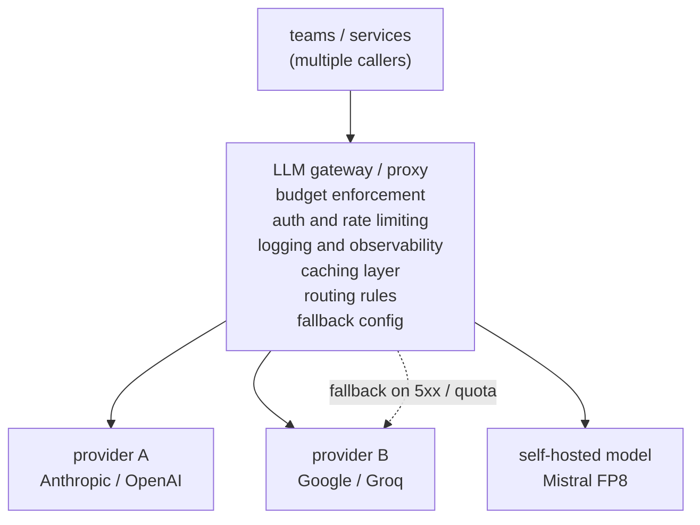

# 6. Serving and scaling

Individual levers (routing, caching, compression, right-sizing) save money in
isolation. The gateway pattern is what makes them enforceable, observable, and
composable in production.

## The gateway: the one control point

Every request should pass through a single proxy before it reaches any provider.
Without a gateway, cost optimization is guesswork: you cannot find where the
money goes, cannot enforce a budget, and cannot fall back gracefully when a
provider goes down.

What the gateway buys:

- **Budgets per team/tenant.** One runaway loop cannot torch the whole month's
  budget. Finance can see spend by owner in the same system.
- **Fallbacks.** When the primary provider is over quota, timing out, or returning
  5xx, the gateway routes to the backup. The feature degrades gracefully instead
  of dying. Alert on fallback rate; silent fallback hides outages and may route
  to a model with different safety behavior.
- **Unified caching and routing.** Applied once at the gateway, not re-implemented
  per service. A service that bypasses the gateway also bypasses these controls.
- **Logging.** Every call's model, token count, cost, and latency in one place.
  Without this you cannot even find where the money goes.

Uber's GenAI Gateway and Cloudflare's AI Gateway are the production shapes of
this: a central proxy that makes cost optimization enforceable, not advisory.

## Batching for cost

Batching (packing multiple requests into one GPU step) dramatically improves
throughput and cost per token on self-hosted models. It matters here in two
ways:

- **Continuous batching on self-hosted models.** Modern serving runtimes (vLLM,
  TGI) insert new requests into the decode step of already-running sequences,
  keeping GPU utilization near 100% rather than the single-request baseline.
  This is the throughput-per-GPU lever for self-hosted inference.
- **Provider batch APIs.** Providers (Anthropic, OpenAI) offer batch endpoints
  that process jobs within hours at roughly half the per-token API price. Bulk
  work that can wait (backfills, nightly classification, offline eval) belongs
  here. A lot of "LLM bill" is bulk work accidentally on the synchronous
  endpoint.

The key design signal is recognizing which traffic is genuinely offline: it is
often larger than teams assume.

## The monitoring you must have

A cost drop without a quality number attached is a silent quality cut waiting to
be discovered. Track these together:

| Metric | What it catches |
|---|---|
| Cost per successful request | A cheap-but-wrong answer is not a success; tracks the real unit economics |
| Quality per routing bucket | If the small-model bucket regresses, the aggregate quality number stays green |
| Cache hit rate and cache-hit quality | A high hit rate at a loose threshold can be mostly wrong answers |
| Escalation rate (cascade) | Spiking escalation rate means the cutoff drifted or traffic got harder |
| Fallback rate (gateway) | Sustained fallback means the primary is in trouble, not a transient blip |
| Router drift alert | Periodic re-sweep of the quality-cost frontier; alert when per-bucket quality moves |

## The metrics matrix: quality, cost, safety (offline vs online)

Cost optimization is the axis this chapter is about, but a cost win never ships on its
own number. It sits on three axes (quality, cost, safety), each with an offline proxy
you measure before shipping and an online signal you confirm on real traffic. A cheaper
route that quietly returns wrong answers is not a saving; it is a hidden quality cut.

| Axis | Offline | Online |
| --- | --- | --- |
| Quality | Per-routing-bucket eval score and cache-hit quality on a golden set before a threshold or model change | Cost per successful request, escalation rate, output edit rate, thumbs up/down on live traffic |
| Cost | Projected cost per request across routing buckets, cache break-even hit rate $h^{\ast}$, batch-API vs sync price | Actual spend per team or tenant, cache hit rate, batch-vs-online mix, latency added by the gateway hop |
| Safety | Confirming a fallback or cheaper model preserves policy behavior on the safety eval set | Fallback rate and refusal-rate drift, since a silent fallback can route to a model with different safety behavior |

A route that is cheaper but returns wrong answers or falls back to an unsafe model does
not ship, so all three axes gate a launch, not cost alone.

## Bottlenecks table

| Bottleneck | First sign | Fix | Tradeoff |
|---|---|---|---|
| Frontier model on every request | Bill dominated by one model, even for simple queries | Route easy traffic to cheap model; right-size subtasks | More models to maintain, evaluate, and keep from drifting |
| Router eats its own savings | Router cost is comparable to model cost | Sub-ms classifier or tiny model; never a frontier call to route | Less routing accuracy from a simpler model |
| Low semantic cache hit rate | Hit rate below break-even $h^{\ast}$ despite tuning | Broaden threshold slightly; improve query normalization | Looser threshold risks wrong-answer hits |
| Input-token bill dominates | Profiling shows input cost, not output | Reranker to top-3 chunks, then LLMLingua if still high | Lossy compression risks answer quality on extraction tasks |
| Bulk work at online prices | Offline jobs on the sync endpoint | Provider batch API or saturated self-host | Hours of latency; unacceptable for interactive traffic |
| Spend invisible until the invoice | Direct provider calls, no gateway | Route all calls through the gateway | Gateway is a new latency hop (usually under 5ms) |
| Threshold optimal once, wrong later | Per-bucket quality degrades over weeks; cost stays flat | Periodic re-sweep of quality-cost frontier + automated alerts | Ongoing eval set maintenance |

**More detail.** Two rows hide sharper mechanics. The low-cache-hit-rate row is a precision-recall tradeoff: the semantic cache is a nearest-neighbor lookup over a vector index such as HNSW (Malkov and Yashunin, 2016), so widening the similarity threshold raises recall (more hits) while lowering precision (more near-miss wrong answers). That is why the fix must be gated on cache-hit quality, not hit rate alone. The router-eats-its-savings row compounds most when the router is itself an LLM call; the routing decision has to cost a small fraction of the cheapest downstream model, so a sub-millisecond classifier or embedding lookup is the only router that stays self-funding as traffic grows.
