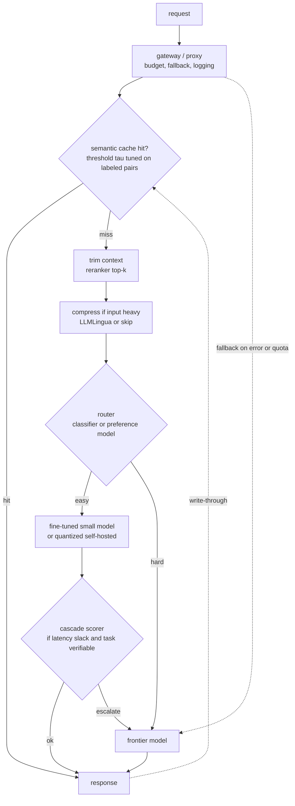

# 9. Summary

## One-page recap

- **Find the cost driver before designing the fix.** Input-heavy RAG (long
  prompts, over-retrieval) calls for trimming and compression. Output-heavy
  generation calls for model size reduction. High-QPS workloads call for caching
  and right-sizing. Applying the wrong lever to the wrong driver is free work
  that saves nothing.
- **Every lever has a knob, and every knob trades cost against quality.** You can
  only set a knob by measuring quality. If quality is unmeasured (vibes, no eval
  set), the first deliverable is an eval set, not a router.
- **Routing and cascades choose a cheaper model.** A router decides blind and
  before generation (latency-friendly but cannot catch its own mistakes); a
  cascade scores its own answer and escalates only when unsure (catches mistakes,
  costs a first call). Router when latency is tight; cascade when it is not and
  the task is verifiable.
- **Caching eliminates the call; compression shrinks it.** Semantic caching at
  the right threshold is the highest-leverage move for repeated or paraphrase-rich
  traffic. Context trimming (fewer retrieved chunks) is the safe first step for
  RAG. LLMLingua-style compression is the sharp tool when input tokens dominate
  and context is verbose and redundant.
- **Right-sizing is where the money actually is.** The biggest bills come from
  a single frontier model wired into every subtask: classification, embedding,
  reranking, lookup. Move each to its cheapest capable model and the cost floor
  drops sharply. Self-hosting above the QPS break-even adds quantization as an
  additional lever.
- **The gateway makes it all enforceable.** Without a single proxy: spend is
  invisible until the invoice, budgets are advisory, fallbacks are per-service
  afterthoughts, and routing is re-implemented (inconsistently) by each team.
- **A cost number without a paired quality number is meaningless.** A green cost
  dashboard is the signature of a router dumping hard queries on the small model.
  Track cost per successful request, quality per routing bucket (especially the
  hard tail), cache-hit quality, and escalation rate.

## The system on one page

## Test yourself

1. The LLM bill for a RAG product is dominated by input tokens. What is the
   first lever to try, and what does it cost in quality risk?
2. A router cuts the bill 40% but the hard-tail quality check was skipped. Why
   is this a problem, and what would you instrument to detect the failure?
3. A semantic cache is live with threshold $\tau = 0.90$. Users report they
   occasionally receive answers that are correct for a different question. What
   is wrong, and how do you fix it without killing the hit rate?
4. When does a cascade beat a router on quality at the same cost, and when does
   a router beat a cascade on latency at the same quality?
5. FP8 quantization improved throughput 33% on a self-hosted model. Under what
   conditions does this not reduce cost at all?
6. A new batch summarization job was added to the interactive endpoint. What is
   the cost and latency impact, and where should it go instead?

## Further reading

- Dense reference (all math, case studies, quadrant plot):
  [topics/11-cost-optimization-and-model-routing.md](../../topics/11-cost-optimization-and-model-routing.md).
- Comparisons and teardowns: [tools/comparisons/11.md](../../tools/comparisons/11.md)
  and [tools/teardowns/11.md](../../tools/teardowns/11.md).
- Related topics: inference serving and continuous batching
  [topics/04-inference-serving-at-scale.md](../../topics/04-inference-serving-at-scale.md);
  KV cache and prefix caching
  [topics/02-long-context-and-kv-cache.md](../../topics/02-long-context-and-kv-cache.md);
  rerankers for context trimming
  [topics/08-reranking.md](../../topics/08-reranking.md).
