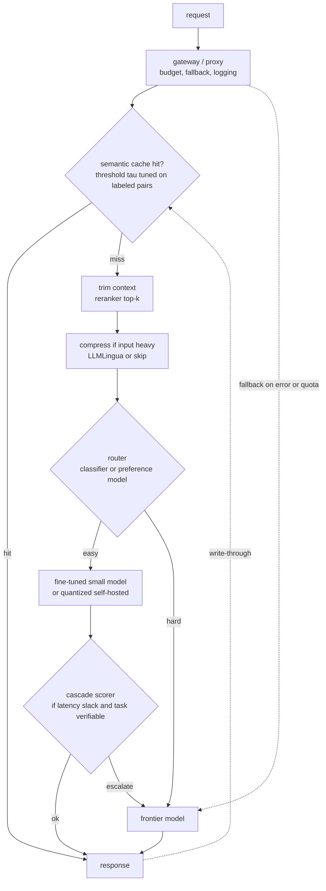

# 9. Summary

## One-page recap

- **Find the cost driver before designing the fix.** Input-heavy RAG (long
  prompts, over-retrieval) calls for trimming and compression. Output-heavy
  generation calls for model size reduction. High-QPS workloads call for caching
  and right-sizing. Applying the wrong lever to the wrong driver is free work
  that saves nothing.
- **Every lever has a knob, and every knob trades cost against quality.** You can
  only set a knob by measuring quality. If quality is unmeasured (vibes, no eval
  set), the first deliverable is an eval set, not a router.
- **Routing and cascades choose a cheaper model.** A router decides blind and
  before generation (latency-friendly but cannot catch its own mistakes); a
  cascade scores its own answer and escalates only when unsure (catches mistakes,
  costs a first call). Router when latency is tight; cascade when it is not and
  the task is verifiable.
- **Caching eliminates the call; compression shrinks it.** Semantic caching at
  the right threshold is the highest-leverage move for repeated or paraphrase-rich
  traffic. Context trimming (fewer retrieved chunks) is the safe first step for
  RAG. LLMLingua-style compression is the sharp tool when input tokens dominate
  and context is verbose and redundant.
- **Right-sizing is where the money actually is.** The biggest bills come from
  a single frontier model wired into every subtask: classification, embedding,
  reranking, lookup. Move each to its cheapest capable model and the cost floor
  drops sharply. Self-hosting above the QPS break-even adds quantization as an
  additional lever.
- **The gateway makes it all enforceable.** Without a single proxy: spend is
  invisible until the invoice, budgets are advisory, fallbacks are per-service
  afterthoughts, and routing is re-implemented (inconsistently) by each team.
- **A cost number without a paired quality number is meaningless.** A green cost
  dashboard is the signature of a router dumping hard queries on the small model.
  Track cost per successful request, quality per routing bucket (especially the
  hard tail), cache-hit quality, and escalation rate.

## The system on one page

```mermaid
flowchart TD
  REQ["request"] --> GW["gateway / proxy<br/>budget, fallback, logging"]
  GW --> CACHE{"semantic cache hit?<br/>threshold tau tuned on labeled pairs"}
  CACHE -->|"hit"| OUT["response"]
  CACHE -->|"miss"| TRIM["trim context<br/>reranker top-k"]
  TRIM --> COMP["compress if input heavy<br/>LLMLingua or skip"]
  COMP --> ROUTE{"router<br/>classifier or preference model"}
  ROUTE -->|"easy"| SMALL["fine-tuned small model<br/>or quantized self-hosted"]
  ROUTE -->|"hard"| BIG["frontier model"]
  SMALL --> CONF{"cascade scorer<br/>if latency slack and task verifiable"}
  CONF -->|"ok"| OUT
  CONF -->|"escalate"| BIG
  BIG --> OUT
  OUT -.->|"write-through"| CACHE
  GW -.->|"fallback on error or quota"| BIG
```

## Test yourself

Answers are collapsed. Attempt each question before opening one.

1. The LLM bill for a RAG product is dominated by input tokens. What is the
   first lever to try, and what does it cost in quality risk?

   

Answer

   **Context trimming**: rerank the retrieved chunks and keep only the top few,
   before reaching for any compression algorithm. The chapter's scenario pulls 20
   chunks into every prompt and most turn out irrelevant, so a cross-encoder that
   keeps the top-3 removes 17 of 20 chunks, roughly an 85% context reduction; the
   capstone in [10](10-putting-it-together.md) works it through as about 8,500
   input tokens down to about 1,700, and \$0.024 down to about \$0.0068 per query
   before any routing. The quality risk is close to zero because the reranker is
   scoring relevance the retrieval pipeline usually computes anyway and the
   surviving text is untouched: the answer already lived in the top chunks and the
   rest was padding. The residual risk is a reranker that misranks the one chunk
   the answer hinged on, which shows up as a recall loss on questions spanning
   several chunks, so set the kept-chunk count against the eval set rather than by
   feel. Only if input tokens still dominate after trimming does
   LLMLingua-style compression pay, because its small-LM pass scores every token
   in the full original context (sections [4](04-caching-and-compression.md) and
   [2](02-frame-the-system.md)).

   

2. A router cuts the bill 40% but the hard-tail quality check was skipped. Why
   is this a problem, and what would you instrument to detect the failure?

   

Answer

   The 40% is an unverified number: it is equally consistent with a genuine win
   and with the router dumping newly-hard queries on the small model. The blind
   spot is structural, not accidental. An aggregate quality metric is dominated by
   the easy majority of traffic, so a regression concentrated in a small hard-tail
   slice barely moves the mean, which is why **a green cost dashboard is the exact
   signature of the failure** rather than evidence against it. Instrument four
   things, in order: quality per routing bucket measured on a fixed hard-tail
   slice that is oversampled in the eval set; cost per successful request, since a
   cheap wrong answer is not a success and only this ratio tracks real unit
   economics; escalation rate if a cascade is present; and a router drift alert
   that periodically re-sweeps the quality-cost frontier as traffic shifts. Fix
   the objective too: the router should minimize cost **subject to a per-bucket
   quality floor expressed as a hard constraint**, because an unconstrained
   objective drifts toward the term it can cheaply observe, which is cost. Until
   those numbers exist, the honest answer is that you do not know whether quality
   held (sections [6](06-serving-and-scaling.md) and [8](08-interview-qa.md)).

   

3. A semantic cache is live with threshold $\tau = 0.90$. Users report they
   occasionally receive answers that are correct for a different question. What
   is wrong, and how do you fix it without killing the hit rate?

   

Answer

   The threshold is too loose, so the nearest-neighbor lookup is returning a
   near-neighbor's stored answer to a genuinely different question: confidently,
   cheaply wrong. This is the defining semantic-cache failure, and it is a
   precision-recall tradeoff over the vector index, so lowering tau raises hit
   rate and the wrong-answer rate together. The fix is to **re-tune tau on a
   labeled set of should-hit and should-not pairs**, not on raw hit rate, and to
   pick the point that maximizes hits while keeping wrong-neighbor serves under
   your quality tolerance. To avoid paying for that in coverage, recover hits from
   layers that cannot be wrong instead of from a looser threshold: normalize
   queries better before embedding, and put a **prefix (KV) cache in series**,
   which matches tokens exactly and can only miss and recompute, never serve a
   different question's answer. While you are in there, scope the cache key per
   tenant and set aggressive TTLs on volatile facts, since a shared or stale cache
   produces the same "wrong answer, cheap" symptom for different reasons. Then
   monitor cache-hit quality alongside hit rate, because hit rate alone cannot see
   this (sections [4](04-caching-and-compression.md) and
   [6](06-serving-and-scaling.md)).

   

4. When does a cascade beat a router on quality at the same cost, and when does
   a router beat a cascade on latency at the same quality?

   

Answer

   A cascade wins on quality per dollar when there is **latency slack and a
   trustworthy confidence signal**, ideally a verifiable one: does the SQL run,
   does the code compile, does the citation exist. It scores a real answer before
   deciding to spend more, so it adds information a blind policy does not have,
   and the frontier budget concentrates on the queries that need it. The simulator
   in [10](10-putting-it-together.md) makes this concrete: at tau = 0.6 the
   cascade reaches 0.952 accuracy at cost 4.42 against always-strong's 0.956 at
   10.00, and at tau = 0.8 it hits 0.967 at 7.85, strictly dominating always-strong
   on both axes. A router wins on latency at equal quality when the SLO is tight
   and there is a real up-front difficulty signal, because it decides once with a
   sub-millisecond classifier and pays a single model's latency, whereas an
   escalating cascade pays the cheap call plus the scorer plus the frontier call
   serially. That is why the chapter's two-second interactive SLO keeps the
   cascade off the hot path. The signal ladder matters for the cascade side:
   verifiable ground truth first, then a trained reliability scorer, then
   self-consistency, and raw log-probabilities last, since a miscalibrated cutoff
   either degrades quality or pays for both models on everything. They compose:
   route easy and hard directly and cascade only the uncertain middle bucket
   (section [3](03-routing-and-cascades.md)).

   

5. FP8 quantization improved throughput 33% on a self-hosted model. Under what
   conditions does this not reduce cost at all?

   

Answer

   Quantization is a **self-hosting lever only**, so it buys nothing in three
   situations. First and most common, you are on per-token API pricing (the
   chapter's scenario): the provider sets the price, their own quantization is
   already baked into it, and any efficiency gain they get accrues to their margin
   rather than your bill. Second, you self-host but sit below the break-even QPS
   $Q^{\ast} = c_{\text{gpu/hour}} / (3600 \cdot t_{\text{tok}} \cdot
   c_{\text{api/tok}})$: below that point you are paying for idle GPU time, and a
   faster idle GPU is still idle, so the API would have been cheaper regardless of
   precision. Third, the 33% more tokens per second only becomes money if you
   convert it, by shrinking the fleet or absorbing more traffic on the same GPUs;
   left at the same fleet size and the same utilization, the GPU-hour bill is
   unchanged. Baseten's measured numbers (33% more tokens/s, 24% lower cost per
   million tokens on a Mistral 7B in FP8 on H100, with near-zero perplexity
   change) are real, but they are per-GPU-second numbers that only reach the
   invoice when you are the one paying for the GPU-second (sections
   [5](05-right-sizing.md), [7](07-how-teams-do-it-in-production.md) and
   [8](08-interview-qa.md)).

   

6. A new batch summarization job was added to the interactive endpoint. What is
   the cost and latency impact, and where should it go instead?

   

Answer

   You are paying online prices for offline work, and the interactive traffic pays
   the latency. On cost, provider **batch APIs run at roughly half the per-token
   sync price**, so every batch summary on the interactive endpoint costs about
   twice what it needs to; a large share of any surprising "LLM bill" is bulk work
   accidentally sitting on the synchronous endpoint. On latency, the job competes
   with user requests for the same provider quota and gateway capacity, so it
   drives throttling, queueing, and quota-triggered fallbacks against a
   two-second SLO, and a sustained rise in the gateway's fallback rate is where
   you would first see it. It also inherits interactive routing logic that was
   designed around a latency budget the job does not have, which is wasted
   constraint. Move it to a provider batch API, or to a self-hosted model running
   at maximum batch size with continuous batching once its QPS clears
   $Q^{\ast}$; the half price is the mechanism of batching showing up in the bill,
   not an arbitrary discount, which is also why the trade is unacceptable for
   interactive traffic. Give the job its own gateway budget so one runaway
   backfill cannot torch the month (sections [5](05-right-sizing.md),
   [6](06-serving-and-scaling.md) and [8](08-interview-qa.md)).

   

## Further reading

- The capstone: [the complete build](10-putting-it-together.md), where every
  choice in this chapter is committed once for the scenario, costed, rebuilt
  under two other constraint sets, and compressed into a runnable one-file
  router-cascade.
- Dense reference (all math, case studies, quadrant plot):
  [topics/11-cost-optimization-and-model-routing.md](../../topics/11-cost-optimization-and-model-routing.md).
- Comparisons and teardowns: [tools/comparisons/11.md](../../tools/comparisons/11.md)
  and [tools/teardowns/11.md](../../tools/teardowns/11.md).
- Related topics: inference serving and continuous batching
  [topics/04-inference-serving-at-scale.md](../../topics/04-inference-serving-at-scale.md);
  KV cache and prefix caching
  [topics/02-long-context-and-kv-cache.md](../../topics/02-long-context-and-kv-cache.md);
  rerankers for context trimming
  [topics/08-semantic-search-and-embeddings.md](../../topics/08-semantic-search-and-embeddings.md).
