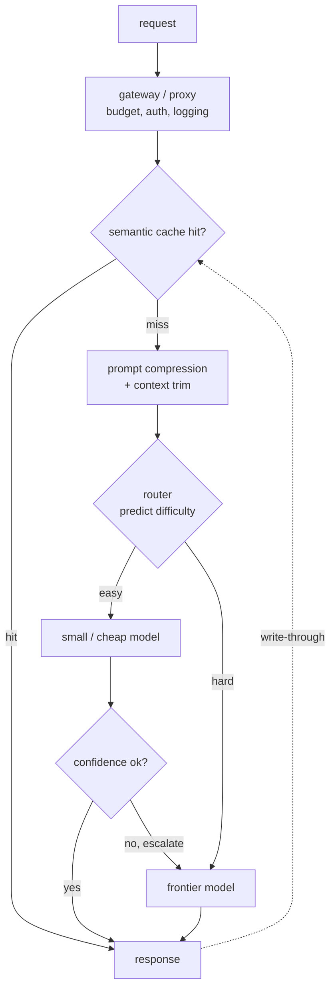

# Cost Optimization and Model Routing

An interviewer rarely says "cut the LLM bill." They say: **"Our LLM feature
shipped and users love it, but the monthly provider bill is now the single
biggest infra line item and finance is asking hard questions. The obvious move,
downgrade everyone to a cheaper model, tanks quality on the hard queries. Walk
me through how you would cut the bill without users noticing the quality drop."**

That is this chapter. The answer is not one trick; it is matching every query
to the cheapest path that still clears the quality bar, by routing, caching,
compression, and right-sizing. Each section builds one piece of that system,
and the production teardowns show how Stanford, LMSYS, Anyscale, IBM, Microsoft,
Databricks, Baseten, Cloudflare, and Uber actually ship it.

## Sections

1. [Clarifying the requirements](01-clarifying-requirements.md) - the dialogue that scopes the problem and surfaces the quality-cost frontier.
2. [Frame the system](02-frame-the-system.md) - where the tokens and dollars actually go; input, output, and the lever that fits each cost driver.
3. [Routing and cascades](03-routing-and-cascades.md) - send easy queries to small models; cascades that score their own answers.
4. [Caching and compression](04-caching-and-compression.md) - semantic caching, prompt compression, and when each pays.
5. [Right-sizing](05-right-sizing.md) - model size vs quality, quantization, distillation, and when to self-host.
6. [Serving and scaling](06-serving-and-scaling.md) - the gateway pattern, batching for cost, and the bottlenecks table.
7. [How teams do it in production](07-how-teams-do-it-in-production.md) - named systems with first-party links and the divergence table.
8. [Interview Q&A](08-interview-qa.md) - commonly asked, tricky, and commonly-answered-wrong, with clear answers.
9. [Summary](09-summary.md) - one-page recap, mermaid, test-yourself, and further reading.

## The whole system on one page

Read the sections in order the first time; each one opens with the question the
interviewer actually asks, then answers it.
