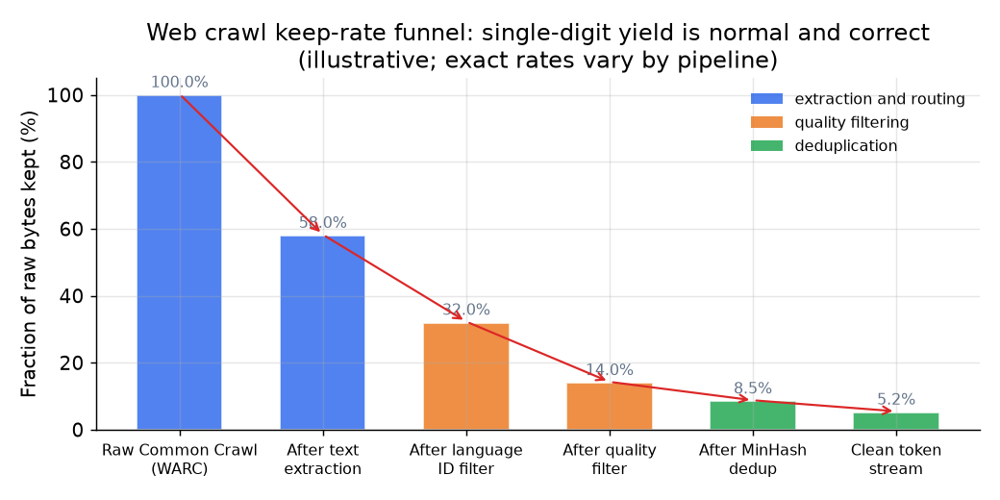

# 2. The data pipeline

The pipeline is a funnel with an ordering that matters. Each stage reduces volume
and raises quality; running them out of order wastes compute and produces a worse
result. The training loop feeds on whatever emerges from the bottom of this funnel,
so every quality deficit in the data becomes a quality ceiling on the model.

## Overview: input, transform, output

```mermaid
flowchart TD
  IN["Input: raw web archives (WARC / WET)\n+ curated corpora\n(books, code, papers, math, licensed data)"]
  IN --> EXT["1. Text extraction\nInput: HTML / WARC bytes\nOutput: plain text per document\nTool: trafilatura-style WARC re-extractor\nDrop: navigation, ads, boilerplate, cookie notices"]
  EXT --> LID["2. Language ID + routing\nInput: plain text documents\nOutput: per-language document streams\nTool: fastText lid.176 or equivalent\nDrop: below-threshold confidence, off-target languages"]
  LID --> QUAL["3. Quality filtering\nInput: on-target documents\nOutput: high-quality subset\nTool: heuristic rules + learned classifier\nDrop: SEO spam, truncated pages, keyword salad, machine filler"]
  QUAL --> DEDUP["4. Deduplication\nInput: quality-filtered documents\nOutput: deduplicated documents\nTool: exact hash + MinHash / LSH fuzzy\nDrop: byte-identical and near-duplicate documents"]
  DEDUP --> PII["5. PII scrub + safety\nInput: deduplicated documents\nOutput: scrubbed documents\nDrop: personal names, emails, phone numbers, flagged content"]
  PII --> DECON["6. Decontamination\nInput: scrubbed documents\nOutput: eval-safe token stream\nTool: n-gram overlap + optional embedding overlap\nDrop: documents that overlap benchmark eval sets"]
  DECON --> MIX["7. Data mixing + curriculum\nInput: per-domain clean streams\nOutput: weighted interleaved token stream\nTool: domain weight schedule + annealing recipe"]
  MIX --> TOK["8. Tokenization\nInput: mixed plain text\nOutput: integer token sequences packed into fixed-length chunks\nTool: BPE (byte-level) or SentencePiece\nFit tokenizer once on a representative sample of the mixture"]
  TOK --> OUT["Output: clean token stream ready for pretraining"]
```

*A typical pipeline keeps a small fraction of raw bytes at each stage. The
single-digit final keep rate is correct: the low-quality majority of the web
is not worth training on, and running the full compute budget on clean tokens
beats running it on dirty ones.*

## Stage notes

**Text extraction.** The web arrives as WARC (raw HTTP responses) or WET
(pre-extracted plaintext) archives from Common Crawl. WET is convenient but
lossy: its generic extractor keeps navigation, boilerplate, and cookie banners.
Pipelines that invest in quality (FineWeb, RefinedWeb) re-extract directly from
WARC with a purpose-built HTML-to-text extractor that strips boilerplate while
keeping article body text. Extraction quality is the load-bearing step: garbage
coming out of extraction inflates duplicate counts, misleads quality filters, and
degrades every downstream result.

**Language ID and routing.** A fastText-style language classifier tags each
document. Documents below the confidence threshold are dropped; the rest are
routed to per-language streams. This routing step is what makes multilingual
pipelines work: filters, deduplication thresholds, and quality classifiers are
then tuned independently per language rather than letting high-resource languages
set thresholds that drown out others (the CCNet insight).

**Quality filtering.** After extraction and language filtering, most remaining
content is still low quality: SEO spam, keyword salad, truncated pages,
machine-generated filler. Two families of filters, used together, address this
(covered in depth in section 3).

**Deduplication.** Near-identical documents dominate the web. A document that
appeared in one Common Crawl dump probably appears, with minor edits, in many
others. Deduplication reduces memorization, closes the main eval-leakage vector,
and stops wasted compute on repeated tokens. Two approaches, both needed (covered
in depth in section 3).

**PII scrub and safety.** Named-entity recognizers and pattern matchers flag
personal names, email addresses, phone numbers, and other personal information
for removal or masking. What the model never sees it cannot regurgitate, which
is both a product safety and a legal requirement.

**Decontamination.** Benchmark questions or passages that sit in training data
inflate every reported number into fiction. Decontamination removes training
documents that overlap eval sets. This step is the integrity gate of the whole
pipeline and should be done before the first training token is generated (covered
in depth in section 3).

**Data mixing and curriculum.** The corpus is not one pile. Web text, code,
books, papers, and math each carry different qualities; each is given a domain
weight. High-value but scarce domains (code, math, papers) are upsampled above
their natural frequency; noisy web text is downsampled. Near the end of
training, the mixture is annealed toward the highest-quality, most-on-target
data, which cheaply sharpens the base before post-training.

**Tokenization.** The tokenizer is fit once, on a representative sample of the
final mixture, before any pretraining runs. Changing it later means training
from scratch. It maps raw text to integer token sequences; those sequences are
packed into fixed-length chunks (with document-boundary masking so attention
does not bleed across documents) and written to disk for the training loop.
Vocabulary size and algorithm are covered in section 4.
