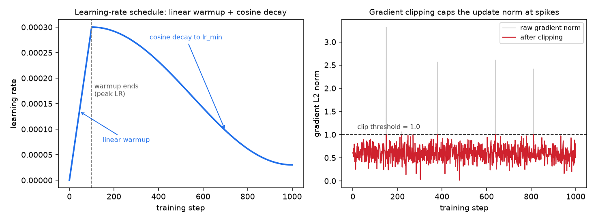
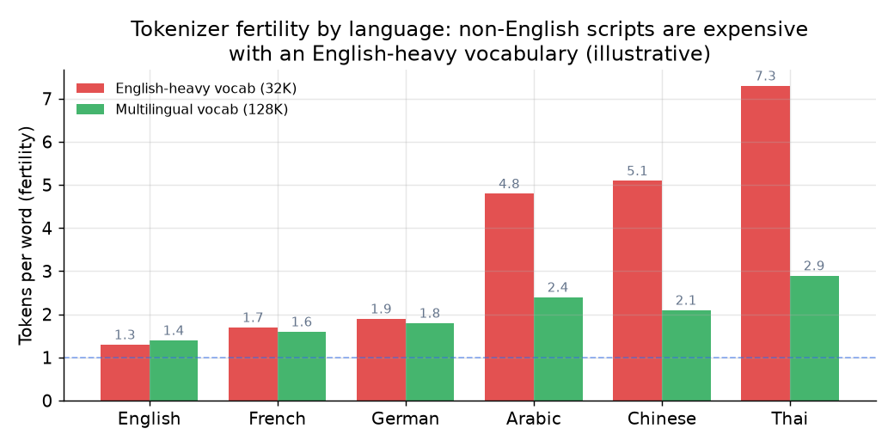
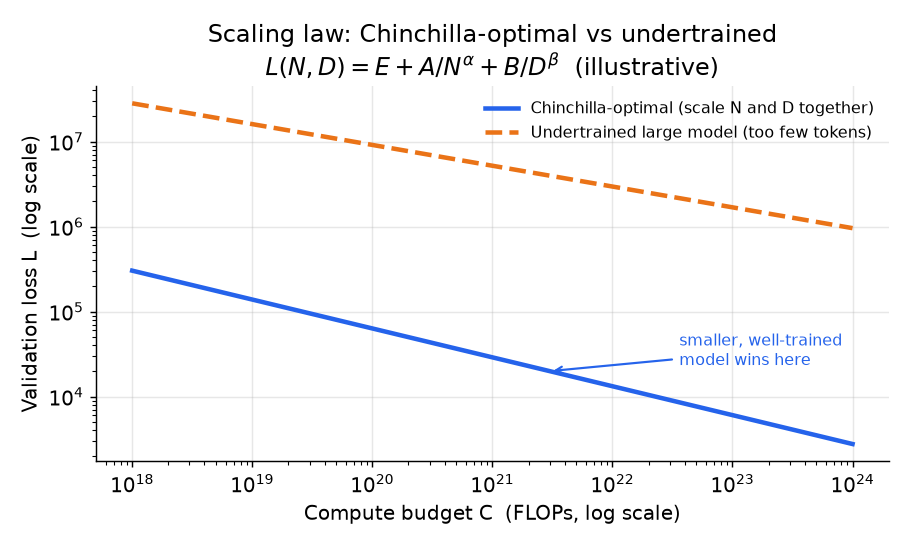
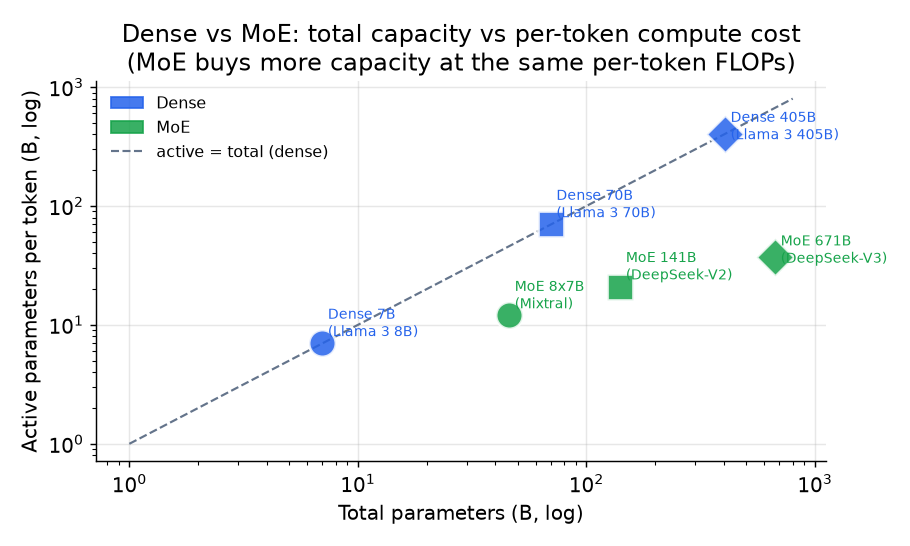

# 4. Pretraining choices

With a clean token stream in hand, the architecture and compute allocation are
second-order decisions compared to data quality. But they are still decisions
with hard consequences: the tokenizer vocabulary, attention variant, and
architecture type are commitments you cannot cheaply undo without retraining.

## The pretraining objective

The objective is a single line. A decoder-only transformer factorizes the
sequence probability autoregressively and minimizes the token-averaged negative
log-likelihood:

$$p_{\theta}(x) = \prod_{t=1}^{T} p_{\theta}(x_t \mid x_{\lt t}), \qquad \mathcal{L}(\theta) = -\frac{1}{T} \sum_{t=1}^{T} \log p_{\theta}(x_t \mid x_{\lt t})$$

Documents are packed into fixed-length sequences with document-boundary masking
so attention does not bleed across unrelated documents. Training is a single pass
(or a small number of passes) over the token budget. Everything hard is the data
feeding this objective and the systems running it.

## Learning-rate schedule: warmup, cosine decay, gradient clipping

The single objective above hides a training-stability recipe that every base
model uses, and that interviewers probe because it separates "read a paper" from
"ran a training job." The learning rate is not constant: it **warms up linearly**
from zero over the first fraction of steps, then **decays on a cosine** to a small
floor.

$$\eta(t) = \begin{cases} \eta_{\max}\dfrac{t}{t_{\text{warm}}} & t < t_{\text{warm}} \\ \eta_{\min} + \tfrac{1}{2}(\eta_{\max}-\eta_{\min})\left(1 + \cos\dfrac{\pi (t - t_{\text{warm}})}{t_{\text{total}} - t_{\text{warm}}}\right) & t \ge t_{\text{warm}} \end{cases}$$

Warmup exists because the first steps have huge, noisy gradients against
randomly-initialized weights; a full learning rate there diverges. Cosine decay
exists because late training wants small steps to settle into a minimum. On top of
the schedule, **gradient clipping** rescales any update whose global L2 norm
exceeds a threshold (typically 1.0), which is the cheap insurance against the loss
spikes that a bad batch would otherwise turn into a divergence.



*Left: linear warmup to the peak learning rate, then cosine decay to a small
floor. Right: gradient clipping leaves normal steps untouched and caps only the
occasional spike at the threshold, so one pathological batch cannot blow up the
run. Illustrative values.*

## Tokenizer: BPE, SentencePiece, and vocabulary size

The tokenizer is fit before pretraining, on a representative sample of the final
mixture. Changing it later means retraining from scratch.

**Byte-level BPE** (GPT-2 onward) starts from raw bytes and greedily merges the
most frequent adjacent pair until reaching the target vocabulary size. Because it
starts from bytes, it can represent any string with no out-of-vocabulary token
ever, which is why it is the default for English-primary models.

The "greedily merges the most frequent pair" step is worth seeing concretely.
Starting from characters, BPE repeatedly finds the most frequent adjacent pair in
the corpus and adds it as a new token, learning an ordered list of merge rules:

```text
corpus:  l o w   l o w   l o w e r   n e w e s t   w i d e s t
merge 1: (e, s) -> es        ...  n e w es t   w i d es t
merge 2: (es, t) -> est      ...  n e w est    w i d est
merge 3: (l, o) -> lo        lo w   lo w   lo w e r  ...
merge 4: (lo, w) -> low      low   low   low e r  ...
```

At encoding time the learned merges are replayed in order, so "lowest" tokenizes
into `low` + `est` rather than six characters. More merges means a larger
vocabulary and fewer tokens per word (lower fertility), which is the tradeoff the
next paragraphs quantify.

**SentencePiece** (BPE or unigram language model) treats input as a raw stream
including whitespace, encoding spaces as a meta-symbol. This makes it reversible
and language-independent, without relying on whitespace pre-tokenization. It is
the default for multilingual models and languages without whitespace delimiters
(Chinese, Japanese, Thai).

**Vocabulary size is a fertility tradeoff, not a free win.** A larger vocabulary
means each token covers more text, so sequences are shorter, training and
inference cost per document drop, and effective context stretches. But a larger
vocabulary means a bigger embedding matrix and output softmax (parameters and
compute that scale with vocabulary size), rarer tokens that are undertrained, and
worse fallback on unseen strings.



*A vocabulary trained primarily on English fragments other scripts into many more
tokens per word. The same content costs more compute and more context window for
Thai or Arabic under an English-heavy vocabulary. Check fertility per language,
not just overall vocabulary size. Multilingual and code-heavy models push to
128K or larger vocabularies to keep fertility down.*

Modern bases run 32K to 256K vocabulary; multilingual and code-heavy models push
higher. **Report fertility per language** (tokens per word), not just vocabulary
size. Perplexity is only comparable across models that share a tokenizer; a
larger vocabulary emits fewer tokens per sentence and flatters perplexity while
being no better. Bits-per-byte removes this artifact.

## Scaling: compute allocation and the Chinchilla result

Before choosing model size or architecture, spend the compute budget on paper.
Training FLOPs are well approximated by:

$$C \approx 6 N D$$

where $N$ is non-embedding parameters and $D$ is training tokens. The achievable
loss follows a power law in both:

$$L(N, D) = E + \frac{A}{N^{\alpha}} + \frac{B}{D^{\beta}}$$

Here $E$ is the irreducible loss (the entropy of text you cannot beat with any
model). Minimizing $L$ subject to fixed compute $C$ gives the Chinchilla result:
$N$ and $D$ should grow together, with $D^{\ast} \approx 20 N^{\ast}$. A 7B
model at compute-optimal wants about 140B tokens.



*Chinchilla-optimal scales parameters and tokens together. Pre-Chinchilla models
were "undertrained large models" (orange): too many parameters, too few tokens.
The Chinchilla-optimal frontier (blue) achieves the same loss at lower compute,
and a smaller, well-trained model also costs less to serve.*

**The senior caveat: Chinchilla-optimal is training-optimal, not
deployment-optimal.** If you will serve the model billions of times, you
deliberately overtrain a smaller model far past 20 tokens per parameter so the
inference cost drops. Llama 3 8B saw roughly 15T tokens, close to 1800 tokens
per parameter, because the serving economics dominate the training cost. State
which cost you are minimizing before quoting a ratio.

## Architecture: dense versus mixture-of-experts

The base architecture is a pre-norm decoder-only transformer. The choices that
matter at pretraining time:

**Attention variant.** Multi-head attention (MHA) is the original; it has
$n_{\text{heads}}$ query, key, and value heads, all of dimension
$d_{\text{head}}$. Multi-query attention (MQA) collapses key and value to a
single head per layer, drastically shrinking the KV cache at serving time at
some quality cost. Grouped-query attention (GQA, used in Llama 3 and most modern
bases) is the compromise: $n_{\text{kv}}$ key/value head groups, fewer than
$n_{\text{heads}}$ query heads, shrinking the KV cache by
$n_{\text{heads}} / n_{\text{kv}}$ with near-MHA quality. GQA is now the
default and should be your answer unless the question forces a specific tradeoff.

**Positional encoding.** Learned absolute positions (GPT-2) do not generalize
beyond training length. Rotary position embeddings (RoPE, used in Llama and most
modern bases) encode relative position in the rotation of key and query vectors
and generalize better. Critically, RoPE makes late-stage context extension cheap:
rescale RoPE frequencies plus a short continued-training on long documents
(YaRN-style) can extend context from 4K to 128K tokens at a fraction of
pretraining cost. This is a training-time decision with a serving payoff.

**Normalization and activation.** Pre-norm with RMSNorm (rather than LayerNorm)
plus SwiGLU MLPs are the modern defaults for training stability and quality.

**Dense versus mixture-of-experts.** A dense transformer has one set of MLP
weights activated for every token. A mixture-of-experts (MoE) model replaces the
dense MLP with $E$ experts and a router that sends each token to the top-$k$
experts. Total parameters (capacity) grow while per-token FLOPs (cost) stay
approximately flat:

$$g(x) = \text{softmax}(x W_g), \qquad y = \sum_{i \in \text{top-}k(g)} g_i(x) \cdot E_i(x)$$

The failure mode is routing collapse: all tokens pile onto a few experts, leaving
the rest idle. The classic fix adds an auxiliary load-balancing loss:

$$\mathcal{L}_{\text{aux}} = \lambda E \sum_{i=1}^{E} f_i P_i$$

where $f_i$ is the fraction of tokens routed to expert $i$ and $P_i$ is the mean
gate mass for expert $i$. DeepSeek-V3 instead uses auxiliary-loss-free balancing
(a learned per-expert bias nudges routing without gradient interference).



*MoE buys a larger model (total parameters) at the same per-token FLOPs (active
parameters). DeepSeek-V3 achieves 671B total parameters with only about 37B
active per token. But every expert still sits in VRAM, and routing adds
all-to-all communication traffic. MoE is a memory-and-systems win, not a free
lunch.*

## When to use which

| Reach for | When | Instead of |
|---|---|---|
| Dense transformer (Llama 3, OLMo) | Serving VRAM is tight, you want the simplest parallelism, or predictable per-token cost | MoE, when you need more capacity than the per-token FLOP budget allows |
| MoE (DeepSeek-V3, Mixtral) | You want frontier capacity at a small active FLOP count on a constrained compute budget | Dense, when VRAM to hold all experts or all-to-all routing is the binding constraint |
| GQA attention (Llama 3, Mistral) | You want a cheap KV cache at serve time with near-MHA quality; commit at pretraining | MQA, unless the serving budget demands an even smaller cache; MHA, unless quality headroom is unlimited |
| RoPE positional encoding | You plan to extend context late in training without retraining long from the start | Learned absolute positions, which do not generalize beyond training length |
| Chinchilla-optimal sizing (about 20 tokens/parameter) | A fixed training budget and you are minimizing training compute for a target loss | Overtraining a smaller model, which is what you want when you will serve at scale |
| Overtrained smaller model (Llama 3 8B at 15T tokens) | You will serve billions of tokens per day and inference cost dominates training cost | Chinchilla-optimal, which minimizes training compute but ignores serving |
| Larger vocabulary (128K or more) | Multilingual or code-heavy mix with high fertility for non-English scripts | A 32K vocabulary for a narrow English base, where a larger vocab undertrains rare tokens |

**Provenance.** The dense backbone is the Transformer (Google, 2017) and the sparse variant descends from GShard and Switch Transformer MoE (Google); cheap-KV attention is GQA (Google, 2023) or its extreme MQA (Google, 2019), and positions use RoPE (RoFormer, Su et al., 2021). The tokenizer is BPE (Sennrich et al., 2016), its byte-level form byte-level BPE (OpenAI GPT-2), or SentencePiece (Google), and the sizing rules come from neural scaling laws (OpenAI, 2020) and Chinchilla (DeepMind, 2022).

**Tools.** Tokenizers come from the Hugging Face tokenizers library (byte-level BPE) and SentencePiece (Google), which ships both the BPE and unigram-language-model variants used for whitespace-free scripts. The dense-versus-MoE architecture, GQA attention, RoPE, RMSNorm, and SwiGLU are all expressed directly in Hugging Face Transformers model definitions, while large-scale training frameworks such as Megatron-LM (NVIDIA), DeepSpeed (Microsoft), and the fully open OLMo stack implement the parallelism, learning-rate schedule, and load-balancing losses these choices imply. MoE routing with auxiliary-loss-free balancing is available in the open DeepSeek-V3 and Mixtral reference implementations.

**Worked example.** A team pretraining a 7B base that they intend to serve at very high volume first fixes the tokenizer, choosing byte-level BPE for an English-primary mix so no string is ever out-of-vocabulary, and sizing the vocabulary near 32K rather than 128K because the corpus is not multilingual and a bigger vocab would undertrain rare tokens. They pick a dense transformer over MoE because serving VRAM is tight and predictable per-token cost matters more than raw capacity, and they commit to GQA plus RoPE at pretraining so the KV cache is cheap and context can be extended later without training long from the start. On sizing, they deliberately reject Chinchilla-optimal (about 20 tokens per parameter) and overtrain far past it, since inference cost will dominate training cost over the model's life. Warmup, cosine decay, and gradient clipping at norm 1.0 hold the run stable throughout.

> **Open validated graphs.** Browse real architecture choices at production scale
> in the [Model Zoo](https://github.com/neurarch-ai/awesome-llm-model-zoo): GPT-2
> small (byte-level BPE, dense), OLMo 7B (the fully open base with documented
> data recipe), Llama 3 8B (GQA + RoPE + RMSNorm at production scale), and
> DeepSeek-V3 (MoE routing with 671B total and 37B active parameters per token).
