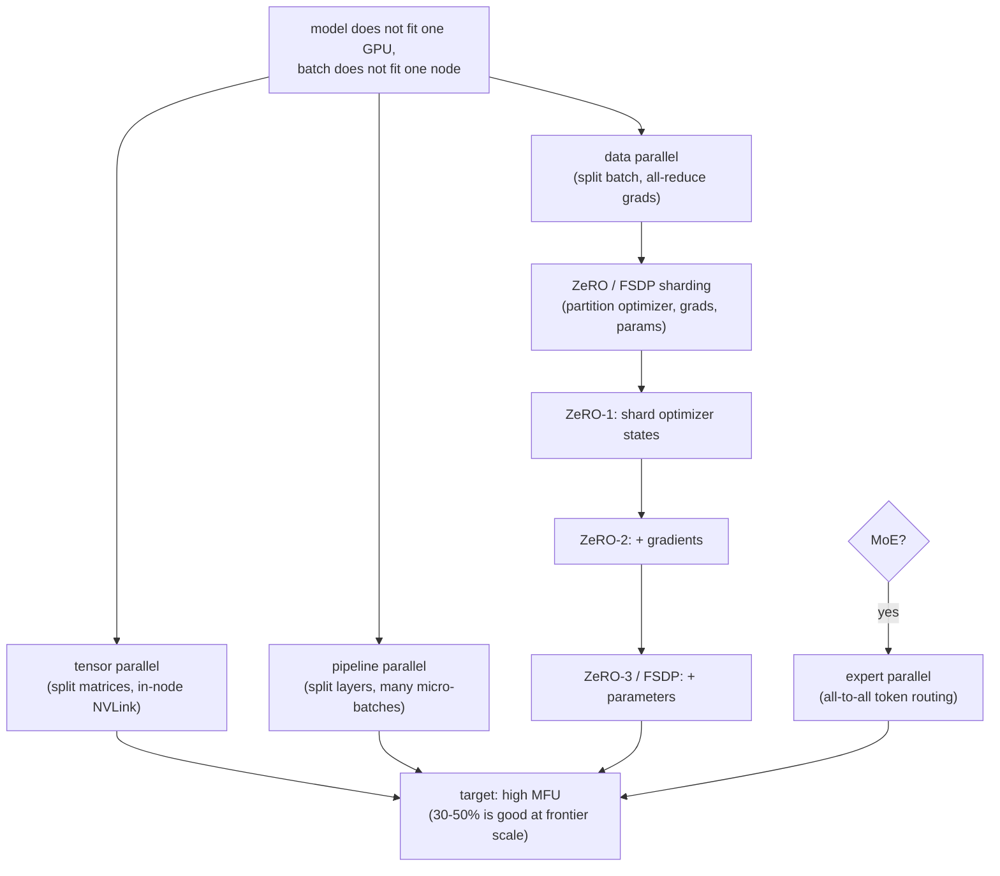

# 5. Systems

A frontier model does not fit on one GPU, and training one on a single device
would take centuries. The objective is one line; the systems problem is fitting
the model across thousands of GPUs, keeping them busy (high MFU, model FLOPs utilization: the fraction of a GPU's peak compute actually used), and keeping
the run alive for weeks on hardware that fails every few hours.

## Why FLOPs are not the bottleneck

The number candidates cite as the constraint is almost always FLOPs. The actual
bottleneck is **interconnect and memory bandwidth**. A well-tuned frontier run
achieves 30 to 50 percent model-FLOPs utilization (MFU): the gap to 100 percent
is communication overhead, pipeline bubbles, and memory stalls. Adding faster
compute you cannot feed does nothing; the parallelism plan and the network
decide MFU.

## Parallelism axes

Training uses a combination of up to four parallelism axes at once:

**Data parallelism (DP).** Replicate the model across workers, split the batch,
and all-reduce gradients each step. Simple and scales throughput. The problem:
every replica holds a full copy of the model and optimizer state. A 70B model
with mixed-precision Adam (2 bytes fp16 weights + 2 bytes fp16 gradients + 12
bytes fp32 master weights and moments) costs 16 bytes per parameter, over 1 TB
for 70B parameters, which no single GPU holds. ZeRO and FSDP attack this wall.

**Tensor parallelism (TP, Megatron-LM).** Split individual weight matrices
across GPUs: each GPU does part of every matmul, and an all-reduce assembles the
full result. A layer too large for one GPU's VRAM can now fit. The cost:
high-bandwidth all-reduce inside every layer, so TP is kept within a node on
NVLink, not across the slower inter-node network.

**Pipeline parallelism (PP).** Split layers into stages on different GPUs and
stream micro-batches through like an assembly line. The cost is the **pipeline
bubble**: idle time while the pipe fills and drains. With $p$ stages and $m$
micro-batches per step:

$$\text{bubble fraction} = \frac{p - 1}{m + p - 1}$$

```python
def bubble_fraction(p, m):             # p: pipeline stages, m: micro-batches per step
    return (p - 1) / (m + p - 1)       # idle fraction while the pipe fills and drains
# many micro-batches shrink it; e.g. bubble_fraction(p=8, m=64) -> 0.0986 (approx)
```

Using many micro-batches ($m \gg p$) keeps the bubble small. Interleaved
schedules (1F1B) reduce it further.

**Expert parallelism (EP), for MoE only.** Place different experts on different
GPUs. Routing becomes an all-to-all that shuffles tokens to their expert and
back. This is the extra communication MoE pays for its parameter efficiency.

## Memory sharding: ZeRO and FSDP

Plain data parallelism replicates the full 16-bytes-per-parameter optimizer
footprint on every GPU. **ZeRO** (DeepSpeed) partitions that footprint instead:

- **ZeRO-1:** shard optimizer states (12 bytes of fp32 master weights and Adam
  moments) across $N_d$ data-parallel ranks.
- **ZeRO-2:** additionally shard gradients (2 bytes fp16).
- **ZeRO-3:** additionally shard parameters (2 bytes fp16), gathering each
  layer's weights on demand for forward and backward, then discarding them.

Per-GPU memory in ZeRO-3 falls toward:

$$M_{\text{gpu}} \approx \frac{16\,\Psi}{N_d}$$

```python
def zero3_mem_bytes(psi, n_d):         # psi: total params, n_d: data-parallel ranks
    return 16 * psi / n_d              # 16 B/param (fp16 weights + grads + fp32 master + Adam moments), sharded
# e.g. a 70B model over 64 ranks: zero3_mem_bytes(70e9, 64) -> 1.75e10  (~17.5 GB/GPU)
```

where $\Psi$ is total parameters and $N_d$ is the number of data-parallel ranks.
The cost is extra all-gather and reduce-scatter communication each step, which
you overlap with compute on fast links to protect MFU.

**PyTorch FSDP** (Fully Sharded Data Parallel) is the native-PyTorch realization
of ZeRO-3-style sharding. It all-gathers a unit's parameters just before use and
frees them right after. This is how a model far larger than one GPU's memory
trains on commodity data-parallel clusters.

## Mixed precision

Training in fp32 throughout is stable but wastes memory and bandwidth. Standard
mixed-precision training keeps fp32 master weights and Adam moments (for
numerical stability) but uses fp16 or bf16 for forward and backward passes.
bf16 is preferred because it has the same exponent range as fp32 (no loss
scaling needed) at the cost of lower mantissa precision.

**FP8** (used by DeepSeek-V3) halves the bytes moved for activations and
inter-GPU communication versus bf16. At scale, where the bottleneck is
interconnect, not compute, this is a large throughput win. FP8 requires careful
scaling management to avoid numerical instability; stay on bf16 when stability
matters more than throughput.

## Checkpointing and failure recovery

A multi-week run on thousands of GPUs will hit hardware failures and will hit
training instabilities. The run is a fault-tolerant distributed system, not a
single `.fit()` call.

**Checkpoint frequently and cheaply.** Write model, optimizer, and data-loader
state at a fixed interval. Asynchronous and sharded writes keep the checkpoint
from stalling training. The data-loader position matters: on resume, you must
neither re-feed nor skip tokens. The checkpoint interval is sized so that
expected wasted work on a failure (mean time between failures times fraction
lost) is acceptable.

**Detect and recover from loss spikes.** Loss occasionally spikes due to a bad
batch, numerical instability, or an unlucky interaction. The standard recovery:
roll back to the last good checkpoint, skip or reshuffle the offending data
batches, and optionally lower the learning rate or tighten gradient clipping
through the rough patch. Bake this into the training harness; at scale it is
routine, not an incident.

**Elastic and redundant training.** At cluster scale, interruptions are frequent
enough that automated detection and restart are core parts of the system. The
Llama 3 writeup documents exactly this: hot spares or elastic schedulers that
drop a failed node and continue on the survivors are standard practice, not
afterthoughts.

Naming failure recovery unprompted is a strong senior signal. Candidates who
describe pretraining as "call the training loop for three weeks" have never run
one.

## Combining the axes: the 3D/4D parallelism plan

The practical plan stacks multiple axes, chosen by which constraint binds:



**How it works.** The plan starts from the binding constraint: the model does not
fit one GPU and the batch does not fit one node. That single problem forks into
three parallelism axes applied together. Tensor parallelism splits weight
matrices inside a node over fast NVLink, pipeline parallelism splits layers into
stages fed by many micro-batches to keep the bubble small, and data parallelism
splits the batch and all-reduces gradients. The data-parallel branch then hands
off to memory sharding, layering ZeRO/FSDP from ZeRO-1 (optimizer states) to
ZeRO-2 (plus gradients) to ZeRO-3 (plus parameters) as the memory wall demands.
A separate flag adds expert parallelism with all-to-all token routing only when
the architecture is MoE. Every branch converges on the same target, high MFU
(30 to 50 percent is good at frontier scale), which is the metric the whole plan
is tuned against.

## When to use which

| Reach for | When | Instead of |
|---|---|---|
| Tensor parallelism (Megatron) | A single layer does not fit one GPU's VRAM | Cross-node TP, which needs NVLink speeds; TP across the slow network kills MFU |
| Pipeline parallelism | The full model stack does not fit even after TP; use many micro-batches to shrink the bubble | Too few micro-batches ($m$ close to $p$), where the bubble dominates |
| ZeRO-1 or ZeRO-2 | The optimizer state is the memory wall but you want to minimize extra communication | ZeRO-3 / FSDP unless the parameter shard communication is acceptable |
| ZeRO-3 / FSDP | The model parameters themselves do not fit a single GPU even with TP | ZeRO-1/2, when optimizer state alone is the wall and parameter all-gather overhead matters |
| Expert parallelism | The MoE architecture forces you to spread experts across devices | Dense parallelism plans, since EP adds all-to-all traffic you must overlap carefully |
| FP8 precision (DeepSeek-V3) | Frontier-scale run where halving activation and communication bytes buys throughput | bf16 with fp32 master weights, when numerical stability is more important than throughput |
| Frequent sharded checkpointing | Multi-week run where hardware failures are expected (always at cluster scale) | Infrequent checkpointing; size the interval against the mean time between failures |
| Activation checkpointing | Memory is the wall after all sharding is applied | Recomputing activations when latency matters more than memory |

**Provenance.** Tensor and pipeline parallelism originate in Megatron-LM (NVIDIA); optimizer, gradient, and parameter sharding are ZeRO (Microsoft), whose ZeRO-3-style parameter sharding is realized natively as FSDP (Meta).

**Tools.** Tensor and pipeline parallelism are implemented in Megatron-LM (NVIDIA) and its NeMo packaging, and reused by many stacks on top. Optimizer, gradient, and parameter sharding come from ZeRO in DeepSpeed (Microsoft) or from PyTorch FSDP (Meta), which is the native realization of ZeRO-3-style sharding. FP8 activation and communication paths are exposed through Transformer Engine (NVIDIA), while activation checkpointing and the mixed-precision autocast are built into PyTorch itself. Expert parallelism ships inside the same Megatron and DeepSpeed MoE code paths.

**Worked example.** A team pretraining a 70B dense model whose single layer already overflows one GPU's VRAM starts with tensor parallelism kept inside an NVLink node, since running that all-reduce across the slow inter-node network would collapse MFU. If the full stack still does not fit, they add pipeline parallelism with many micro-batches so the bubble fraction stays small, rather than a few micro-batches where the bubble dominates. The optimizer state is the remaining wall, so they reach for ZeRO-3 or FSDP to shard parameters as well, accepting the extra all-gather traffic because ZeRO-1 or ZeRO-2 alone would not fit the parameters. They stay on bf16 with fp32 master weights because stability matters more than the throughput FP8 would buy at this scale, and they checkpoint frequently with sharded asynchronous writes sized against the cluster's mean time between failures.
