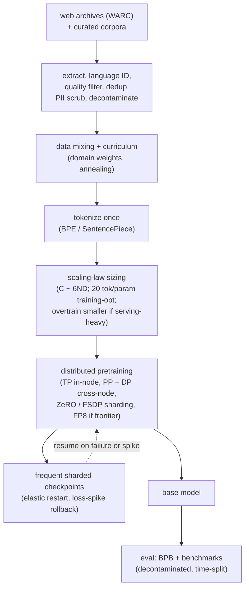

# 9. Summary

## One-page recap

- **Almost no one should pretrain from scratch.** Continue-pretraining an open
  base (Llama 3, OLMo, Mistral) covers the vast majority of real-world needs.
  From-scratch pretraining is justified only by a new language, a new modality,
  a new tokenizer, or a capability genuinely absent from every open model. Say
  this before designing anything.

- **Data is the capability ceiling.** Model quality is bounded by data quality
  long before it is bounded by architecture. Raw Common Crawl is mostly boilerplate,
  spam, and near-duplicates. The pipeline keeps a small fraction, often
  single-digit percentages, and training on the clean minority beats training on
  the dirty majority. Extraction, filtering, and dedup are the work; the
  objective is one line.

- **The pipeline has an ordering that matters.** Extraction quality is upstream
  of every filter; garbage extraction poisons every downstream step. Dedup and
  quality filtering are the two highest-leverage steps. Decontamination is the
  integrity gate and must happen before the first training token.

- **Decontamination is not optional.** Any headline benchmark without a
  decontamination claim is suspect. Remove training documents that overlap eval
  sets by n-gram overlap, report the rate, and lead with this unprompted.

- **The compute budget sizes the run before architecture talk.** $C \approx 6ND$;
  Chinchilla-optimal gives $D^{\ast} \approx 20 N^{\ast}$. But Chinchilla
  minimizes training compute, not lifetime cost. If you serve at scale, overtrain
  a smaller model far past 20 tokens per parameter so inference stays cheap
  forever.

- **The tokenizer is a fertility decision.** An English-heavy vocabulary
  fragments other scripts into many more tokens per word, costing more compute
  and more context per document. Check fertility per language and report
  bits-per-byte (BPB), not perplexity, when comparing models with different
  vocabularies.

- **The run is a distributed-systems problem, not a `.fit()` call.** Tensor
  parallelism splits matrices in-node (NVLink speeds); pipeline parallelism
  splits layers across nodes with many micro-batches to shrink the bubble;
  ZeRO / FSDP partitions the optimizer footprint instead of replicating it.
  The bottleneck is interconnect and memory bandwidth, not FLOPs. Frequent
  sharded checkpoints, elastic restart, and loss-spike rollback are core, not
  afterthoughts.

## The system on one page

## Test yourself

1. A team proposes pretraining a 7B model from scratch for a new enterprise
   document domain. What is the first question you ask, and what is the likely
   right answer?
2. After running the pipeline, your team notices the keep rate is only 4% of raw
   Common Crawl bytes. Is this a problem? Why or why not?
3. Your held-out perplexity is lower than a competitor's published number. Does
   that mean your model is better? What would you need to verify first?
4. The scaling team says "Chinchilla-optimal for our 7B model is 140B tokens,
   so we should stop there." You are planning heavy production serving. How do
   you respond?
5. Mid-training, the loss spikes sharply at step 52K and then begins diverging.
   Walk through your recovery procedure step by step.
6. A colleague wants to put tensor parallelism across data center racks to scale
   to a 200-rank TP group. What goes wrong, and what would you do instead?

## Further reading

- Dense reference (all case studies, full math, comparison diagrams):
  [topics/14-data-curation-and-pretraining.md](../../topics/14-data-curation-and-pretraining.md).
- Open base models with documented data pipelines:
  [OLMo / Dolma (Ai2)](https://arxiv.org/abs/2402.00838),
  [Llama 3 (Meta)](https://ai.meta.com/research/publications/the-llama-3-herd-of-models/),
  [Pythia (EleutherAI)](https://arxiv.org/abs/2304.01373).
- Trace the architecture choices committed at pretraining in the
  [Model Zoo](https://github.com/neurarch-ai/awesome-llm-model-zoo):
  GPT-2 small (byte-level BPE, dense),
  OLMo 7B (fully open pipeline),
  Llama 3 8B (GQA + RoPE + RMSNorm),
  DeepSeek-V3 (MoE routing at frontier scale).
