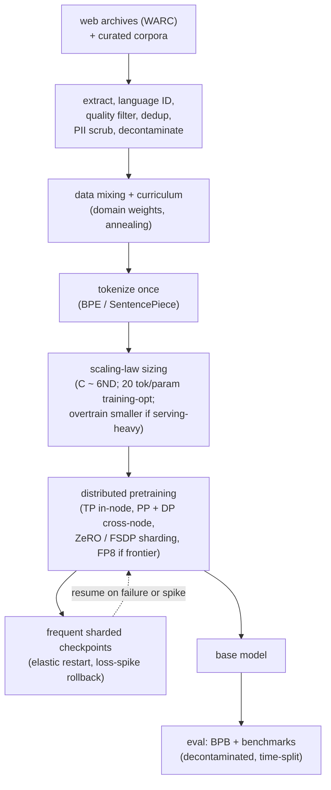

# 9. Summary

## One-page recap

- **Almost no one should pretrain from scratch.** Continue-pretraining an open
  base (Llama 3, OLMo, Mistral) covers the vast majority of real-world needs.
  From-scratch pretraining is justified only by a new language, a new modality,
  a new tokenizer, or a capability genuinely absent from every open model. Say
  this before designing anything.

- **Data is the capability ceiling.** Model quality is bounded by data quality
  long before it is bounded by architecture. Raw Common Crawl is mostly boilerplate,
  spam, and near-duplicates. The pipeline keeps a small fraction, often
  single-digit percentages, and training on the clean minority beats training on
  the dirty majority. Extraction, filtering, and dedup are the work; the
  objective is one line.

- **The pipeline has an ordering that matters.** Extraction quality is upstream
  of every filter; garbage extraction poisons every downstream step. Dedup and
  quality filtering are the two highest-leverage steps. Decontamination is the
  integrity gate and must happen before the first training token.

- **Decontamination is not optional.** Any headline benchmark without a
  decontamination claim is suspect. Remove training documents that overlap eval
  sets by n-gram overlap, report the rate, and lead with this unprompted.

- **The compute budget sizes the run before architecture talk.** $C \approx 6ND$;
  Chinchilla-optimal gives $D^{\ast} \approx 20 N^{\ast}$. But Chinchilla
  minimizes training compute, not lifetime cost. If you serve at scale, overtrain
  a smaller model far past 20 tokens per parameter so inference stays cheap
  forever.

- **The tokenizer is a fertility decision.** An English-heavy vocabulary
  fragments other scripts into many more tokens per word, costing more compute
  and more context per document. Check fertility per language and report
  bits-per-byte (BPB), not perplexity, when comparing models with different
  vocabularies.

- **The run is a distributed-systems problem, not a `.fit()` call.** Tensor
  parallelism splits matrices in-node (NVLink speeds); pipeline parallelism
  splits layers across nodes with many micro-batches to shrink the bubble;
  ZeRO / FSDP partitions the optimizer footprint instead of replicating it.
  The bottleneck is interconnect and memory bandwidth, not FLOPs. Frequent
  sharded checkpoints, elastic restart, and loss-spike rollback are core, not
  afterthoughts.

## The system on one page

```mermaid
flowchart TD
  SRC["web archives (WARC)<br/>+ curated corpora"] --> PREP["extract, language ID,<br/>quality filter, dedup,<br/>PII scrub, decontaminate"]
  PREP --> MIX["data mixing + curriculum<br/>(domain weights, annealing)"]
  MIX --> TOK["tokenize once<br/>(BPE / SentencePiece)"]
  TOK --> SIZE["scaling-law sizing<br/>(C ~ 6ND; 20 tok/param training-opt;<br/>overtrain smaller if serving-heavy)"]
  SIZE --> PT["distributed pretraining<br/>(TP in-node, PP + DP cross-node,<br/>ZeRO / FSDP sharding, FP8 if frontier)"]
  PT --> CKPT["frequent sharded checkpoints<br/>(elastic restart, loss-spike rollback)"]
  PT --> BASE["base model"]
  CKPT -.resume on failure or spike.-> PT
  BASE --> EVAL["eval: BPB + benchmarks<br/>(decontaminated, time-split)"]
```

## Test yourself

Answers are collapsed. Attempt each question before opening one.

1. A team proposes pretraining a 7B model from scratch for a new enterprise
   document domain. What is the first question you ask, and what is the likely
   right answer?

   

Answer

   Ask "are we genuinely pretraining from scratch, or continue-pretraining an
   existing open base?", and the likely right answer is **continue-pretrain an
   open base** (Llama 3, OLMo, Mistral). From-scratch pretraining is justified by
   exactly four things: the target language has no adequate open base, the
   modality is new, the tokenizer must differ from every open one, or a capability
   genuinely absent from all open models is required. A new enterprise document
   domain is none of those; it is a domain gap, which continued pretraining on
   ~30B domain tokens over tens of GPUs closes for a tiny fraction of the cost.
   Saying this unprompted, then proceeding under the interviewer's framing, is the
   first senior signal in the whole question (section
   [1](01-clarifying-requirements.md), reinforced in
   [8](08-interview-qa.md)). The left column of
   [10](10-putting-it-together.md) shows what that build looks like concretely:
   the tokenizer, architecture, and parallelism plan are inherited, and all the
   effort goes into curation, with decontamination the one row that never shrinks.

   

2. After running the pipeline, your team notices the keep rate is only 4% of raw
   Common Crawl bytes. Is this a problem? Why or why not?

   

Answer

   Not a problem: **a single-digit keep rate is the design, not a failure**. Raw
   Common Crawl is mostly boilerplate, spam, and near-duplicates, and training the
   full compute budget on the clean minority beats training it on the dirty
   majority. The illustrative funnel in [10](10-putting-it-together.md) lands near
   2% end to end (about 20% surviving extraction, 60% of that on-target after
   language ID, 30% of that past quality filters, 50% of that past dedup), so 4%
   sits comfortably inside the expected band. What is worth checking is *where*
   the drop happened rather than how large it is: a collapse concentrated at
   extraction usually means the extractor is producing garbage, which then
   inflates duplicate counts and misleads every downstream filter (section
   [2](02-the-data-pipeline.md)). Also confirm the funnel still delivers the token
   budget the run needs; if it does not, the fix is more sources or up to roughly
   four epochs of repetition, not a looser filter (section
   [4](04-pretraining-choices.md)).

   

3. Your held-out perplexity is lower than a competitor's published number. Does
   that mean your model is better? What would you need to verify first?

   

Answer

   No. **Perplexity is only comparable across models that share a tokenizer.** A
   model with a larger vocabulary emits fewer tokens per sentence, so the same
   total surprisal is averaged over fewer positions and the reported number drops
   with no real modeling gain. Verify three things before claiming anything: that
   both models use the same tokenizer, that both are evaluated on the same
   held-out set, and that both training corpora were decontaminated against that
   set, since contamination can only push a score in the flattering direction.
   The tokenizer-invariant comparison is **bits-per-byte**,
   $\text{BPB} = \frac{\mathcal{L}}{\ln 2} \cdot \frac{n_{\text{tokens}}}{n_{\text{bytes}}}$,
   which normalizes by raw bytes, a quantity no tokenizer choice can change
   (section [6](06-evaluation-and-scaling.md)). Serious pretraining papers report
   both, and the same fertility artifact seen from the other direction is why
   vocabulary size is a tradeoff rather than a free win (section
   [4](04-pretraining-choices.md)).

   

4. The scaling team says "Chinchilla-optimal for our 7B model is 140B tokens,
   so we should stop there." You are planning heavy production serving. How do
   you respond?

   

Answer

   Chinchilla is right about the wrong objective: $D^{\ast} \approx 20 N^{\ast}$
   minimizes **training compute** for a target loss, and a model served billions
   of times a day has a second, larger lifetime cost that the rule ignores. Under
   heavy serving the deployment-optimal point is a smaller model overtrained far
   past 20 tokens per parameter, because extra training FLOPs are paid once while
   the lower per-token inference cost is collected forever. Llama 3 8B is the
   precedent at roughly 15T tokens, about 1800 tokens per parameter, and this
   chapter's own build spends the same $C \approx 6ND = 6 \times 10^{22}$ FLOPs on
   a 7B model at about 1.4T tokens (roughly 200 tokens per parameter) instead of
   the Chinchilla-optimal 22B on 450B, accepting worse loss per training FLOP for
   roughly 3x better cost per served token. The honest caveat is token supply:
   overtraining assumes you have the unique tokens, and past roughly four epochs
   of repetition each additional repeat adds almost nothing. State which cost you
   are minimizing before quoting any ratio (sections
   [4](04-pretraining-choices.md) and [10](10-putting-it-together.md)).

   

5. Mid-training, the loss spikes sharply at step 52K and then begins diverging.
   Walk through your recovery procedure step by step.

   

Answer

   In order. **One, roll back to the last good checkpoint before the spike**, and
   restore optimizer state along with the weights: rewinding weights alone
   re-diverges because the Adam second-moment estimates are already corrupted.
   **Two, identify and skip or reshuffle the data batches around step 52K**, since
   a pathological batch interacting with a large adaptive-optimizer step is the
   usual trigger. **Three, soften the schedule through the rough region**: lower
   the peak learning rate or tighten gradient clipping, which normally sits at
   global L2 norm 1.0 and is the cheap insurance against exactly this. **Four,
   confirm the data loader resumes at the correct position** so you neither
   re-feed nor skip tokens. **Five, resume and watch the loss and gradient-norm
   alarms** through the region you just replayed. This is routine tooling baked
   into the harness before the run starts, not an incident response (sections
   [5](05-systems.md) and [8](08-interview-qa.md)); a run that needs a human for
   every spike will not survive weeks on hardware that fails every few hours.

   

6. A colleague wants to put tensor parallelism across data center racks to scale
   to a 200-rank TP group. What goes wrong, and what would you do instead?

   

Answer

   Tensor parallelism issues a **high-bandwidth all-reduce inside every layer**,
   and that all-reduce sits on the critical path where it cannot be hidden behind
   compute, so TP only works at NVLink speeds inside a node. Stretched across
   racks it runs on the slow inter-node network and collapses MFU, which is the
   metric the whole parallelism plan is tuned against (30 to 50 percent is good at
   frontier scale, and the gap to 100 percent is already communication overhead).
   Instead, keep TP within a node and scale outward on the axes that tolerate
   slower links: **pipeline parallelism across nodes** with many micro-batches, so
   the bubble fraction $\frac{p-1}{m+p-1}$ stays small at $m \gg p$, plus **data
   parallelism with ZeRO/FSDP sharding** when the memory wall is the optimizer
   footprint of 16 bytes per parameter rather than a single oversized layer. Reach
   for TP only when one layer genuinely overflows one GPU's VRAM, and only in-node
   (sections [5](05-systems.md) and [10](10-putting-it-together.md)). At 7B no TP
   or PP is needed at all: FSDP alone puts the persistent footprint near 1.75 GB
   per GPU over 64 ranks.

   

## Further reading

- The capstone: [the complete build](10-putting-it-together.md), where every
  choice in this chapter is committed once for the scenario, costed, rebuilt
  under two other constraint sets, and compressed into a runnable one-file MinHash dedup.
- Dense reference (all case studies, full math, comparison diagrams):
  [topics/14-data-curation-and-pretraining.md](../../topics/14-data-curation-and-pretraining.md).
- Open base models with documented data pipelines:
  [OLMo / Dolma (Ai2)](https://arxiv.org/abs/2402.00838),
  [Llama 3 (Meta)](https://ai.meta.com/research/publications/the-llama-3-herd-of-models/),
  [Pythia (EleutherAI)](https://arxiv.org/abs/2304.01373).
- Trace the architecture choices committed at pretraining in the
  [Model Zoo](https://github.com/neurarch-ai/awesome-llm-model-zoo):
  GPT-2 small (byte-level BPE, dense),
  OLMo 7B (fully open pipeline),
  Llama 3 8B (GQA + RoPE + RMSNorm),
  DeepSeek-V3 (MoE routing at frontier scale).
