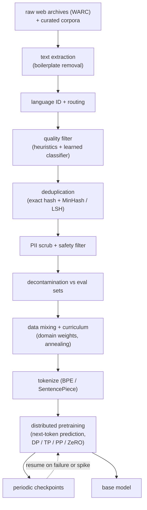

# Data Curation and Pretraining

An interviewer rarely says "design a pretraining pipeline." They say **"a frontier
lab has handed you the budget to build a base model from scratch: thousands of GPUs,
a few months, and the whole open web plus some licensed corpora. Walk me through
how you turn a petabyte of raw Common Crawl into a clean token stream, how you
decide the model size and token budget, and how you actually run the training job
across a cluster without the loss diverging or the run dying every six hours."**

That is this chapter. It covers the two things weak answers skip: **how the data
gets clean** and **how the run stays alive.** The objective (next-token
cross-entropy) is one line; the engineering is everything around it.

## Sections

1. [Clarifying the requirements](01-clarifying-requirements.md) - the dialogue that
   scopes the problem, plus the two consequences that follow immediately.
2. [The data pipeline](02-the-data-pipeline.md) - sourcing, extraction, language ID,
   filtering, dedup, decontamination, tokenization, and mixing.
3. [Data quality](03-data-quality.md) - heuristic versus learned filters,
   deduplication at scale, and decontamination; with a "when to use which" table.
4. [Pretraining choices](04-pretraining-choices.md) - dense versus MoE, attention
   variant, positional encoding, scaling laws, and training versus inference optimal;
   with a "when to use which" table and KaTeX for the key formulas.
5. [Systems](05-systems.md) - distributed training, precision, parallelism axes,
   ZeRO and FSDP, checkpointing and failure recovery; with a "when to use which"
   table.
6. [Evaluation and scaling](06-evaluation-and-scaling.md) - perplexity versus
   bits-per-byte, benchmark decontamination, and the bottlenecks table.
7. [How teams do it in production](07-how-teams-do-it-in-production.md) - divergence
   table of named systems plus first-party links.
8. [Interview Q&A](08-interview-qa.md) - commonly asked, tricky, and commonly
   answered wrong, with clear answers.
9. [Summary](09-summary.md) - one-page recap, mermaid, and test-yourself questions.

## The full pipeline on one page

Read the sections in order the first time; they build on each other. Each opens
with the question an interviewer actually asks, then answers it.
