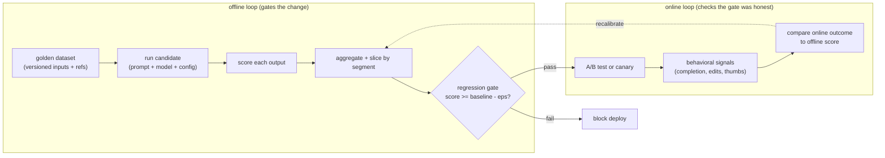

# 2. Framing the eval

## What does "good" mean for an LLM output?

Before writing a single line of evaluation code, name what you are measuring.
"Good" almost always decomposes into several dimensions that can regress
independently:

- **Accuracy / groundedness.** Is the answer factually correct, and is it
  supported by the context or retrieved evidence?
- **Relevance.** Does the answer address what was actually asked?
- **Helpfulness.** Does the answer move the user toward their goal, beyond just
  being technically correct?
- **Safety.** Does the answer stay within policy (no harmful content, no
  disclosures the product should not make)?
- **Efficiency.** Is the answer the right length, or does it pad with noise?

These are not the same metric, and they can move in opposite directions. A longer
answer can be more helpful and less efficient. A model upgrade can improve accuracy
while adding verbosity. Evaluating only one dimension and ignoring the rest gives
a misleading picture.

## Offline vs online: two loops, not one

The eval system is not a single pipeline. It is two loops that serve different
purposes and must both be wired up.

The offline loop tells you a candidate is probably better. The online loop tells
you it actually is, on real traffic. The two loops disagree more often than people
expect, which is exactly why both are necessary: offline has no access to task
completion, user edits, session length, cost, or any signal that requires a real
user. The online loop's most valuable output is the recalibration edge back to the
offline loop: when they disagree, the offline suite is measuring the wrong thing
and must change.

## Inputs and outputs of the eval system

**Input to the eval system:** a candidate, which is a tuple of (prompt template,
model identifier, inference config). A model swap is a candidate just as much as a
prompt edit, and it goes through the same gate.

**Input to each eval run:** the golden dataset, a versioned set of (input,
expected output or reference) pairs. The dataset itself is under version control;
a score is only meaningful relative to a fixed dataset version.

**Output:** a set of per-segment scores and a pass/fail verdict for the regression
gate. The verdict is binary: the candidate clears the gate or it does not. Scores
without a verdict are not a gate.

## What the eval system does not do

Two things are out of scope and worth naming explicitly.

The eval system is not a way to **improve** the model. It tells you whether a
proposed change is better than the current production system. The iteration loop
that tries different prompts or fine-tunes is upstream of the eval system; eval is
the exit criterion, not the engine.

The eval system does not replace **human judgment** for the uncertain cases. It
reduces the set of changes that need human review to only those where the automated
verdict is too close to call. High-stakes or irreversible outputs (legal, medical,
regulated) still need a human-in-the-loop gate, as Thomson Reuters demonstrates.
The automation handles the volume; humans handle the judgment calls.
