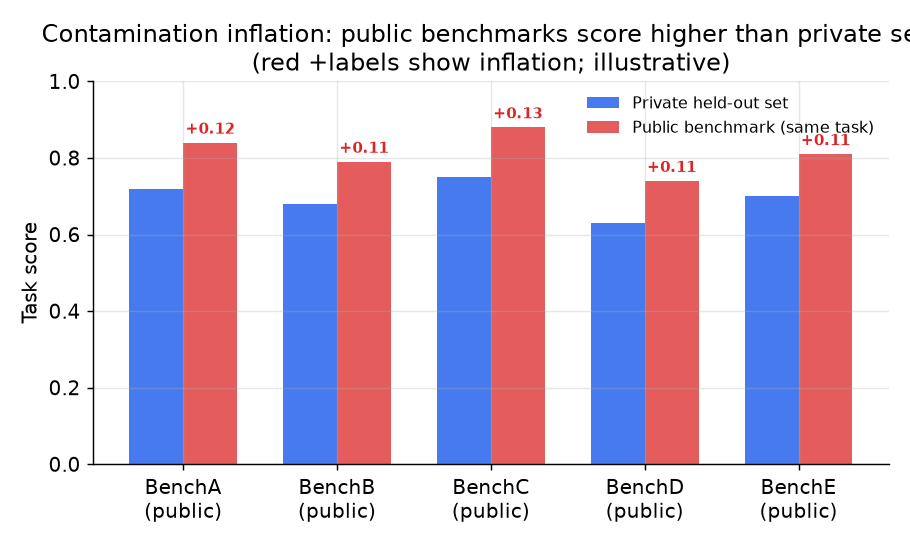
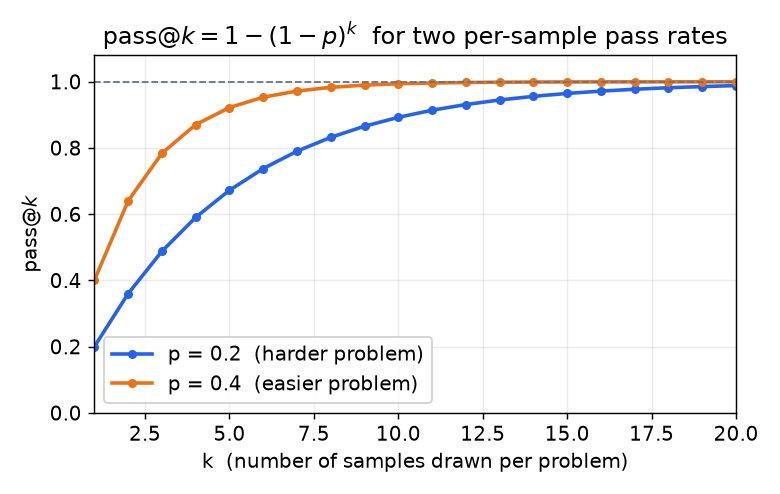

# 3. Offline evaluation

## The golden dataset: the foundation of everything

The offline eval system sits on top of a fixed, versioned set of inputs paired
with expected outputs or references. Getting this right makes everything else
easier; getting it wrong makes the whole gate unreliable.

**Coverage over volume.** A few hundred well-chosen cases beat ten thousand random
ones. You want the common paths (the queries that represent most of production
traffic), the known-hard cases (examples that broke the last model), and one row
for every bug you have ever fixed (a regression row so it never quietly returns).
GitHub Copilot ships more than 4,000 cases; the quality bar matters more than the
count.

**Slice it.** A single average hides regressions. Score per segment: language,
document length, customer tier, query type. A change that lifts the average while
tanking one segment still blocks. GitLab runs daily regression across dozens of use
cases so no single segment quietly falls off.

**Version it.** The dataset lives in source control. A score on dataset version 3
is not comparable to a score on dataset version 4 unless they overlap in a
controlled way. A prompt change that also adds ten new cases to the golden set
must be gated on a fixed snapshot, not on the updated set.

**Keep a held-out slice.** If you tune prompts against the full eval set you start
fitting to it. Keep a fraction you do not look at during development. This is what
separates measurement from optimization theater.

**Refresh it.** Real traffic drifts. A golden set built in Q1 may not cover the
query patterns that emerge by Q3. Periodically sample production traffic, annotate,
and merge new rows in. Booking.com watches for this drift and treats golden-set
freshness as a system health signal.

## Public benchmarks: capability signal, not a quality gate

Public benchmarks are useful for a single purpose: filtering candidate models by
baseline capability before you invest in task-specific evaluation. They are not a
quality gate for your own feature.

**Name the current landscape, not the saturated one.** The classic multiple-choice
suites (MMLU, HumanEval, TruthfulQA) are largely saturated, so as of 2025 to 2026
the meaningful public benchmarks are harder and more agentic. Know the families:
reasoning and knowledge (GPQA Diamond, MMLU-Pro, SciCode); real software
engineering (SWE-bench, Terminal-Bench); tool-using agents (tau-bench, or
$\tau$-bench, for airline and retail workflows); and economically-valuable
knowledge work (GDPval). Because no single benchmark captures "intelligence,"
independent aggregators now publish a **composite index** built from many of these
at once, notably the [Artificial Analysis Intelligence Index](https://artificialanalysis.ai/),
which also charts the two tradeoffs a system designer actually cares about: quality
versus price per token, and quality versus output speed. Three things worth
borrowing from how they report:

- **A composite index over many evals** is more robust than any single benchmark, since gaming one eval barely moves the aggregate.
- **Serving is a provider choice, not just a model choice.** The same open-weight model varies several-fold in output tokens per second and in price across hosting providers; independent trackers report the median (for example P50 over a rolling window) per provider, which is the number to quote when you compare serving options (see the [inference-serving](../inference-serving/) and [cost-optimization](../cost-optimization/) chapters).
- **Report an interval, not a point.** Benchmark scores carry sampling noise; a 1-point difference inside overlapping 95 percent confidence intervals is not a real difference. State the interval.

Use these as the coarse capability filter and the live-numbers reference; then run
your own task-specific eval, because a public number never gates your feature.

The reason is contamination. If eval cases or near-duplicates leaked into a
model's training data, its scores look inflated on public benchmarks while the
model fails in production on real user queries. The inflation is systematic and
invisible: you cannot detect it from benchmark scores alone.



*Public benchmark scores inflate relative to private held-out sets on the same
task. The gap is the contamination premium. Illustrative magnitudes; real gaps
vary widely by model and benchmark.*

Thomson Reuters uses public benchmarks only as the coarse first filter in a
three-stage gate, then applies task-specific semi-automated evaluation and human
sign-off before any deployment. The benchmark filter is cheap and fast; it is not
the standard.

## Capability evaluation vs safety evaluation

These are distinct evaluation problems and often use different datasets, different
metrics, and different gate thresholds.

**Capability evaluation** asks: does the model do the task correctly? Metrics are
task-specific: exact match for extraction, F1 for question answering, test pass
rate for code generation, relevance score for search.

**Safety evaluation** asks: does the model stay within policy? Metrics are
typically binary (refused/complied, policy-violating/clean) over a dataset of
adversarial or edge-case prompts: jailbreak attempts, policy boundary cases,
sensitive query categories. A safety regression should block even if the capability
score improved.

The two must be gated separately. A model that is more capable but less safe is
not a better model for production, and gating only on capability would let it
through.

## Task metrics: use them wherever the task allows

When the answer is checkable, use a task metric. It is cheap, deterministic, and
unfoolable by surface patterns. The art is reframing a task to expose a checkable
signal:

- A code-generation task becomes "does the unit test pass" rather than "does the
  answer look like good code."
- A SQL generation task becomes "does the query return the correct rows on a test
  database."
- An extraction task becomes "do the extracted fields exactly match the labeled
  fields."
- An information-retrieval task becomes recall and precision at k against labeled
  relevant documents.

GitHub Copilot's broken-repo suite exploits this: they intentionally break roughly
100 containerized repositories with passing CI and check whether a candidate model
can fix them. The metric is unit-test pass rate, not a judge's subjective rating.
An unfoolable task metric beats an LLM-as-judge that you then have to calibrate.

**How pass@k is computed.** Drawing a single sample underestimates a model's
coding ability because stochastic generation sometimes fails even when the model
"knows" the answer. The standard fix is to draw $k$ independent samples per
problem and count the problem as solved if at least one passes:

$$\text{pass@}k = 1 - (1-p)^k$$

where $p$ is the per-sample pass probability (estimated from a batch of $n \ge k$
samples without replacement in practice; the i.i.d. form above is the closed-form
approximation). As $k$ grows, even a weak per-sample rate eventually yields a
correct solution.

The HumanEval harness does not plug in $\hat p = c/n$ (that is biased); it uses the
unbiased combinatorial estimator over $n$ drawn samples of which $c$ pass:

```python
from math import comb
def pass_at_k(n, c, k):    # n samples drawn, c correct, budget k
    if n - c < k:          # fewer than k failures -> any k-subset contains a pass
        return 1.0
    return 1.0 - comb(n - c, k) / comb(n, k)   # 1 - P(all k sampled solutions fail)
# unbiased estimate of 1 - (1-p)^k; e.g. pass_at_k(n=200, c=40, k=10)
```



*How pass@k scales with sample budget: for a per-sample pass rate of p = 0.2, drawing
10 samples gives pass@10 = 1 - 0.8^10 = 0.89; for p = 0.4 the same 10 samples give
0.99. The metric rewards models that are occasionally right; exact-match at k = 1
would miss both. Illustrative.*

## When to use which offline approach

| Reach for | When | Instead of |
|---|---|---|
| Task metric (exact match, F1, pass-fail) | The answer is checkable: extractable fields, executable code, retrievable documents | An LLM judge you would then have to calibrate and maintain |
| Public benchmarks | First-pass capability filter when selecting a base model | A quality gate for your specific feature, where contamination biases the score |
| Private golden dataset, task metric | Ongoing regression gate for a checkable task (code, extraction, SQL) | Public benchmarks, which an adversarially trained model can game |
| Private golden dataset, LLM-as-judge | Regression gate for open-ended output (summaries, chat, explanations) | No measurement at all, or a single-number average that hides slice regressions |
| Held-out slice, no tuning | Honest final evaluation before a model upgrade | The same set used for prompt iteration, which you may have overfitted |
| Safety dataset, binary gate | Any change that could affect policy compliance | A single capability metric that ignores the safety dimension |
