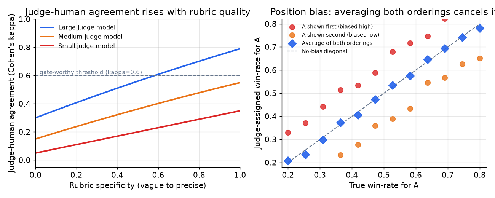

# 4. LLM-as-judge

When a task metric is unavailable because the output is genuinely open-ended, you
prompt a capable model to score or compare outputs against a rubric. This is
LLM-as-judge. It scales to thousands of examples where human annotation cannot.
But it has sharp, well-documented failure modes that you must name and address
before you gate anything on it.

## Pairwise vs pointwise

There are two fundamental modes, and they differ in reliability.

**Pointwise (absolute scoring).** The judge receives a single output and scores it
on a scale (1 to 10, or a rubric dimension). Simple to implement, but scores bunch
in the middle and are hard to interpret in absolute terms. A score of 7 from one
judge on one rubric means nothing compared to a 7 from a different judge or a
different rubric version.

**Pairwise (comparative).** The judge receives two outputs, A and B, and picks the
winner, or assigns a preference strength. More reliable than absolute scoring
because relative judgment is easier for both humans and models. The risk is
position bias: judges favor whichever answer is shown first (or sometimes last).

In practice: use pairwise for human-preference evals and for the primary quality
comparison between a candidate and the production baseline. Use pointwise with a
sharp rubric for dimension-level scoring (accuracy, helpfulness, groundedness)
where you need a per-dimension breakdown rather than just a winner. Avoid
unvalidated 1-to-10 scales.

## Bias types: what breaks a judge

Four biases are well-documented in the literature. A senior answer names them
unprompted.

**Position bias.** In a pairwise comparison, the judge assigns a higher win rate to
the answer shown first. The size of the bias varies by model and rubric but is
consistently measurable. The fix: run both orderings and average the two scores.

$$s(A,B) = \tfrac{1}{2}\bigl[ j(A \prec B) + \bigl(1 - j(B \prec A)\bigr) \bigr]$$

where $j(A \prec B)$ is the judge probability that A wins when A is presented
first. Averaging cancels the fixed positional preference.

*Left: judge-human agreement (Cohen's kappa) rises with rubric specificity and
with judge model capability. The dashed line marks a kappa of 0.6, a common
threshold for trusting a judge as a gate. Right: position bias shifts win-rate
estimates upward for the first-shown answer and downward when shown second.
Averaging both orderings recovers the unbiased estimate. Illustrative.*

**Verbosity bias.** Judges reward longer, more confident-sounding answers even when
they are not better. Optimizing prompts hard against a judge that has verbosity
bias produces padded outputs that the judge loves and users do not. The fix:
instruct the rubric to penalize padding, or explicitly control for length in the
scoring prompt. Use the online behavioral metric (user edit rate, task completion)
as the tiebreaker when suspecting verbosity bias.

**Self-preference bias.** A judge model tends to prefer outputs from the same model
family. A GPT-family judge will slightly favor GPT-family outputs; a Claude-family
judge will favor Claude-family outputs. The fix: use a different model family as
judge than the model being evaluated, where possible. Measure cross-family
agreement against human labels to quantify the effect in your specific context.

**Calibration shift (judge drift).** A judge is a hosted model, and hosted models
can change without notice. If the judge prompt or model version changes silently,
yesterday's scores stop being comparable to today's. The fix: pin the judge model
version, version the judge prompt, and re-score a fixed calibration set on a
schedule to detect drift.

## Calibrating the judge: Cohen's kappa

An LLM judge is a measurement instrument. An uncalibrated instrument lies. Before
you gate anything on a judge, measure its agreement with human labels and report
the agreement rate.

**Cohen's kappa** accounts for the agreement that would occur by chance from the
label marginals alone:

$$\kappa = \frac{p_o - p_e}{1 - p_e}$$

where $p_o$ is the observed agreement fraction between judge and human labels, and
$p_e$ is the agreement expected by chance given the label marginals. Values near
0 mean the judge is guessing; values near 1 mean near-perfect agreement. A judge
is typically trusted for gating once kappa clears a bar (Pinterest reports 73.7%
exact match as its analog for a fine-tuned relevance judge on a 5-level scale,
with 91.7% within one level).

If kappa is below your threshold, fix the rubric first. Do not adjust the gate
tolerance to compensate for a bad instrument; fix the instrument. A low kappa
means the judge is measuring something other than what humans care about, and
gating on it gives false confidence.

## Pairwise vs pointwise: when to use which

| Reach for | When | Instead of |
|---|---|---|
| Pairwise (A vs B) | Primary quality comparison between candidate and production; human-preference studies | Absolute scoring, which bunches in the middle and is hard to interpret |
| Pointwise with per-dimension rubric | You need scores on multiple dimensions (accuracy, helpfulness, tone) separately | A single-number pairwise outcome that hides which dimension changed |
| Position-bias averaging (both orderings) | Any pairwise comparison where order can leak | A single-ordering judge score that bakes in first-slot preference |
| Validated judge (kappa above bar) | Gating any deploy on the judge verdict | An uncalibrated judge, which may reward verbosity or self-preference instead of quality |
| Different model family as judge | Evaluating a specific model family's outputs | The same family as judge, which self-prefers |
| Task metric instead of judge | The answer is checkable (code passes tests, field matches label) | A judge you then have to calibrate and maintain indefinitely |

## The judge is not free infrastructure

Every judged example is a model call. A thousand-row suite with pairwise judgment
run in both orderings is roughly two thousand judge calls per candidate. At
high-cadence prompt editing (daily changes, dozens of engineers), that recurs
constantly. Size the judge deliberately: use a smaller, validated, cheaper judge
model rather than the most expensive one; cache judge results for unchanged output
pairs so the same (prompt-version, output, judge-version) triple is not re-scored;
run a small smoke subset for local iteration and the full suite only at the gate.
The judge's per-call cost times cadence times suite size is a real budget line.
