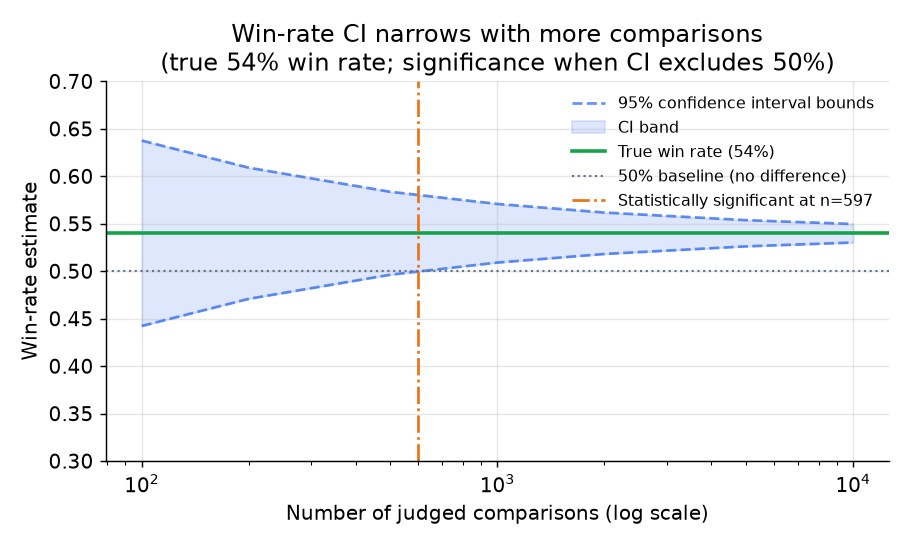

# 5. Online evaluation

Offline eval tells you a candidate is probably better. Online eval tells you it
actually is, on real user traffic. The two disagree more often than people expect.
Offline has no access to task completion, whether the user edited the output,
whether the session continued or ended, or cost. Those signals only exist online.

## A/B testing

The standard online evaluation method routes a slice of live traffic to the
candidate system and the rest to the control (current production), then measures
the outcome metrics that actually matter.

**What to measure:** behavioral signals that reflect real user value. For an LLM
assistant: task completion rate (did the user get what they came for?), output edit
rate (did the user have to fix the answer?), thumbs-up/down or explicit feedback,
follow-up "that is wrong" messages, session length, and return rate. These are the
signals offline is structurally blind to.

**What to watch as guardrails:** latency (median and tail), cost per request,
refusal rate, error rate. A candidate that lifts quality but doubles latency or
triples cost may not be a net win even if the quality signal is real. Spotify
explicitly tracks session length, crash rate, and retention alongside the target
quality metric.

**Statistical power.** A preference measurement is a proportion. The 95% confidence
interval for a win rate $p$ at sample size $n$ is:

$$\hat{p} \pm 1.96 \sqrt{\frac{p(1-p)}{n}}$$

The interval must exclude 0.5 to declare a significant win. At a true win rate of
54%, you need roughly 2,400 comparisons to detect the effect at 95% confidence.
Smaller effects need larger samples. This is the argument for Spotify's funnel
strategy: cheap offline evals filter weak candidates first, so the A/B slots go
only to candidates already likely to win, raising the A/B hit rate.

*The 95% CI around a 54% win rate narrows as sample size grows. Significance
requires the lower CI bound to clear 50%. At small n the interval includes 50%
even when the true effect is real. Illustrative.*

## Human preference evaluation

For high-stakes or regulated outputs, human expert A/B evaluation is the final
arbiter. Two reviewers (or a reviewer panel) rate production vs candidate outputs
on defined scales. Thomson Reuters uses subject-matter expert ratings as the
definitive sign-off before any legal-output deployment. Human sign-off is slow and
expensive, so it does not scale to daily prompt edits; reserve it for model
upgrades, major capability changes, or regulated domains.

## Regression gates in the deploy path

An eval that someone runs manually when they remember is not a gate. Wire it in.

**Treat the gate like a test suite.** The offline suite runs automatically on any
change to a prompt, model identifier, or inference config, the same way unit tests
run on a code change. A model swap is a versioned artifact change; it goes through
the same gate, because "drop-in newer model" is exactly the kind of change that
silently regresses one language or customer tier.

**Gate per slice, not just on the average.** The per-slice gate inequality is:

$$\text{ship} \iff \min_{g \in \text{segments}} \bigl( s_g^{\text{cand}} - s_g^{\text{base}} \bigr) \ge -\epsilon$$

where $s_g$ is the score on segment $g$ and $\epsilon$ is the tolerance. The
candidate ships only if no segment drops more than $\epsilon$ below baseline. Gate
on the worst slice. A change that lifts the average while tanking one language
still blocks.

**Set the tolerance from measured judge variance, not by guessing.** If you guess
a tolerance of 2% and the judge's measured noise is 4%, the gate flaps on every
build. Measure the judge's score variance on identical inputs and set
$\epsilon \sim \sigma_{\text{judge}}$.

**Canary before full rollout.** Even after the offline gate passes, ship to a
canary (internal users, a small traffic fraction) and let the online loop confirm
before full rollout. GitHub ships new models to internal Hubbers for a canary
period before production; Ramp runs new agent actions in shadow mode on live
traffic before enabling them for users.

## The offline-online feedback loop

The most valuable thing the online loop produces is a calibration check on the
offline loop. If the candidate that won offline loses online, the offline suite is
measuring the wrong thing.

When you detect a large offline-online gap, the right response is to recalibrate
the suite: add the cases that the online A/B exposed as the real failure mode,
adjust the judge rubric to match what users actually penalized, or add a dimension
that was previously unscored. Over time you want the offline gate to be a
trustworthy predictor of online outcome so that most changes can ship on the cheap
offline gate alone, and only the genuinely uncertain ones need a full A/B.

Spotify explicitly names this: "without offline-online signal calibration, our
evals are opinions, not evidence."

## When to use which online approach

| Reach for | When | Instead of |
|---|---|---|
| Online A/B test | You have live traffic to split and want a behavioral ground truth (Spotify, Pinterest) | Treating offline score as proof of user value |
| Shadow mode | The action must run silently with no user-facing risk; evaluate quality before enabling (Ramp) | A live A/B when you cannot yet expose the output |
| Internal canary (dogfood) | Blast radius is large or you need a safe cohort with real usage patterns before broad rollout (GitHub Hubbers) | Jumping straight from offline pass to full production |
| Human expert A/B | Output is regulated, irreversible, or stakes are high enough to require human arbitration (Thomson Reuters) | Automated gate alone on non-reversible or legally sensitive output |
| Guardrail tracking (latency, cost, refusals) | Every online eval, alongside the target metric | Target metric only, which misses the cases where you won quality and lost cost |

**Tools for each approach.** Traffic splitting for A/B tests and canaries runs on
feature-flag and experimentation platforms such as GrowthBook, Statsig, Unleash, and
LaunchDarkly, which also route the internal-only cohort for dogfooding. Shadow-mode
runs reuse the same flag layer to fork traffic to a candidate whose output is logged
but not shown. Behavioral and guardrail signals (edit rate, latency, cost, refusals)
are captured by LLM observability tools like LangSmith and Arize Phoenix and by
general metrics stacks such as Prometheus and Grafana over OpenTelemetry traces.
Human expert A/B sign-off uses an annotation tool such as Label Studio, and the
win-rate confidence math is a few lines over statsmodels or scipy.

**Worked example.** A chat product with steady live traffic validates a new model by
splitting a slice into an online A/B rather than trusting the offline win, because
task completion and edit rate only exist online. Since the change is a drop-in model
swap with a large blast radius, they first ship it to an internal canary cohort to
confirm behavior on real usage before widening, rather than jumping straight from an
offline pass to full production. A new autonomous action that could act on a user's
behalf runs in shadow mode first, logging its output silently until the quality holds,
because a live A/B would expose an unproven action. Throughout, they track latency,
cost, and refusal guardrails next to the target metric so a candidate that wins
quality but doubles cost still blocks. Human expert A/B they reserve for the regulated
slices where an automated gate alone is not enough.
