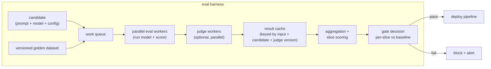

# 6. Serving and scaling the eval harness

## The eval harness is a system, not a script

At small scale, an eval runs as a script: loop over the golden set, call the
model, score each output, print a number. At production cadence, that falls apart.
Dozens of engineers edit prompts daily, each change triggering a full-suite run, a
judge call on every row, a comparison against baseline, and a per-slice gate. The
eval harness becomes a service with its own latency, cost, and reliability
requirements.

**How it works.** Two things feed the harness: a candidate (prompt, model, and
config) and the versioned golden dataset, both landing on a shared work queue.
Parallel eval workers pull items off that queue, run the candidate model on each
golden input, and score the output, passing open-ended rows on to a pool of
optional judge workers that run in parallel. Results flow into a cache keyed by
input plus candidate plus judge version, so an unchanged triple is served from
cache instead of paying for the call again. The cached and fresh scores are then
aggregated and sliced by segment, and a gate compares each slice against the
baseline. A pass hands off to the deploy pipeline; a fail blocks the change and
raises an alert, which is what makes the harness a gate rather than a report.

## Controlling cost

Every judged example costs one model call plus one judge call (or two, if you run
both orderings to cancel position bias). A thousand-row suite judged in both
orderings is roughly two thousand judge calls per candidate. At ten cents per
thousand tokens and a few hundred tokens per judgment, that is manageable per run.
At dozens of candidates per day across a team, it adds up.

Four levers reduce cost without sacrificing gate quality.

**Use task metrics wherever the task allows.** A unit-test pass/fail or an exact
field match is free compared to a judge call. Reserve the judge for the dimensions
where a task metric genuinely does not exist. GitHub Copilot's broken-repo suite
runs four thousand tests, most of which yield a deterministic pass/fail, and
reaches the judge only for open-ended chat quality.

**Cache judge results for unchanged output pairs.** If the (golden input, candidate
output, judge prompt version) triple is identical to a prior run, the judge score
does not change. Cache the result and skip the call. This is most useful when
iterating the prompt on a fixed golden set: early outputs that have not changed
do not need to be re-judged.

**Right-size the judge model.** The most expensive judge is not always the most
accurate judge for a specific rubric. Measure kappa against human labels for
several candidate judge models; pick the cheapest one that clears the kappa
threshold. Uber uses a grader model separate from the generator and picks the
combination on accuracy plus cost.

**Run a smoke subset for local iteration, the full suite at the gate.** Engineers
iterating prompts locally do not need to score all one thousand rows to get a
directional signal. A fixed random fifty-row smoke subset gives fast feedback; the
full suite runs only at gate time when the change is ready to ship.

## Parallelism

The golden set rows are independent. Run them in parallel. A serially-executed
thousand-row suite at two seconds per call takes thirty minutes; at thirty-way
parallelism it takes one minute. The gate path (offline suite, judge, aggregation)
should complete in a few minutes at any reasonable suite size. If it does not, the
gate is too slow to wire into the deploy path and engineers will route around it.

## Sampling the online stream for evaluation

Online evaluation does not score everything. It samples the production stream
proportionally across segments (language, query type, tier) and routes a fraction
to human review, to the judge, or to both. The sampling fraction trades off
measurement resolution against cost. Too sparse a sample and you miss rare-but-
important segment regressions; too dense a sample and the evaluation bill
dominates the inference bill. Stratified sampling by segment (rather than uniform
random) ensures the rare segments still get enough coverage to move the metric.

## Bottlenecks table

| Bottleneck | First sign | Fix | Tradeoff |
|---|---|---|---|
| Judge cost per change | Eval bill rises with team size and cadence | Task metrics where checkable, smaller validated judge, cache unchanged pairs | May need to validate a cheaper judge before switching |
| Slow gate | Eval takes longer than PR review; engineers skip it | Parallelize workers; smoke subset for local, full suite at gate | Smoke subset may miss rare regressions |
| Untrustworthy judge | Offline wins but online loses repeatedly | Measure kappa, fix the rubric, possibly switch judge family | Rubric iteration requires collecting human labels |
| Average masks regression | A segment tanks silently | Gate per slice; alert on worst-slice delta, not mean delta | More alert noise on segments with high judge variance |
| Stale golden set | Real traffic queries not covered; online surprises multiply | Sample production traffic, annotate, merge into golden set on a schedule | Dataset maintenance overhead |
| Judge version drift | Scores shift without a candidate change | Pin judge model version; re-score fixed calibration set regularly | Must track two version numbers (candidate and judge) |
| Canary too small | Latent segment regression reaches full production | Set canary size from power analysis for the expected effect size | Larger canary delays full rollout |
