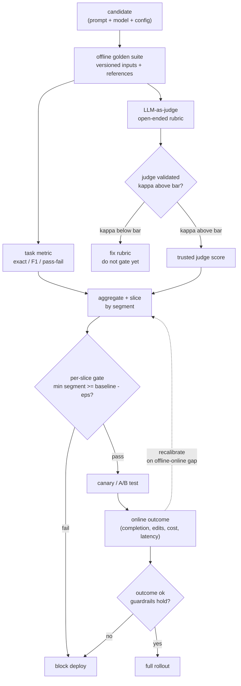

# 9. Summary

## One-page recap

- **Eval is a two-loop system, not a script.** An offline loop gates the change
  by running a candidate (prompt plus model plus config) against a versioned golden
  dataset and producing a per-slice pass/fail verdict. An online loop (A/B test,
  shadow mode, or canary) checks the offline loop was honest and feeds back to
  recalibrate it. Both loops are necessary; neither alone is sufficient.

- **Use task metrics wherever the task allows.** An exact-match, F1, or test-
  pass-fail metric is cheap, deterministic, and unfoolable. Reserve the LLM judge
  for the dimensions that are genuinely open-ended. GitHub Copilot reaches the
  judge only for open-ended chat quality; the broken-repo suite produces
  deterministic unit-test pass rates.

- **The judge is a measurement instrument that must be calibrated.** An
  uncalibrated judge lies. Before gating anything on an LLM-as-judge, collect
  human labels, measure judge-human agreement (Cohen's kappa), and fix the rubric
  if agreement is below bar. Pin the judge model version and re-score a calibration
  set regularly to detect drift. Position bias is real: run both orderings and
  average to cancel it.

- **Gate per slice, never just on the average.** A change that lifts the average
  while tanking one language, tier, or query type still blocks. Set the tolerance
  from the judge's measured noise, not by guessing. GitLab runs daily per-feature
  regression; GitHub runs daily vs-production comparison: both catch regressions
  before they reach users.

- **Public benchmarks are not your quality gate.** They measure general capability
  and are contaminated for models trained on public data. Use them as a coarse
  first-pass capability filter when selecting a base model; use a private, freshly-
  sampled golden set for the actual gate.

- **The offline-online gap is the calibration signal.** When offline says a
  candidate wins and the A/B says it loses, the suite is measuring the wrong thing.
  Recalibrate the suite to match online reality. Over time a well-calibrated suite
  predicts A/B outcomes reliably enough that most changes ship on the cheap offline
  gate alone, and only the uncertain ones need a full online test.

## The system on one page

## Test yourself

1. A model upgrade passes the offline gate but the online canary shows a
   helpfulness regression in one language. What does this tell you about the offline
   suite, and what do you change?

2. You are evaluating a summarization feature. There is no reference summary. What
   evaluation approach do you use, and what is the first thing you do before trusting
   it as a gate?

3. Your pairwise judge scores candidate A as the winner 65% of the time when A is
   shown first, and only 55% when A is shown second. What is the position-bias-
   corrected win rate for A, and what does the result tell you?

4. An engineer proposes "let us gate on the average score across all segments to
   keep the gate simple." What is the failure mode, and how do you fix it?

5. Why does running a full 1000-row suite with a pairwise judge in both orderings
   on every prompt edit become unsustainable, and what three levers reduce cost
   without sacrificing gate quality?

6. Your judge's kappa against human labels is 0.45. You set the gate tolerance to
   5% to compensate for the unreliable judge. What is wrong with this approach?

## Further reading

- Dense reference (all case studies, math, divergence diagram):
  [topics/06-evaluation-system.md](../../topics/06-evaluation-system.md).
- LLM-as-judge survey: [Judging the Judges: Evaluating Alignment and Vulnerabilities in LLMs-as-Judges](https://arxiv.org/abs/2406.12624).
- Calibrated multi-dimension rubrics: [LLM-Rubric (Microsoft Research)](https://www.microsoft.com/en-us/research/publication/llm-rubric-a-multidimensional-calibrated-approach-to-automated-evaluation-of-natural-language-texts/).
- Eval-as-funnel, not fork: [Spotify engineering blog](https://engineering.atspotify.com/2026/5/better-experiments-with-llm-evals-a-funnel-not-a-fork).
