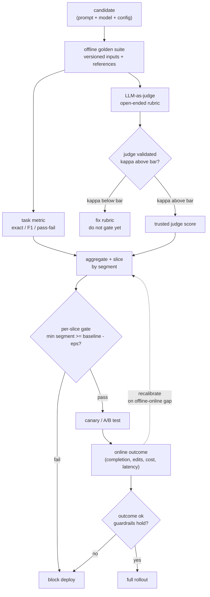

# 9. Summary

## One-page recap

- **Eval is a two-loop system, not a script.** An offline loop gates the change
  by running a candidate (prompt plus model plus config) against a versioned golden
  dataset and producing a per-slice pass/fail verdict. An online loop (A/B test,
  shadow mode, or canary) checks the offline loop was honest and feeds back to
  recalibrate it. Both loops are necessary; neither alone is sufficient.

- **Use task metrics wherever the task allows.** An exact-match, F1, or test-
  pass-fail metric is cheap, deterministic, and unfoolable. Reserve the LLM judge
  for the dimensions that are genuinely open-ended. GitHub Copilot reaches the
  judge only for open-ended chat quality; the broken-repo suite produces
  deterministic unit-test pass rates.

- **The judge is a measurement instrument that must be calibrated.** An
  uncalibrated judge lies. Before gating anything on an LLM-as-judge, collect
  human labels, measure judge-human agreement (Cohen's kappa), and fix the rubric
  if agreement is below bar. Pin the judge model version and re-score a calibration
  set regularly to detect drift. Position bias is real: run both orderings and
  average to cancel it.

- **Gate per slice, never just on the average.** A change that lifts the average
  while tanking one language, tier, or query type still blocks. Set the tolerance
  from the judge's measured noise, not by guessing. GitLab runs daily per-feature
  regression; GitHub runs daily vs-production comparison: both catch regressions
  before they reach users.

- **Public benchmarks are not your quality gate.** They measure general capability
  and are contaminated for models trained on public data. Use them as a coarse
  first-pass capability filter when selecting a base model; use a private, freshly-
  sampled golden set for the actual gate.

- **The offline-online gap is the calibration signal.** When offline says a
  candidate wins and the A/B says it loses, the suite is measuring the wrong thing.
  Recalibrate the suite to match online reality. Over time a well-calibrated suite
  predicts A/B outcomes reliably enough that most changes ship on the cheap offline
  gate alone, and only the uncertain ones need a full online test.

## The system on one page

```mermaid
flowchart TD
  CAND["candidate<br/>(prompt + model + config)"] --> SUITE["offline golden suite<br/>versioned inputs + references"]
  SUITE --> TM["task metric<br/>exact / F1 / pass-fail"]
  SUITE --> JUDGE["LLM-as-judge<br/>open-ended rubric"]
  JUDGE --> VAL{"judge validated<br/>kappa above bar?"}
  VAL -->|"kappa below bar"| FIX["fix rubric<br/>do not gate yet"]
  VAL -->|"kappa above bar"| JS["trusted judge score"]
  TM --> AGG["aggregate + slice<br/>by segment"]
  JS --> AGG
  AGG --> GATE{"per-slice gate<br/>min segment >= baseline - eps?"}
  GATE -->|"fail"| BLOCK["block deploy"]
  GATE -->|"pass"| CANARY["canary / A/B test"]
  CANARY --> OUT["online outcome<br/>(completion, edits, cost, latency)"]
  OUT --> GUARD{"outcome ok<br/>guardrails hold?"}
  GUARD -->|"no"| BLOCK
  GUARD -->|"yes"| SHIP["full rollout"]
  OUT -.->|"recalibrate<br/>on offline-online gap"| AGG
```

## Test yourself

Answers are collapsed. Attempt each question before opening one.

1. A model upgrade passes the offline gate but the online canary shows a
   helpfulness regression in one language. What does this tell you about the offline
   suite, and what do you change?

   

Answer

   It tells you the offline suite is measuring the wrong thing, and the
   **offline-online gap is the calibration signal** that says so. Concretely there are
   three candidate causes to check in order: the golden set has too few rows in that
   language to move any score, the suite is not sliced by language at all so the
   regression hid behind an improving average, or the judge rewarded the more verbose
   upgrade in a way real users of that language penalized. The fix is to recalibrate
   the suite, not to loosen the gate: add the language as a slice axis, merge the
   cases the canary exposed as the real failure mode into the golden set, and adjust
   the judge rubric to score what users actually penalized. Size matters here too,
   since a segment much below roughly 50 rows carries judge noise wider than the
   tolerance and cannot gate anything ([10](10-putting-it-together.md)). Sections
   [5](05-online-eval.md) and [2](02-frame-the-eval.md) describe the recalibration
   edge from the online loop back into aggregation; Spotify puts it bluntly: without
   offline-online calibration, evals are opinions, not evidence.

   

2. You are evaluating a summarization feature. There is no reference summary. What
   evaluation approach do you use, and what is the first thing you do before trusting
   it as a gate?

   

Answer

   Use **LLM-as-judge**, specifically pairwise candidate versus the production
   baseline with both orderings averaged, because relative judgment is more reliable
   than an absolute 1-to-10 scale that bunches in the middle and drifts across rubric
   versions. Before that, reframe whatever sub-part is checkable out of the judge's
   scope: if a summary must carry a figure, a date, or an entity from the source, score
   that with an exact-match task metric, which is free, deterministic, and unfoolable
   ([3](03-offline-eval.md)). The first thing you do before gating is **calibrate the
   judge**: collect human labels on a sample, measure Cohen's kappa
   ($\kappa = (p_o - p_e)/(1 - p_e)$) between judge and human, and only gate once it
   clears the bar, commonly around 0.6. If kappa is below bar you fix the rubric, not
   the gate tolerance, because an uncalibrated instrument is a second opinion you have
   no reason to believe. Also pick a judge from a different model family than the
   summarizer to avoid self-preference bias, and pin the judge model and prompt
   versions so tomorrow's scores stay comparable ([4](04-llm-as-judge.md)).

   

3. Your pairwise judge scores candidate A as the winner 65% of the time when A is
   shown first, and only 55% when A is shown second. What is the position-bias-
   corrected win rate for A, and what does the result tell you?

   

Answer

   The corrected win rate is **60%**: average the two orderings,
   $(0.65 + 0.55)/2 = 0.60$, which is the order-swap fix from
   [4](04-llm-as-judge.md) applied to a measured pair of numbers. The 10-point spread
   between the two orderings is the position bias itself, a fixed offset of about 5
   points toward whichever answer is shown first, and averaging cancels it because the
   offset is symmetric across the two presentations. The result tells you two things.
   First, A is genuinely better than the baseline and not merely first in the prompt,
   because the corrected number still sits well above 50%. Second, the naive
   single-ordering protocol would have reported 65% and overstated the lift by 5
   points, which is exactly the fabricated win the runnable experiment in
   [10](10-putting-it-together.md) reproduces. Before declaring a ship, confirm the
   sample supports it: a win rate is a proportion, and its 95% interval must exclude
   0.5 ([5](05-online-eval.md)). One caveat from [8](08-interview-qa.md): averaging
   only works for an additive, symmetric bias, so track the swap-consistency rate, and
   record pairs whose verdict flips with the order as ties rather than half-wins.

   

4. An engineer proposes "let us gate on the average score across all segments to
   keep the gate simple." What is the failure mode, and how do you fix it?

   

Answer

   The failure mode is that **an average hides a slice collapse**, and it hides it as a
   matter of arithmetic rather than bad luck. If a segment is 2 percent of traffic, a
   total collapse on it moves the overall mean by only about 2 percent, which sits
   inside normal judge variance, so the mean cannot distinguish the collapse from
   noise ([6](06-serving-and-scaling.md)). That is precisely how a change that lifts
   the average while tanking one language, one customer tier, or one query type ships
   anyway. The fix is to gate on the worst slice:
   $\text{ship} \iff \min_{g} (s_g^{\text{cand}} - s_g^{\text{base}}) \ge -\epsilon$,
   with the tolerance $\epsilon$ set from the judge's measured score variance on
   identical inputs rather than guessed ([5](05-online-eval.md)). Two supporting moves
   make the worst-slice gate workable: size the golden set from the smallest slice you
   must protect, not from the total, since a slice thinner than the judge noise floor
   flaps the gate on its own; and gate safety separately with its own binary threshold
   so a more capable but less safe candidate still blocks
   ([3](03-offline-eval.md)). The cost is real but small: more alert noise on
   high-variance segments, which is the tradeoff GitLab and GitHub accept by running
   daily per-feature and vs-production regression.

   

5. Why does running a full 1000-row suite with a pairwise judge in both orderings
   on every prompt edit become unsustainable, and what three levers reduce cost
   without sacrificing gate quality?

   

Answer

   Because the bill is per-call cost times suite size times cadence, and all three
   terms are large at once: 1,000 rows judged pairwise in both orderings is roughly
   **2,000 judge calls per candidate**, near \$80 per gate run at a few hundred tokens
   per judgment and ten cents per thousand tokens, and dozens of engineers editing
   prompts daily multiply that every day ([6](06-serving-and-scaling.md),
   [10](10-putting-it-together.md)). Three levers, in the order to reach for them.
   **One, use task metrics wherever the task allows**: a unit-test pass or an exact
   field match is free next to a judge call, which is why GitHub Copilot reaches the
   judge only for open-ended chat quality and scores the broken-repo suite on
   deterministic unit-test pass rate. **Two, cache judge results for unchanged
   (golden input, candidate output, judge-prompt version) triples**, so an iterating
   engineer pays only for the rows their edit actually moved. **Three, run a 50-row
   smoke subset locally and the full suite only at the gate**, which is about 100 calls
   and \$4 per local iteration. A fourth lever from the same section is right-sizing
   the judge: measure kappa for several candidate judges and pick the cheapest one
   above bar, as Uber does when choosing its grader model. None of these lowers the
   bar, they only stop paying for measurements that cannot change.

   

6. Your judge's kappa against human labels is 0.45. You set the gate tolerance to
   5% to compensate for the unreliable judge. What is wrong with this approach?

   

Answer

   You are compensating for a broken instrument by making the gate blind, which is the
   one move [4](04-llm-as-judge.md) tells you never to make: **fix the rubric, do not
   widen the tolerance**. A kappa of 0.45 sits below the roughly 0.6 bar for trusting a
   judge as a gate, and it means the judge is measuring something other than what
   humans care about, so widening the tolerance does not make its verdicts correct, it
   just stops the gate from acting on them. The 5% number is also wrong on its own
   terms, because the tolerance $\epsilon$ is supposed to be derived from the judge's
   measured score variance on identical inputs, typically one to two points, not chosen
   to paper over disagreement ([5](05-online-eval.md)). At 5% you have made the gate
   insensitive in both directions: any real slice regression smaller than 5 points now
   ships silently, which for a small segment is most regressions you actually needed to
   catch. The correct sequence is to sharpen the rubric, collect more human labels, try
   a different judge model or family, re-measure kappa, and only once it clears the bar
   set $\epsilon$ from measured sigma. Until then the judge is not a gate, and the
   honest position is to say so rather than ship behind a number you do not trust.

   

## Further reading

- The capstone: [the complete build](10-putting-it-together.md), where every
  choice in this chapter is committed once for the scenario, costed, rebuilt
  under two other constraint sets, and compressed into a runnable one-file
  judge experiment.
- Dense reference (all case studies, math, divergence diagram):
  [topics/06-evaluation-system.md](../../topics/06-evaluation-system.md).
- LLM-as-judge survey: [Judging the Judges: Evaluating Alignment and Vulnerabilities in LLMs-as-Judges](https://arxiv.org/abs/2406.12624).
- Calibrated multi-dimension rubrics: [LLM-Rubric (Microsoft Research)](https://www.microsoft.com/en-us/research/publication/llm-rubric-a-multidimensional-calibrated-approach-to-automated-evaluation-of-natural-language-texts/).
- Eval-as-funnel, not fork: [Spotify engineering blog](https://engineering.atspotify.com/2026/5/better-experiments-with-llm-evals-a-funnel-not-a-fork).
