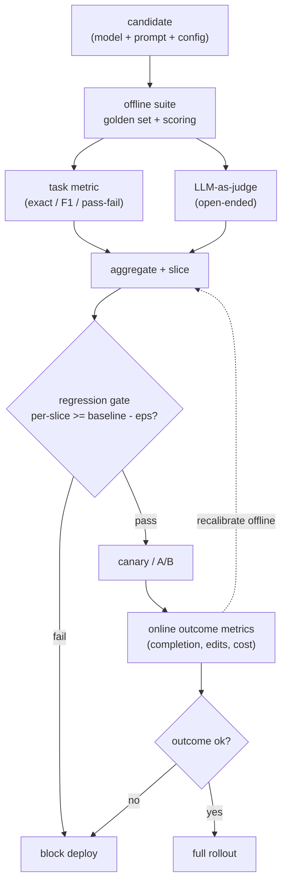

# LLM Evaluation Systems

An interviewer rarely says "design an LLM evaluation system." They say something
like: **"You shipped an LLM feature. A teammate wants to tweak the prompt and bump
to a newer model next week. How do you know the feature works today, and how do you
stop that change from silently making it worse?"**

That is the real question. "It works, look at these examples" is not an answer; it
is a vibe. The whole topic is about turning a fuzzy "is the output good" into
something you can measure, repeat, and gate a deploy on. This chapter builds that
system end to end, and shows how DoorDash, GitHub, Spotify, Pinterest, Thomson
Reuters, Uber, GitLab, Ramp, Booking.com, and others actually run it.

## Sections

1. [Clarifying the requirements](01-clarifying-requirements.md) - the dialogue that scopes the problem and the two consequences that fall out.
2. [Framing the eval](02-frame-the-eval.md) - offline vs online; what "good" means; inputs and outputs of the eval system.
3. [Offline evaluation](03-offline-eval.md) - benchmarks, golden datasets, contamination, capability vs safety; when to use which approach.
4. [LLM-as-judge](04-llm-as-judge.md) - pairwise vs pointwise, bias types, calibration, Cohen's kappa; when to use which variant.
5. [Online evaluation](05-online-eval.md) - A/B tests, human preference, regression gates, the deploy path; when to use which.
6. [Serving and scaling the eval harness](06-serving-and-scaling.md) - cost, sampling, parallelism, bottlenecks.
7. [How teams do it in production](07-how-teams-do-it-in-production.md) - where real designs diverge; named company comparison; first-party links.
8. [Interview Q&A](08-interview-qa.md) - commonly asked, tricky, and commonly answered wrong.
9. [Summary](09-summary.md) - one-page recap, mermaid, test-yourself questions, further reading.

## The two-loop system on one page

Read the sections in order the first time; they build on each other. Each opens
with the question an interviewer actually asks, then answers it.
