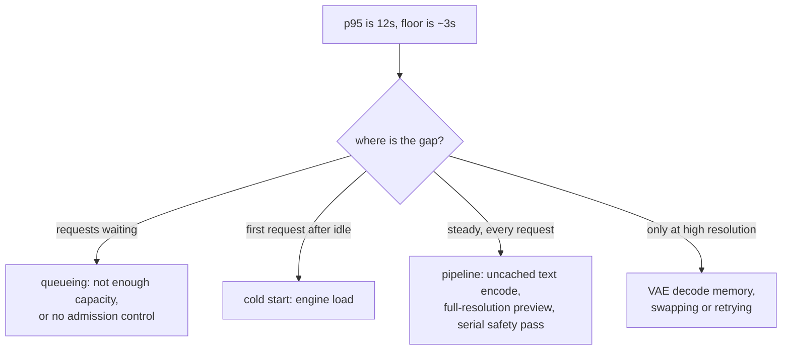

# 2. The cost model

Say this part out loud in the interview. Everything after it is commentary.

## The unit is a forward evaluation, not a token

A diffusion model generates by starting from noise and running a denoiser network
repeatedly, each pass removing a little more noise. The number of passes is what you
buy:

$$
N_{\text{FE}} = S \cdot c, \qquad c = \begin{cases} 2 & \text{with classifier-free guidance} \\ 1 & \text{without} \end{cases}
$$

$S$ is the sampler's step count. Classifier-free guidance runs the network twice per
step, once conditioned on the prompt and once unconditioned, and combines the two
predictions to push the output toward the prompt. **Guidance doubles the cost of
every image**, and a surprising number of candidates quote a step count as if it were
the cost.

The end-to-end latency of one request is then:

$$
t \approx t_{\text{text}} + N_{\text{FE}} \cdot t_{\text{step}} + t_{\text{decode}} + t_{\text{safety}}
$$

Three of those four terms are paid once. The text encoder runs once per request and
its output is cacheable. The VAE decode runs once at the end. The safety classifier
is a second model, run once. Only the middle term is multiplied, which is why it is
the only term worth optimizing first.

## Why the latent is what makes any of this affordable

The denoiser does not operate on pixels. A latent diffusion model encodes the image
into a compressed grid with a downsampling factor $f$, commonly 8, does all the
denoising there, and decodes once at the end:

$$
\text{latent side} = \frac{\text{image side}}{f}, \qquad 1024 / 8 = 128
$$

A 1024 by 1024 image is a 128 by 128 latent, which is 64 times fewer positions than
pixels. For a convolutional denoiser, $t_{\text{step}}$ scales roughly with the area
of that latent. For a transformer denoiser the latent is cut into patches and treated
as a sequence, so the arithmetic you already know from the language chapters applies
directly:

$$
\text{tokens} = \left(\frac{\text{latent side}}{\text{patch}}\right)^{2}, \qquad \left(\frac{128}{2}\right)^{2} = 4096
$$

and attention is quadratic in that count. This is the reason 2048px generation is
more than four times the cost of 1024px, not exactly four times.

```python
def latent_tokens(image_side, downsample=8, patch=2):
    """Sequence length a transformer denoiser sees for a square image."""
    latent = image_side // downsample
    return (latent // patch) ** 2

# latent_tokens(1024) -> 4096
# latent_tokens(2048) -> 16384   (4x the tokens, more than 4x the attention)
```

## The worked number

Take the system from section 1: 1024 by 1024, 30 steps, guidance on, four variants.

- $N_{\text{FE}} = 30 \times 2 = 60$ forward evaluations.
- The four variants ride the batch dimension of the same loop, so the grid costs
  roughly one generation, not four. This single fact is why products offer a grid,
  and pricing the grid as four requests is wrong by nearly four times.
- On a current data-centre GPU with a compiled engine, those 60 evaluations are
  roughly two seconds. Add the VAE decode, the safety pass and the text encode, and
  the p95 of twelve seconds in the problem statement is clearly not the denoiser
  alone: something else is wrong, most likely queueing.

That last observation is the point of building the cost model before optimizing. The
model tells you what the floor is, and the gap between the floor and the measurement
tells you where to look.



## What this model says about the levers

Rewrite the latency expression as a list of things you are allowed to change, in the
order of how much they move:

| Lever | Changes | Typical effect |
|---|---|---|
| Sampler | $S$ | 30 to 50 down to 20 to 30, free, no retraining |
| Guidance distillation | $c$ from 2 to 1 | Halves the loop |
| Step distillation | $S$ to single digits | 4x to 15x on the loop |
| Compiled engine | $t_{\text{step}}$ | Tens of percent, at the cost of cold start |
| Resolution | tokens, quadratically | Large, and visible to the user |
| Batching the grid | requests per loop | Nearly 4x on a four-variant product |
| Caching the text encode | $t_{\text{text}}$ | Small but free on templated prompts |
| Preview decode | perceived latency | Large, and costs a little extra decode |

The rest of this chapter is those rows in order: samplers and distillation in
section 3, the latent and the denoiser in section 4, the serving decisions in
section 5, and the extra axis video adds in section 6.
