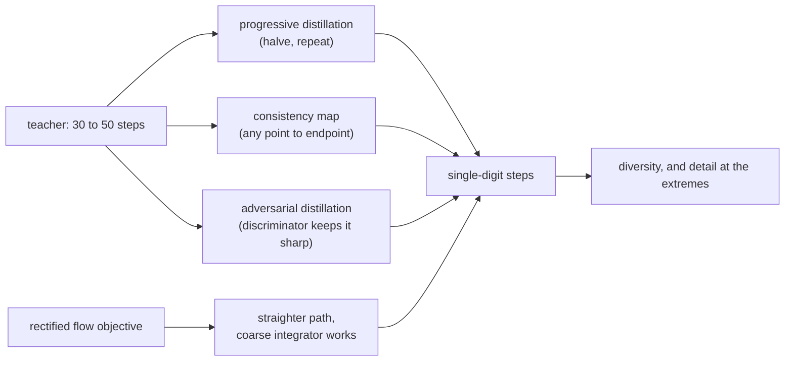

# 3. Steps and distillation

Two ways to lower the step count. One is free and changes nothing about the model.
The other changes the weights and always costs you something. Do them in that order.

## The sampler is free

The training formulation needs on the order of a thousand denoising steps, because it
follows the noise schedule literally. Serving does not have to. Treating the reverse
process as an ordinary differential equation to integrate means you can take larger,
better-placed steps and reach the same trajectory endpoint with far fewer
evaluations.

| Sampler family | Typical steps | Why it works |
|---|---|---|
| Ancestral, following the training schedule | hundreds | Faithful, stochastic, and nobody serves it |
| [DDIM](https://arxiv.org/abs/2010.02502) and relatives | 30 to 50 | Deterministic and non-Markovian, so steps can be skipped consistently |
| Higher-order ODE solvers | 20 to 30 | Better placement of fewer evaluations along the same path |
| Distilled model | 1 to 8 | The reduction is trained in, see below |

Determinism is worth more than it looks. A deterministic sampler with a fixed seed
lets a user reproduce an image, and lets you diff two model versions on identical
inputs. Losing that to a scheduler or kernel change turns every quality investigation
into an argument nobody can settle.

## Guidance is the other half of the same lever

[Classifier-free guidance](https://arxiv.org/abs/2207.12598) is what makes an image
follow its prompt. The model is evaluated twice, conditioned and unconditioned, and
the two predictions are extrapolated apart by a guidance scale:

$$
\hat\epsilon = \epsilon_{\text{uncond}} + w \cdot (\epsilon_{\text{cond}} - \epsilon_{\text{uncond}})
$$

Raising $w$ increases prompt adherence and lowers diversity, and eventually
saturates colours and destroys detail. Lowering it is not a cost lever, because the
cost is in evaluating the model twice, not in the arithmetic. The cost lever is
**guidance distillation**: train a model whose single evaluation already behaves like
the guided combination, which turns $c$ from 2 back to 1 for free at serving time.

## Buying steps back by changing the weights

Below roughly twenty steps, the sampler runs out. Getting to single digits means
distilling, and there are four families worth knowing by name.

| Method | Steps | The idea | What it costs |
|---|---|---|---|
| [Progressive distillation](https://arxiv.org/abs/2202.00512) | halves per round | A student learns to take two teacher steps at once, repeatedly | Several training rounds; quality erodes at the low end |
| [Consistency models](https://arxiv.org/abs/2303.01469) | 1 to 4 | Learn a map from any point on the trajectory directly to its endpoint | Sample diversity, and fine detail |
| [Latent consistency](https://arxiv.org/abs/2310.04378) and [LCM-LoRA](https://arxiv.org/abs/2311.05556) | 2 to 8 | The same in latent space, packaged as an adapter | Some prompt adherence; quality varies by base checkpoint |
| [Adversarial diffusion distillation](https://arxiv.org/abs/2311.17042) | 1 to 4 | Add a discriminator so a single step stays sharp | Training complexity, and diversity again |
| [Rectified flow](https://arxiv.org/abs/2309.06380) and [flow matching](https://arxiv.org/abs/2210.02747) | few | Straighten the trajectory so a coarse integrator suffices | A training-time objective decision, not a serving switch |

## The sentence to say out loud

**Every step distillation trades diversity for speed.** A four-step model produces a
narrower range of images from the same prompt. That is fine for a product with a
fixed house style and wrong for a creative tool where the user is exploring, and the
loss shows up on the tail of prompts rather than on the demo set.

The design that follows from it is routing, not a single choice: the distilled model
generates the draft grid at interactive speed, and the full model renders the one the
user picked. Both models resident, one loop each, and the user never sees the seam.

## When to use which

| Reach for | When | Instead of |
|---|---|---|
| A higher-order ODE sampler | Always, before anything else | Serving the training-time step count |
| Guidance distillation | Guidance is doubling every evaluation and you can change weights | Lowering the guidance scale, which changes what users see |
| LCM-LoRA | You need few-step generation on an existing fine-tune, this week | A full distillation program for a first result |
| Adversarial distillation | Single-digit steps and sharpness both matter | Consistency distillation alone, which softens at one step |
| A rectified-flow model | You are choosing a base model anyway | Trying to convert an existing model to a different objective |
| Routing between distilled and full | The product has both a draft moment and a final moment | Picking one model and arguing about the tradeoff forever |

## Implementation and training pitfalls

| Pitfall | What you see | Fix |
|---|---|---|
| Distilled model keeps the old guidance scale | Washed-out or over-saturated output | Re-tune guidance for the few-step regime, often to zero |
| Acceptance tested on demo prompts | Great demo, complaints after launch | Paired preference on a broad set including hard compositions and text |
| Stacking a style adapter with an acceleration adapter | Style drifts or artifacts appear | Test the exact adapter stack you will serve |
| Assuming a distillation transfers across bases | Quality varies by checkpoint | Re-run the acceptance test per base |
| Losing determinism | Two runs of the same seed differ, investigations stall | Pin sampler, precision and kernel choices; treat determinism as a feature |
