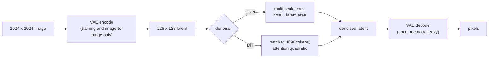

# 4. The latent and the denoiser

Three components decide what a forward evaluation costs: the autoencoder that defines
the latent space, the denoiser that runs inside it, and the conditioning path that
carries the prompt.

## The autoencoder is why this is affordable, and where the memory goes

[Latent diffusion](https://arxiv.org/abs/2112.10752) moves the whole process into a
compressed space. An encoder maps the image to a latent grid, all denoising happens
there, and a decoder maps back to pixels exactly once. With a downsampling factor of
8, a 1024 by 1024 image becomes a 128 by 128 latent: 64 times fewer positions, and
the reason 1024px generation is possible at interactive latency at all.

Two things about the decode that people forget to budget:

- **It runs once, but its activation memory scales with output pixels.** At high
  resolution the VAE decode, not the denoising loop, is what sets peak memory and
  causes out-of-memory failures. Tiled decode bounds it, at the cost of a small seam
  risk between tiles.
- **It is where fine detail is finally committed.** A latent that looks correct can
  still decode with artifacts, so a quality regression that appears only at high
  resolution is often a decode problem rather than a model problem.

## UNet or transformer

| | Convolutional UNet | Transformer denoiser (DiT) |
|---|---|---|
| Sees the latent as | A spatial grid at several scales | A sequence of patches |
| Cost scales with | Latent area, roughly linearly | Tokens, with quadratic attention |
| Scaling behaviour | Harder to predict | Predictable, the language-model story |
| Conditioning | Cross-attention layers | Cross or joint attention over the same sequence |
| Where it is used | The Stable Diffusion 1.x and XL line | [DiT](https://arxiv.org/abs/2212.09748), [SD3](https://arxiv.org/abs/2403.03206), current video models |

The serving consequence of the transformer line is convenient: the cost arithmetic
becomes the arithmetic you already know. Tokens are
$(\text{latent side} / \text{patch})^2$, attention is quadratic in tokens, and every
optimization from the language chapters (fused attention kernels, precision choices,
compiled graphs) applies with no translation.



## Conditioning: the cheapest part of the pipeline

The prompt is encoded once by a text encoder (in the SDXL line, two of them) and the
denoiser attends to that encoding at every step. Two practical notes:

- **The text encoding is cacheable.** Templated prompts, system-style prefixes and
  repeated requests all hit the same encoder output. It is a small win, and it is
  free.
- **Conditioning is not only text.** [SDXL](https://arxiv.org/abs/2307.01952)
  conditions on the original image size and crop parameters so the model stops
  producing accidentally cropped compositions, which is a data problem solved by
  turning it into an input. Image-to-image, inpainting and control signals all enter
  the same way, which is why one serving path can carry all of them.

## What the numbers look like

```python
def denoiser_tokens(image_side, downsample=8, patch=2):
    return ((image_side // downsample) // patch) ** 2

def relative_attention_cost(image_side):
    """Attention work grows with the square of the token count."""
    return denoiser_tokens(image_side) ** 2

# denoiser_tokens(512), denoiser_tokens(1024), denoiser_tokens(2048)
#   -> 1024, 4096, 16384
# relative_attention_cost(2048) / relative_attention_cost(1024) -> 16.0
```

Doubling the side quadruples the tokens and multiplies attention work by sixteen.
That is the honest answer to "can we just offer 2048px", and it is the reason
high-resolution paths are usually a separate tier with their own price.

## When to use which

| Reach for | When | Instead of |
|---|---|---|
| Latent diffusion at f = 8 | Anything at 512px or above | Pixel-space diffusion, which is not affordable at these sizes |
| A transformer denoiser | You are choosing a base model and want predictable scaling | Assuming the UNet line is still the default; current video models are not |
| Tiled VAE decode | Output above roughly 1024px | A larger instance to survive one decode pass |
| Cached text encodings | Templated or repeated prompts | Re-encoding the same prefix every request |
| A separate high-resolution tier | Users ask for 2048px | One price for every resolution, which the arithmetic does not support |

## Implementation and training pitfalls

| Pitfall | What you see | Fix |
|---|---|---|
| Budgeting memory for the loop only | Out of memory at decode, at high resolution only | Size for the VAE decode, or tile it |
| Serving at a resolution the model was not conditioned for | Odd compositions, cropped subjects | Use the model's size and crop conditioning as intended |
| Mixing VAE versions between train and serve | Subtle colour shifts and detail loss | Pin the autoencoder with the checkpoint |
| Treating 2048px as twice 1024px | Capacity plan is wrong by an order of magnitude | Use the token and attention arithmetic above |
| Ignoring the second text encoder | Prompt adherence quietly worse than the reference | Match the reference pipeline exactly before optimizing it |
