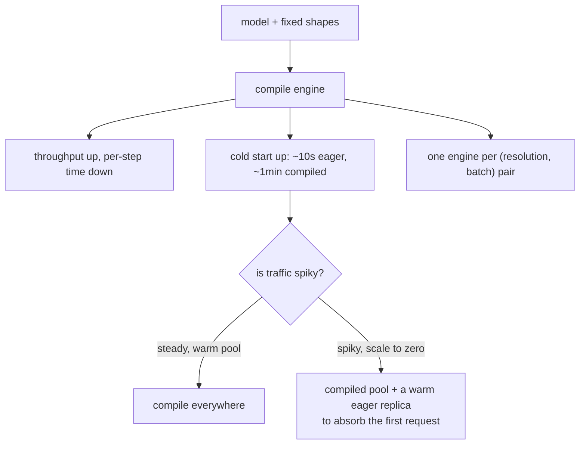
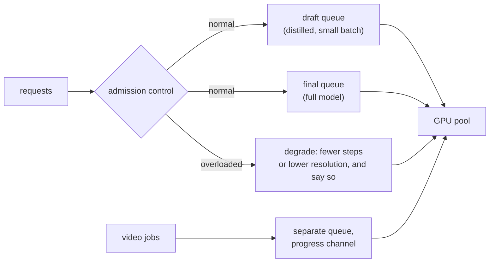

# 5. Serving

This workload looks like an LLM from a distance and behaves like nothing of the sort.
The differences are what the serving design is about.

## Not an LLM

| Property | LLM decode | Diffusion |
|---|---|---|
| Shape | Grows token by token | Fixed from the first step |
| State between steps | A KV cache that grows | A latent tensor, same size throughout |
| Batching | Continuous: requests join and leave mid-flight | Static: one step count for the whole batch |
| Bound by | Memory bandwidth | Compute, mostly |
| Failure under load | Cache pressure and preemption | Queueing, and a memory spike at decode |
| Compilation | Awkward, shapes change | Natural, shapes are known ahead of time |

Two consequences fall straight out. Static batching means a batch is only as fast as
its step count, so mixing a 4-step and a 30-step request in one batch wastes the fast
one: batch by configuration, not by arrival time. And fixed shapes make ahead-of-time
compilation unusually effective here, which leads to the decision this section is
really about.

## Compiled engines, and the cold start they buy you

Compiling the denoiser for a fixed resolution and batch size, with fused kernels and a
chosen precision, is the largest single win available without touching the weights.
[Baseten reports](https://www.baseten.co/blog/40-faster-stable-diffusion-xl-inference-with-nvidia-tensorrt/)
roughly 40 percent faster SDXL inference on an H100 with TensorRT, sub-two-second
latency at 30 steps, and the number that matters operationally: **cold start goes from
about ten seconds to roughly a minute.**

Three things follow that an interviewer will probe:

- **Engines multiply.** Three resolutions and two batch sizes is six engines, each a
  build artifact that has to be versioned with the model and rebuilt in CI.
- **Precision changes hide inside compilation.** A compiled engine may quantize or
  fuse in ways that shift outputs slightly, so a paired preference test belongs in the
  adoption path, not after it.
- **Cold start is a first-class metric.** [Modal's cold-start
  guide](https://modal.com/docs/guide/cold-start) is the operational counterpart:
  load weights from a fast volume rather than pulling them, snapshot memory after
  initialization so expensive setup happens once, and size a warm pool from the
  arrival rate rather than from peak.

## Adapters, previews, and the safety pass

**Style adapters.** LoRA adapters are small and swappable, so keep one base resident
and swap per request. One base plus fifty adapters is a very different memory plan
from fifty models, and batching by adapter where the queue allows keeps the swap cost
amortized.

**Progressive preview.** Decoding an intermediate latent every few steps and streaming
it changes perceived latency more than shaving two steps does. Decode the preview at
low resolution: a full-resolution preview costs a real VAE pass each time.

**Safety in the path.** Prompt classification before generation and output
classification after are two more models in the latency budget. Two tricks worth
knowing: run the output classifier on the low-resolution preview so a rejection does
not pay for the full decode, and make the prompt classifier the cheap one, since it
gates everything downstream.

## The queue is where p95 actually lives

Generation times are long and highly variable, which is the same tail problem the
[reasoning chapter](../reasoning-serving/) describes for thinking models, arriving
here for a different reason. The controls are the same in shape:

- **Separate capacity by class, not just separate queues.** Draft grid, final render
  and video have very different service times, and a priority queue does not fix that
  on shared hardware: it cannot preempt a render that has already started. The
  [capstone](10-putting-it-together.md) runs the numbers.
- **Admission control that degrades rather than queues.** Under load, drop to the
  distilled model or a lower resolution and say so in the response, rather than
  letting the queue grow past the user's patience.
- **Cap concurrency per GPU by memory, not by guess.** The decode spike is what
  decides how many requests can be in flight.

## When to use which

| Reach for | When | Instead of |
|---|---|---|
| Batching the variant grid | The product shows several options | Treating each variant as its own request |
| Batching by configuration | Requests use different step counts or adapters | Batching by arrival time, which wastes the fast requests |
| A compiled engine | Fixed shapes, steady traffic, a warm pool | Compiling when you need scale-to-zero across many shapes |
| A warm eager replica | Spiky traffic that must still scale down | Paying for a compiled instance to sit idle |
| One base plus adapters | Many styles | One loaded model per style |
| Low-resolution preview decode | Interactive products, always | Full-resolution previews, which cost a real decode each |
| Classifier on the preview | Output classification is in the path | Classifying after the full decode, which pays for rejected images |
| Degrade under load | Traffic exceeds capacity | Queueing past the user's patience |

## Implementation and training pitfalls

| Pitfall | What you see | Fix |
|---|---|---|
| Cold start discovered at launch | First request after idle times out | Track cold start from the first deployment, and size a warm pool |
| Engine drift | Compiled engine and checkpoint disagree after an update | Build engines in CI and version them with the model |
| Mixed step counts in one batch | Throughput lower than either configuration alone | Batch by configuration |
| Adapter stack untested | Style drifts when an acceleration adapter is added | Test the exact stack you serve |
| Safety pass serialized after full decode | Rejected images cost the full pipeline | Classify the preview, reject early |
| Concurrency tuned to average memory | Intermittent out-of-memory at high resolution | Size concurrency from the decode peak |
