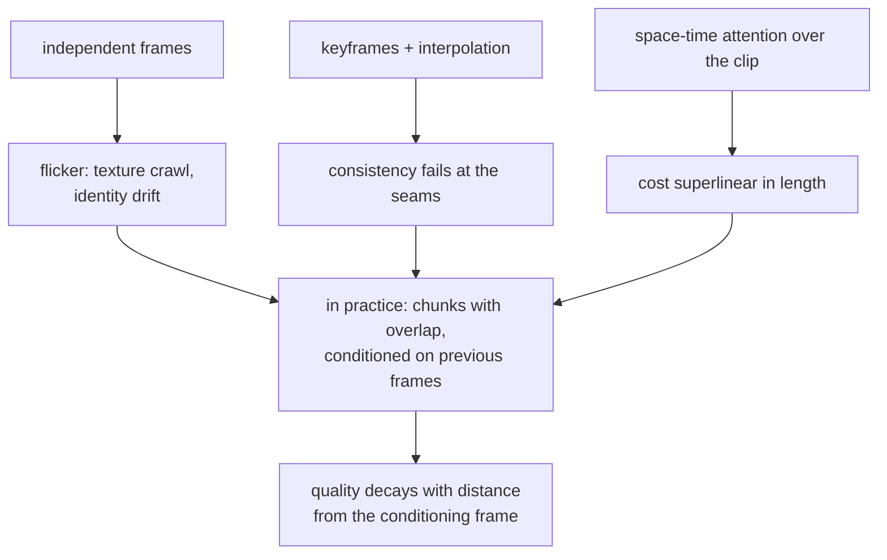

# 6. Video

Video generation is the same model with one more axis, and that axis is a multiplier
rather than a term. Every number from section 2 gets multiplied by frames, and the
temporal attention that keeps frames consistent makes the growth superlinear.

## The arithmetic

$$
N_{\text{FE}}^{\text{video}} \approx S \cdot c \cdot g(F), \qquad g(F) \text{ superlinear once attention spans time}
$$

A five-second clip at 24 frames per second is 120 frames. Even at $g(F) = F$, a
generation that takes two seconds for one image takes four minutes for the clip, and
the real factor is worse because attention across the temporal dimension does not
scale linearly. This is why:

- **Video is a queued job, not a request.** Every product that started with a
  request-response endpoint ended up building the queue anyway. Design it with a job
  id, a progress channel and a result callback from the start.
- **The metric is cost per second of output**, at a stated resolution and frame rate.
  Cost per request is meaningless when the request is a variable-length clip.
- **A preview tier is how this stays affordable.** Low resolution, low frame rate,
  fewer steps, and a full render only for the clip the user keeps.

## Temporal consistency is the whole difficulty

Generate each frame independently and the result flickers: textures crawl, objects
change identity, lighting jumps. The fix is to let the model attend across time,
which is exactly what makes it expensive. Three approaches, and the tradeoff each
makes:

| Approach | How | Tradeoff |
|---|---|---|
| Temporal layers on an image model ([Video LDM](https://arxiv.org/abs/2304.08818), [Stable Video Diffusion](https://arxiv.org/abs/2311.15127)) | Insert temporal attention or convolution into a pretrained image backbone, train those | Cheapest path to video, inherits the image model's strengths and its limits |
| Whole-clip space-time generation ([Lumiere](https://arxiv.org/abs/2401.12945)) | One pass over the full temporal extent, no keyframe interpolation | Removes the interpolation seam, costs compute proportional to the whole clip |
| Media foundation models ([Movie Gen](https://arxiv.org/abs/2410.13720)) | Train at scale on video from the start, with audio and editing in the same family | The scale is the barrier; read it for what production costs |

## Length is generated in chunks, and you should say so

Models have a native clip length. Longer output is produced by generating chunks that
overlap and conditioning each on the last frames of the previous one, so quality
degrades with distance from the conditioning frame: drift in colour, identity and
camera motion. The honest product decision is to quote a supported clip length rather
than implying unbounded generation, and to expose the seam behaviour in the interface
(for example by letting the user re-roll a chunk) rather than pretending it does not
exist.

## The data pipeline is most of the system

The most instructive thing about the [Stable Video Diffusion
report](https://arxiv.org/abs/2311.15127) is its ordering: most of it is the data
pipeline, not the architecture. Cut detection so that no training clip spans a scene
change, captioning at several levels of detail, optical-flow filtering to drop static
clips and camera shake, aesthetic and text-presence filters, then a staged recipe of
image pretraining, video pretraining on the curated set, and a high-quality fine-tune.

Two lessons for an interview. Training across a cut teaches the model to hallucinate
cuts, which is a visible artifact with an obvious cause. And in this area the
curation decisions are more reproducible, and more consequential, than the
architecture ones, which is why the report spends its pages there.

## When to use which

| Reach for | When | Instead of |
|---|---|---|
| A queued job with progress | Any video generation | A synchronous endpoint that will time out |
| Temporal layers on an image backbone | You need video and have an image model you trust | Training a video model from scratch |
| Whole-clip generation | Consistency matters more than clip length | Keyframes plus interpolation, whose seams are visible |
| Chunked generation with overlap | Output longer than the native window | Claiming unbounded length |
| A low-resolution preview tier | Users iterate before choosing | Full-quality renders for every attempt |
| Cost per second of output | Reporting anything about video economics | Cost per request |

## Implementation and training pitfalls

| Pitfall | What you see | Fix |
|---|---|---|
| Frames generated independently | Flicker and identity drift | Temporal attention, or an image-to-video model that has it |
| Training clips spanning a cut | The model invents scene changes | Cut detection before anything else in the pipeline |
| No motion filter | The model learns from static clips and produces static video | Optical-flow filtering during curation |
| Unbounded length promised | Quality collapses far from the conditioning frame | Quote a supported length, expose re-rolls |
| Comparing clips at different settings | Nobody can reproduce the comparison | Fix resolution, frame rate and length before measuring |
| Video sharing the image queue | Image p95 collapses when a video job lands | Separate queues, separate capacity |
