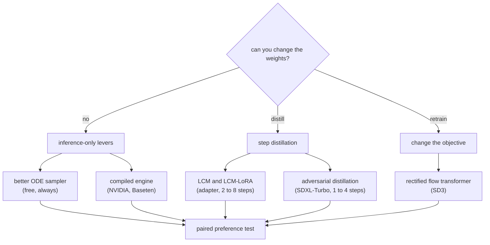

# 7. How teams do it in production

Every system below runs the same pipeline: encode the prompt once, denoise for as few
evaluations as it can, decode once, classify, attach provenance. What separates them
is how they buy the step count back, and how much of the graph they are willing to
freeze into a compiled engine.

## Where the real designs diverge

| Team | Chose | Because | Gave up |
|---|---|---|---|
| Stability AI (SDXL) | A larger base plus a refiner stage | Quality at 1024px | Cost per image, and two checkpoints resident |
| Stability AI (SDXL-Turbo) | Adversarial distillation to 1 to 4 steps | Interactive, near-typing-speed generation | Diversity, and some prompt adherence |
| Stability AI (SD3) | A rectified-flow transformer | Straighter trajectories, predictable scaling | It is a model change, not a serving switch |
| LCM and LCM-LoRA | Consistency distillation shipped as an adapter | Adoption on top of existing fine-tunes | Some detail, and quality varies by base |
| OpenAI (consistency models) | A direct map to the trajectory endpoint | The formulation everything else descends from | Diversity at one step |
| NVIDIA and Baseten | Compiled engines with fixed shapes | Tens of percent, on the same weights | Cold start, and one engine per shape |
| Modal | Cold start as the product | Scale-to-zero economics | Complexity in the platform, not the model |
| Stability AI (SVD), Google (Lumiere), Meta (Movie Gen) | Space-time attention over the clip | Temporal consistency | Interactive latency entirely: these are batch jobs |

## The systems (first-party links)

- **Stability AI** [SDXL](https://arxiv.org/abs/2307.01952) - the base-plus-refiner
  design, and size and crop conditioning as a data fix expressed as an input.
- **Stability AI** [Adversarial diffusion
  distillation](https://arxiv.org/abs/2311.17042) - SDXL-Turbo, and the clearest
  statement anywhere of what step distillation costs in diversity.
- **Stability AI** [Scaling rectified flow
  transformers](https://arxiv.org/abs/2403.03206) - SD3, the move to flow matching
  and a transformer denoiser, with the ablations that justified it.
- **Stability AI** [Stable Video Diffusion](https://arxiv.org/abs/2311.15127) - more
  pages on video data curation than on architecture, which is the honest ordering.
- **OpenAI** [Consistency models](https://arxiv.org/abs/2303.01469) - the one-step
  formulation the whole distillation line descends from.
- **Meta** [Movie Gen](https://arxiv.org/abs/2410.13720) - a family of media
  foundation models with the training and inference scale stated.
- **Meta** [Emu](https://arxiv.org/abs/2309.15807) - quality-tuning on a couple of
  thousand hand-picked images beats another scrape.
- **Google** [Lumiere](https://arxiv.org/abs/2401.12945) - whole-clip space-time
  generation instead of keyframes plus interpolation.
- **Baseten** [40 percent faster SDXL inference with
  TensorRT](https://www.baseten.co/blog/40-faster-stable-diffusion-xl-inference-with-nvidia-tensorrt/)
  - the compiled-engine tradeoff with numbers, cold start included.
- **Baseten** [How to benchmark image generation
  models](https://www.baseten.co/blog/how-to-benchmark-image-generation-models-like-stable-diffusion-xl/)
  - why throughput and latency answer different questions here.
- **NVIDIA** [SDXL on the NVIDIA AI inference
  platform](https://developer.nvidia.com/blog/generate-stunning-images-with-stable-diffusion-xl-on-the-nvidia-ai-inference-platform/)
  - the optimization stack for a fixed-shape workload, end to end.
- **NVIDIA** [Optimizing transformer-based diffusion models for video
  generation](https://developer.nvidia.com/blog/optimizing-transformer-based-diffusion-models-for-video-generation-with-nvidia-tensorrt/)
  - the same, where attention spans space and time.
- **Modal** [Cold start performance](https://modal.com/docs/guide/cold-start) - the
  operational half of the compilation decision.
- **Hugging Face** [LCM-LoRA](https://huggingface.co/blog/lcm_lora) - step
  distillation packaged as an adapter, and why few-step generation spread so fast.

## What to take from the set

Three patterns repeat across all of them, and they are what to say when asked how
real teams approach this.

1. **Nobody serves the training step count.** The first move is always a better
   sampler, and it is free.
2. **The step count is bought back with weights, and the currency is diversity.**
   Every team that went below ten steps traded output variety for speed, and the ones
   that were honest about it said so in the paper.
3. **The operational decision is compilation versus cold start.** It is not about the
   model at all, and it is the one an interviewer is most likely to have lived
   through.
