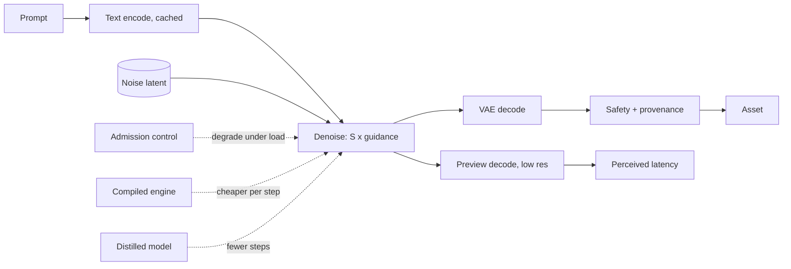

# 9. Summary

## One-page recap

- **The cost unit is a forward evaluation of the denoiser**, not a token.
  $N_{\text{FE}} = S \cdot c$, and classifier-free guidance makes $c = 2$.
- **Latency is one multiplied term and three fixed ones**:
  $t \approx t_{\text{text}} + N_{\text{FE}} \cdot t_{\text{step}} + t_{\text{decode}} + t_{\text{safety}}$.
  Optimize the multiplied one first.
- **The latent is why this is affordable.** Downsample 8 turns 1024px into a 128 by
  128 grid; at patch 2 a transformer denoiser sees 4,096 tokens, and attention is
  quadratic in that, so 2048px is sixteen times the attention work, not four.
- **A variant grid is one batch**, so four images cost about the same as one.
- **Samplers are free, distillation is not.** Better ODE solvers reach 20 to 30
  evaluations with the same weights. Below that you distill, and every distillation
  trades diversity for speed.
- **Compilation is the biggest inference-only win and it costs cold start**, roughly
  ten seconds eager against a minute compiled, plus one engine per shape.
- **The memory spike is the VAE decode**, not the loop. Tile it above 1024px.
- **Video multiplies by frames and then some**, because temporal attention is what
  stops flicker. It is a queued job, priced per second of output.
- **FID is not the gate.** Paired human preference on a fixed prompt set is, with a
  prompt-adherence proxy for cheap checks and seeded determinism so versions can be
  diffed.

## The system on one page

## Test yourself

**1.** A service runs 40 steps with guidance at 1024px. How many forward evaluations
is that, and what happens to the number if you switch to a 4-step distilled model
with guidance distilled in?

Answer

40 steps with guidance is $40 \times 2 = 80$ evaluations. A 4-step model with guidance
distilled in is $4 \times 1 = 4$. That is a 20x reduction in the dominant term, which
is why distillation is the lever that changes the product rather than the margin. The
fixed terms (text encode, decode, safety) do not shrink, so end-to-end latency
improves by less than 20x, and at that point those terms dominate.

**2.** Your product offers 1024px and 2048px at the same price. Why is that a problem?

Answer

Tokens go from $(1024/16)^2 = 4096$ to $(2048/16)^2 = 16384$, four times as many, and
attention work grows with the square of the token count, so roughly sixteen times.
Peak memory at VAE decode also grows with output pixels. One price cannot cover both
unless the 1024px price is carrying the 2048px cost.

**3.** You ship a distilled model. Benchmarks hold, demo prompts look great, and two
weeks later users say the tool feels repetitive. What happened, and what should the
acceptance test have measured?

Answer

Step distillation narrows the output distribution. Individual images stay good, so any
per-image metric holds, but variety across seeds for the same prompt drops. The
acceptance test should have included a diversity measure across seeds and a paired
preference test over a broad prompt set including hard compositions, not only the demo
set.

**4.** p95 is twelve seconds, the cost model says three. Name the four places to look,
in order.

Answer

Queueing (arrival rate against capacity, no admission control), cold start if traffic
is spiky, the pipeline around the loop (uncached text encode, full-resolution preview
decodes, a safety pass serialized after full decode), and memory pressure at VAE
decode causing retries at high resolution.

**5.** Why can a compiled engine make deployments harder even though it makes requests
faster?

Answer

It freezes shapes, so each resolution and batch size needs its own engine, versioned
and rebuilt with the model. And it raises cold start from about ten seconds to roughly
a minute, which breaks scale-to-zero for spiky traffic. The usual answer is a compiled
pool plus a warm eager replica for the first request after idle.

## Further reading

- [Latent diffusion](https://arxiv.org/abs/2112.10752) for why the latent exists,
  and [SDXL](https://arxiv.org/abs/2307.01952) for the design most open generation
  inherits.
- [DDIM](https://arxiv.org/abs/2010.02502) and
  [classifier-free guidance](https://arxiv.org/abs/2207.12598) for the two halves of
  the evaluation count.
- [Consistency models](https://arxiv.org/abs/2303.01469),
  [LCM-LoRA](https://arxiv.org/abs/2311.05556) and
  [adversarial diffusion distillation](https://arxiv.org/abs/2311.17042) for the
  step-distillation family.
- [DiT](https://arxiv.org/abs/2212.09748) and [SD3](https://arxiv.org/abs/2403.03206)
  for the transformer and flow-matching line current systems are built on.
- [Stable Video Diffusion](https://arxiv.org/abs/2311.15127),
  [Lumiere](https://arxiv.org/abs/2401.12945) and
  [Movie Gen](https://arxiv.org/abs/2410.13720) for video.
- The full reading list is in [papers.md](../../papers.md); the production writeups
  are in [section 7](07-how-teams-do-it-in-production.md).
