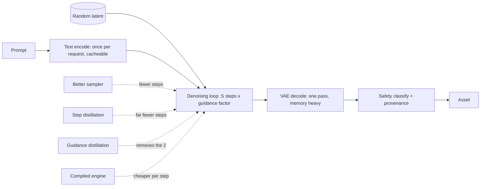

# Image and Video Generation Serving

> **Style note.** This chapter follows the same teach-first shape as the rest of the
> book: an interviewer dialogue to scope the problem, one cost model that everything
> else derives from, one idea per figure, real production writeups, and an interview
> Q&A at the end. It is the one chapter whose cost model is not the KV cache, and
> that difference is the reason it exists.

An interviewer rarely says "explain diffusion." They say **"our image generation
feature costs about eight cents an image and p95 is twelve seconds, make it cheaper
and faster without the outputs getting visibly worse."** That question has one
correct entry point, and it is not the one an LLM serving background suggests.

There is no autoregressive loop here, no KV cache, and no per-token bill. There is
one number: **how many times you run the denoiser**. Every lever in this chapter
either lowers that number, makes each evaluation cheaper, or stops you paying for
evaluations whose output nobody looks at.

## Sections

1. [Clarifying the requirements](01-clarifying-requirements.md) -- the dialogue that scopes the problem.
2. [The cost model](02-the-cost-model.md) -- forward evaluations, guidance, the latent, and the arithmetic everything else hangs off.
3. [Steps and distillation](03-steps-and-distillation.md) -- samplers first, then buying steps back by changing the weights.
4. [The latent and the denoiser](04-latents-and-denoisers.md) -- the VAE, UNet versus transformer, and where conditioning enters.
5. [Serving](05-serving.md) -- batching, compiled engines, cold start, adapters, previews, safety in the path.
6. [Video](06-video.md) -- frames as a multiplier, temporal consistency, and why this is a queued job.
7. [How teams do it in production](07-how-teams-do-it-in-production.md) -- named companies, divergence table, first-party links.
8. [Interview Q&A](08-interview-qa.md) -- commonly asked, tricky, and commonly answered wrong.
9. [Summary](09-summary.md) -- one-page recap, mermaid, test-yourself, further reading.
10. [Putting it together: the complete build](10-putting-it-together.md) -- a default stack, the scenario costed end to end, the same system under two other constraint sets, and a runnable cost model you can execute with nothing but Python 3.

## The whole system on one page

Read the sections in order the first time. They build on each other, and every one
of them refers back to the cost model in section 2.

## Companion chapters

The serving vocabulary here (batching, compiled kernels, queueing, the tail) is the
same one used in [Serving LLM Inference at Scale](../inference-serving/) and
[Reasoning and Test-Time Compute](../reasoning-serving/); what changes is that the
workload has fixed shapes and no KV cache. The evaluation problem, where the metric
everyone quotes is not the metric the product needs, is the same one in
[Benchmarking a Model](../benchmark-eval/). The dense counterpart to this chapter is
[topic 19](../../topics/19-generation-serving.md).
