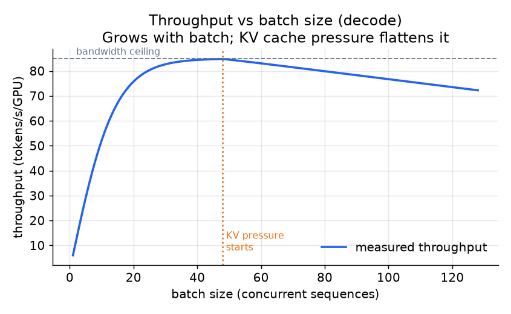
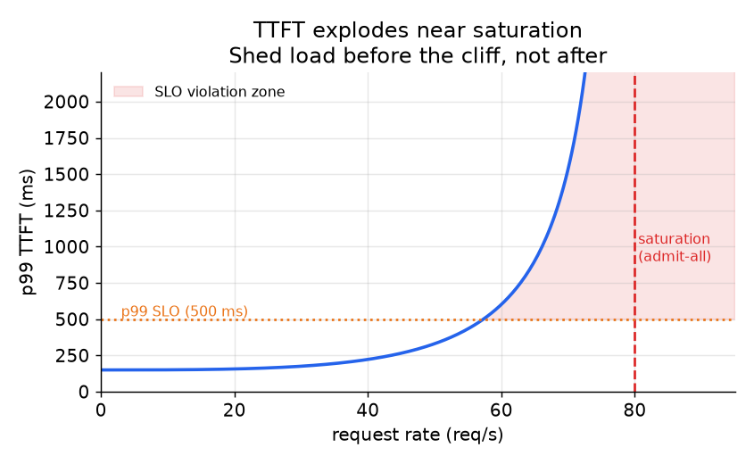

# 2. The throughput problem

Understanding why LLM serving is hard requires understanding that a request has
two distinct phases with opposite hardware appetites. Mixing them naively is where
throughput collapses and latency spikes.

## Prefill and decode: two phases, two bottlenecks

**Prefill** processes the entire prompt in one parallel forward pass. Every prompt
token attends to every other token simultaneously, so the GPU executes a dense
matrix multiply over the full sequence. This is **compute-bound**: the FLOPs
performed greatly outweigh the bytes moved from HBM. Arithmetic intensity is high,
the GPU is busy, and the step finishes quickly relative to the amount of work done.
The cost scales with prompt length and is paid once per request.

**Decode** generates one output token per forward pass. At each step the model
reads its full weight matrix and the growing KV cache, just to emit a single token.
FLOPs are tiny relative to the bytes fetched. This is **memory-bandwidth-bound**:
arithmetic intensity is near 1, meaning roughly one floating-point operation per
byte moved from HBM. The GPU is mostly waiting for data, not computing. The cost
scales with output length and is paid at every token step.

The roofline model captures this precisely:

$$\text{throughput ceiling} = \min\!\left(\frac{\text{peak FLOPs}}{\text{FLOPs per token}},\; \frac{\text{HBM bandwidth}}{\text{bytes per token}}\right)$$

Prefill lands on the compute side of the min. Decode lands on the bandwidth side.
No amount of arithmetic optimization helps decode; you need to move fewer bytes
or amortize the byte cost across more tokens per step.

## The memory wall: KV cache size

The KV cache is what accumulates during decode and is the binding memory
constraint at high concurrency. Its size per token is:

$$\text{KV bytes per token} = 2 \cdot L \cdot n_{\text{kv}} \cdot d_{\text{head}} \cdot b_{\text{kv}}$$

where $L$ is the number of transformer layers, $n_{\text{kv}}$ is the number of KV
heads (MQA/GQA reduce this significantly), $d_{\text{head}}$ is the head dimension,
and $b_{\text{kv}}$ is bytes per KV element (2 for BF16, 1 for INT8).

For a 70B model in BF16 with 8 KV heads (GQA), 128 head dim, and 80 layers, each
token costs approximately $2 \times 80 \times 8 \times 128 \times 2 = 327\,680$ bytes,
or about 320 KB. A sequence of 4 000 output tokens consumes roughly 1.3 GB of KV
cache on the GPU, just for that single request. At 50 concurrent sequences,
that is 64 GB, which exceeds the H100's HBM before even counting model weights.
KV cache size, not weights, is usually what limits how many sequences you can batch
together.

The decode step time follows directly:

$$\text{decode step time} \approx \frac{P \cdot b_w + N \cdot \text{KV}_{\text{bytes}}}{\text{HBM bandwidth}}$$

where $P$ is the number of weight parameters, $b_w$ is bytes per weight, and $N$
is the number of concurrently batched sequences. Increasing $N$ raises throughput
(the weight-read cost is amortized across more tokens) until the KV term dominates.

*Decode throughput grows with batch size as the fixed weight-read cost is
amortized across more sequences. Growth flattens once KV cache pressure fills HBM
and limits how large the batch can be. The bandwidth ceiling is the roofline limit.
Illustrative.*

## TTFT vs inter-token latency: different SLOs, different levers

**Time to first token (TTFT)** is the delay from when a request arrives to when
it receives its first output token. It is dominated by the prefill pass (which
can be long for a large prompt) and by queue wait time. A busy server with many
requests waiting to start their prefill will have poor TTFT even if decode is fast.

**Inter-token latency (TPOT, time per output token)** is the delay between
consecutive output tokens during streaming. It is dominated by the decode step
time and by prefill interference: a large prefill that runs on the same GPU as
ongoing decodes stalls those decodes for a full step, producing a visible pause
in the token stream.

The two SLOs pull against each other in a mixed workload:

- Prioritizing decode throughput by packing large batches: good for TPOT (the weight
  cost is amortized), bad for TTFT (new requests wait longer to start their prefill).
- Prioritizing fast prefill by always running prefill immediately: good for TTFT,
  but a long prefill occupies the GPU for an entire step and spikes TPOT for every
  in-flight request.

The correct lever is **chunked prefill**: break a long prompt's prefill into small
chunks and interleave them with ongoing decode steps. Each chunk is short enough
that it does not noticeably delay the decode step, so TPOT stays smooth, while the
prompt still makes progress, keeping TTFT bounded. This is the key insight; the
batching section covers the mechanics.

*TTFT degrades gradually at low load and catastrophically near saturation. The
shaded zone shows where p99 exceeds the SLO. The right response to approaching
saturation is controlled load-shedding, not admitting more requests and letting
everyone miss their target. Illustrative.*
