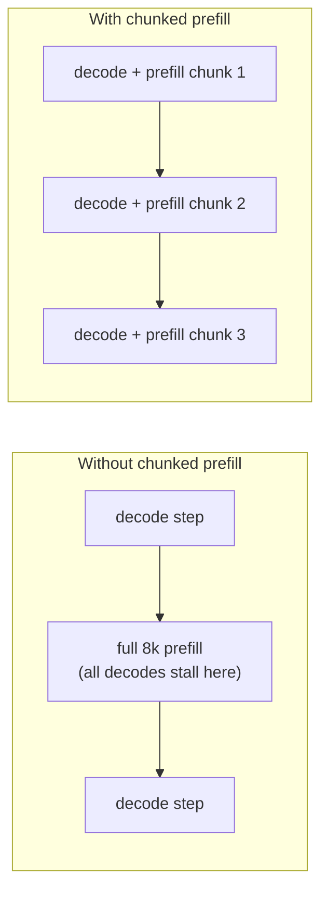

# 3. Batching

Batching (grouping multiple requests so the GPU processes them together) is the single highest-leverage decision in LLM serving. It determines
how efficiently you amortize the fixed cost of reading the model weights across
requests. Getting it wrong wastes GPU cycles; getting it right is the difference
between 8x and 23x throughput over a naive baseline.

## Static batching: the problem

Static batching collects a fixed set of requests, runs all of them to completion
as a group, then starts the next batch. The GPU is efficient while the batch is
running, but each request in the batch generates a different number of output
tokens. A request that finishes in 10 tokens holds its GPU slot until the last
request in the batch finishes 800 tokens later. The GPU sits partly idle through
those final steps, waiting for the longest member to complete. Output-length
variance directly translates to wasted compute.

## Continuous (in-flight) batching: the fix

Continuous batching, also called iteration-level batching, schedules at the token
step rather than the request. After each decode step, the scheduler checks which
sequences have emitted an end-of-sequence token. Finished sequences immediately
release their slots, and the scheduler fills those slots with waiting requests,
which begin their prefill before the next step. The batch composition changes at
every iteration, and the GPU stays saturated.

The per-step throughput is approximately:

$$\text{tokens/s/GPU} \approx \frac{N \cdot \text{step time}^{-1}}{1}$$

```python
def decode_tokens_per_sec(num_live_sequences, step_time_s):
    # each step emits one token per live sequence; throughput = sequences / step time
    return num_live_sequences / step_time_s  # tokens per second per GPU
# decode_tokens_per_sec(50, 0.02) -> 2500.0
```

where $N$ is the number of live sequences. With static batching $N$ falls as
requests finish and the batch is not refilled. With continuous batching $N$ stays
close to the maximum the KV cache allows, so utilization stays high.

Anyscale's vLLM combines continuous batching with **PagedAttention**: instead of
pre-allocating one contiguous buffer per sequence (which wastes memory due to
fragmentation and unknown output lengths), it allocates the KV cache in small
fixed-size blocks and maps them non-contiguously with a page table. Memory waste
drops below 4%. The combined effect over naive static batching is roughly 23x
throughput, with most of the scheduling gain (about 8x) coming from continuous
batching and most of the memory gain from paging.

## The edge case continuous batching hides: KV exhaustion and preemption

Continuous batching admits new sequences greedily up to whatever the KV cache can hold, but decode grows the cache by one token per step for every live sequence, so a batch that fit at admission can outgrow memory mid-flight. When the pool is full and a running sequence needs another block, the scheduler cannot simply wait: it must preempt one or more in-flight sequences to free blocks. vLLM handles this two ways. It can swap the victim's KV blocks out to CPU memory and page them back when space frees up, or it can discard them and recompute the prefill when the sequence is rescheduled. Swapping pays PCIe bandwidth; recomputation pays a redundant prefill pass. Either way the victim stalls, and because preemption falls on the sequences the scheduler picks as victims rather than spreading evenly, the effect lands as a tail-latency cliff rather than a uniform slowdown.

The senior consequence: peak admitted concurrency is not a safe steady state. If you size the batch by what fits at admission time, a workload with long outputs will drive the pool into thrashing, where sequences are repeatedly preempted and restored and aggregate throughput collapses even though the GPU looks busy. The guard is to admit against a KV budget that reserves headroom for the tokens the batch will still generate, not just the tokens present when each request arrives, and to watch the preemption and swap counters as a leading indicator that the admission policy is too aggressive.

## Chunked prefill: smoothing the interference

When a new request arrives, its prefill (computing KV for the entire prompt) must
run before the first output token can be generated. A long prompt (8k tokens)
occupies the GPU for a full prefill step, during which every in-flight decode
sequence is blocked and cannot advance. That pause shows up as a TPOT spike,
sometimes a visible pause in the stream for every other user.

**Chunked prefill** breaks the prefill into smaller chunks (say, 512 tokens each)
and interleaves them with ongoing decode steps. The prefill cost is spread across
several iterations instead of landing in a single step. The decode sequences
advance without interruption, TPOT stays smooth, and the new request still makes
steady prefill progress. The chunk size is a tuning knob: smaller chunks protect
TPOT more, larger chunks complete prefill faster (better TTFT). Sarathi-Serve is
the research paper that formalized this approach.




## Disaggregated prefill and decode: separate pools

A more aggressive answer to prefill-decode interference is to run them on entirely
separate machines. A request enters a **prefill pool**, which runs the compute-bound
prefill pass, fills the KV cache, and then transfers that KV cache to a **decode
pool**, which runs the bandwidth-bound decode loop. The two pools can be sized
and scaled independently: a decode-heavy workload (agents, code generation) gets
more decode machines without starving the prefill pool, and each pool can use the
tensor-parallelism degree that suits its phase.

The cost of disaggregation is the **KV cache transfer** between pools. For a 4k-token
context in BF16 with the numbers from the previous section, that transfer can be
several gigabytes per request per second at scale. It needs fast interconnect
(NVLink or a high-bandwidth fabric) to not become the new bottleneck. NVIDIA Dynamo,
Microsoft Splitwise, and DistServe all use this pattern. For a single small model
at moderate QPS, chunked prefill on one pool is simpler and usually sufficient;
disaggregate when the two SLOs genuinely conflict at fleet scale.

## When to use which

| Reach for | When | Instead of |
|---|---|---|
| Continuous batching (always) | Any production LLM serving | Static batching; the GPU-idle problem is universal |
| PagedAttention (always) | Alongside continuous batching | Contiguous pre-allocation; fragmentation waste is 20-40% without paging |
| Chunked prefill | Long prompts spike TPOT on a mixed-workload single pool | Running full prefill steps that pause all in-flight decodes |
| Disaggregated prefill and decode | Prefill and decode SLOs genuinely conflict; fast interconnect is available | Chunked prefill, when one pool is sufficient and KV transfer cost would dominate |
| Token-budget packing | Prompt lengths vary widely; you want to fill compute per step | Request-count packing, which wastes token budget on batches of short inputs |

**Tools.** Continuous batching with PagedAttention is the default in vLLM and is matched by SGLang, Hugging Face TGI, and TensorRT-LLM (NVIDIA), all of which schedule at the token step and pack by token budget rather than request count. Chunked prefill (the Sarathi-Serve approach) is a configurable flag in vLLM and SGLang. Disaggregated prefill and decode pools are the model in NVIDIA Dynamo and in the DistServe and Splitwise designs, which move the KV cache between separately scaled pools over a fast fabric.

**Provenance.** Continuous (iteration-level) batching originated with Orca (OSDI 2022); PagedAttention originated with vLLM (UC Berkeley, 2023), which borrowed OS-style paging to eliminate contiguous KV pre-allocation. Chunked prefill was introduced by Sarathi-Serve (2024, [arXiv:2403.02310](https://arxiv.org/abs/2403.02310)). Prefill-decode disaggregation was introduced by Splitwise (Microsoft, 2024, [arXiv:2311.18677](https://arxiv.org/abs/2311.18677)) and DistServe (2024, [arXiv:2401.09670](https://arxiv.org/abs/2401.09670)); Mooncake (Moonshot AI, 2024, [arXiv:2407.00079](https://arxiv.org/abs/2407.00079)) treats the KV cache as a first-class distributed object shared across the serving fleet.

**Worked example.** A chat product serving one mid-sized model at moderate QPS turns on continuous batching with PagedAttention unconditionally, because the GPU-idle problem of static batching is universal and paging cuts KV fragmentation waste to a few percent. Because its traffic mixes long prompts with active decode streams, it enables chunked prefill so an 8k-token prompt is spread across several iterations instead of pausing every in-flight stream in one prefill step, keeping TPOT smooth. It does not reach for disaggregated prefill and decode, since a single pool is sufficient at this scale and the multi-gigabyte KV-cache transfer between pools would dominate without a fast interconnect. Only if the prefill and decode SLOs later diverged at fleet scale, with NVLink-class bandwidth available, would it split into separate pools.
