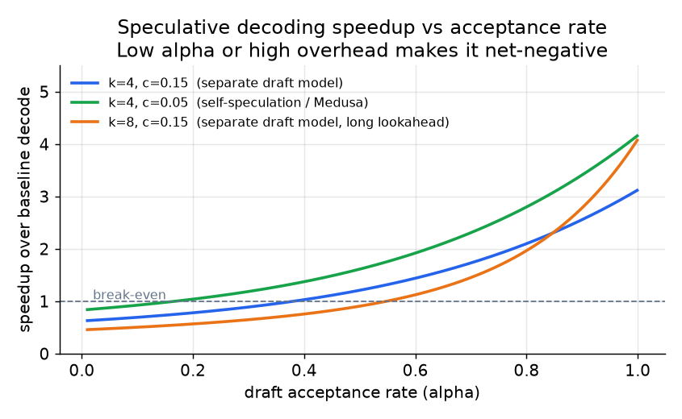

# 4. Speculative decoding

Continuous batching and chunked prefill maximize GPU utilization, but they do not
change the fundamental constraint of decode: one forward pass, one token. Every
decode step reads the full model from HBM to produce a single token. Speculative
decoding breaks that constraint by verifying several tokens in one target-model
pass, at the cost of running a cheaper draft model to propose them first.

## The draft-and-verify pattern

A small, fast **draft model** generates $k$ candidate tokens autoregressively.
This is cheap: the draft model is much smaller than the target, so its forward
passes are fast and memory-light.

The large **target model** then verifies all $k$ draft tokens in a single parallel
forward pass. Verification is parallel because all $k$ positions are known in
advance; computing the probability of each draft token is one forward pass over a
sequence of $k$ tokens, not $k$ sequential passes. The verification cost is
therefore roughly the same as running the target model once over $k$ tokens, which
is much cheaper than running it $k$ times autoregressively.

The acceptance rule is **rejection sampling**: for each draft token $x_i$ with
target probability $p(x_i)$ and draft probability $q(x_i)$, accept with
probability $\min(1, p(x_i)/q(x_i))$. On rejection, resample a correction token
from the residual distribution. This rule is provably equivalent to sampling
directly from the target model: the output distribution is identical. Speculative
decoding is a latency optimization, not a quality trade.

## The speedup formula

Let $\alpha$ be the acceptance rate (the probability that a single draft token is
accepted), $k$ be the number of draft tokens, and $c$ be the per-token
verification overhead as a fraction of one target-model step. The expected number
of tokens emitted per target-model pass is:

$$\text{expected tokens per pass} = \frac{1 - \alpha^{k+1}}{1 - \alpha}$$

The speedup over baseline decode (one target pass per token) is:

$$\text{speedup} = \frac{1 - \alpha^{k+1}}{(1 - \alpha)(1 + ck)}$$

```python
def spec_speedup(alpha, k, c):
    # alpha: per-token accept rate; k: draft tokens; c: verify overhead per draft token
    tokens_per_pass = (1 - alpha ** (k + 1)) / (1 - alpha)  # expected tokens each target pass
    return tokens_per_pass / (1 + c * k)                    # divide by relative pass cost
# spec_speedup(0.8, 4, 0.1) -> ~2.40   (a high-acceptance draft, >1 means faster)
# spec_speedup(0.2, 4, 0.1) -> ~0.89   (a low-acceptance draft, <1 means slower than baseline)
```

The numerator captures how many tokens each target pass produces on average. The
denominator accounts for the overhead of the $k$ draft steps. When $\alpha$ is
high and $c$ is small, speedup is large. When $\alpha$ is low or $c$ is large
(because the draft model is expensive), the formula predicts speedup below 1,
meaning speculative decoding slows inference. Fireworks measured a generic draft
at $\alpha \approx 0.29$ and found a $1.5\times$ slowdown; switching to a
workload-specialized draft brought $\alpha$ to 0.76 and delivered a $2\times$
speedup.



*Speedup as a function of acceptance rate $\alpha$ for three configurations. At
low $\alpha$, overhead from draft tokens dominates and speedup falls below 1.
Self-speculation (lower $c$) breaks even at a lower $\alpha$ than a separate draft
model. Illustrative using the formula above.*

## Variants

**Separate draft model:** a small model (7B drafting for a 70B target) trained to
mimic the target's distribution. Most portable; works on any workload. Hosting a
second model adds memory footprint and deployment complexity.

**n-gram / prompt-lookup drafting:** draft tokens are copied directly from patterns
already in the input (job description quoting, code templates). No extra model to
host; acceptance is very high when output echoes the input. LinkedIn's Hiring
Assistant achieved nearly $4\times$ throughput and 66% lower P90 latency this way.
Acceptance collapses on free-form creative generation.

**Self-speculation (Medusa-style heads):** extra prediction heads attached to the
target model predict several tokens ahead from its own hidden states. No separate
model to host; overhead $c$ is lower. Quality of drafts depends on the distribution;
training the heads is additional work.

**Online adaptive drafts:** Together AI's ATLAS trains a lightweight speculator on
live traffic in real time and blends it with a static baseline. Acceptance tracks
workload drift rather than decaying as traffic patterns shift.

## When to use which

| Reach for | When | Instead of |
|---|---|---|
| Speculative decoding (general) | Decode-bound; batch size is low to moderate; you can measure acceptance $\alpha$ per workload | When batch is already large enough to saturate the GPU; verification overhead eats the win |
| n-gram / prompt-lookup | Output text frequently echoes the input (retrieval, templated generation, code completion); no budget for a draft model | A separate draft model, when input-output overlap is high and you want simplicity |
| Separate draft model | General traffic; you can afford to host a second smaller model and can fine-tune it | Self-speculation, when you cannot modify the target model |
| Self-speculation heads | You want low overhead $c$ and can retrain the target model | A separate model, when target retraining is off the table |
| Workload-adaptive draft (ATLAS) | Traffic distribution shifts over time; you need acceptance to track live sessions | A static draft, when traffic is stable and a one-time trained speculator stays effective |

**Tools.** Speculative decoding is built into vLLM, SGLang, and TensorRT-LLM (NVIDIA), each of which supports a separate draft model, prompt-lookup n-gram drafting, and self-speculation heads. Medusa is the reference self-speculation-head implementation and EAGLE is a widely used draft-head method, both integratable into those engines. Prompt-lookup decoding needs no extra model at all and ships as a flag, while workload-adaptive online drafts follow the ATLAS design.

**Provenance.** Speculative decoding was introduced independently by Google and DeepMind (2023) with the rejection-sampling accept rule that keeps output identical to the target distribution; Medusa (2024) is the origin of the self-speculation-head variant, replacing the separate draft model with extra prediction heads on the target.

**Worked example.** A coding-assistant maker serves a large target model where completions frequently echo the surrounding file and prompt, so it starts with prompt-lookup n-gram drafting, which copies draft tokens straight from the input for very high acceptance and hosts no second model. For its more free-form chat traffic, where output rarely echoes the input and n-gram acceptance would collapse, it instead hosts a separate small draft model fine-tuned on that workload to lift the acceptance rate, since a generic draft measured too low and would have slowed decode below baseline. If it cannot afford a second model's memory footprint, it attaches self-speculation heads to the target for lower per-token overhead, accepting the extra training work. It reaches for a workload-adaptive online draft only if the traffic distribution keeps drifting and a static speculator's acceptance decays over time.
