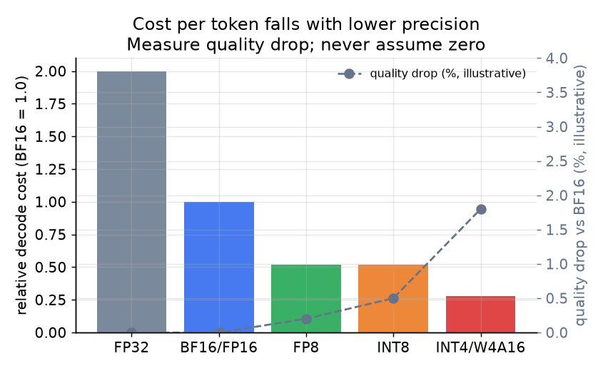

# 5. Parallelism and quantization

When a model does not fit on one GPU, you must shard it before you can serve at
all. When it does fit, you still have two additional levers: replicate it for more
throughput, or shrink the bytes-per-parameter to decode faster. This section covers
the three sharding axes and the quantization strategies (storing each weight in fewer bits so fewer bytes move per step) that reduce the memory and
bandwidth costs from the previous sections.

## Tensor parallelism (TP)

Tensor parallelism splits each layer's weight matrices across GPUs. For a linear
layer $Y = XW$, the columns of $W$ are distributed across $T$ GPUs; each GPU
holds $W_{\text{local}} \in \mathbb{R}^{d \times (d/T)}$ and computes its partial
output. An all-reduce at each layer boundary combines the partial results across
all $T$ GPUs before passing activations to the next layer.

Because the all-reduce happens on every layer for every token, TP needs very fast
interconnect. Within a single NVLink-connected node (8 H100s), the bandwidth is
high enough that the communication cost is small relative to the compute saved.
Across nodes, or over slower links, the all-reduce becomes the bottleneck. Keep
TP within a single node.

TP benefits: reduces per-GPU memory (the model is split), and can cut per-request
latency because each GPU processes a smaller slice of the computation per layer.

## Pipeline parallelism (PP)

Pipeline parallelism splits the model by layer groups (stages) across GPUs or
nodes. GPU 0 holds layers 1 through $L/S$, GPU 1 holds the next $L/S$, and so on
for $S$ stages. Activations pass from one stage to the next over a network link.
Communication happens only at stage boundaries, so PP tolerates slower inter-node
links than TP.

The cost of PP is the **pipeline bubble**: naively, later stages sit idle while
waiting for earlier stages to finish. You hide the bubble by keeping many
micro-batches in flight simultaneously (one stage processes batch $b+1$ while the
next processes batch $b$). This is fine for throughput serving but does not help
single-request latency: that request still waits for each stage in sequence.

Rule of thumb: TP within a node (fast links, helps latency and fits the model);
PP across nodes (slower links tolerated, scales out, has a bubble). Replicate
whole copies for throughput once a single copy fits on its GPUs.

## Expert parallelism (EP) for MoE models

Mixture-of-experts models route each token to a small subset of experts (typically
2 out of 8, 64, or more). The experts are standard feed-forward blocks and may
be too numerous to fit on one GPU. Expert parallelism places different experts on
different GPUs and routes each token to whichever GPU holds its chosen expert.
This requires an all-to-all communication (tokens fly to their expert GPUs and
results return), which is expensive and subject to load imbalance if routing is
skewed (some expert GPUs hot, others idle). EP is specific to MoE; for dense
models, TP and PP are the only axes.

## Quantization: fewer bytes per decode step

Decode is bandwidth-bound: every token requires reading the full model from HBM.
Fewer bytes per weight means fewer bytes moved per step, which directly translates
to more tokens per second.

$$\text{decode bytes per step} = P \cdot b_w + N \cdot \text{KV}_{\text{bytes}}$$

```python
def decode_bytes_per_step(num_params, bytes_per_weight, batch_size, kv_bytes):
    # bytes read from HBM each step: the weights plus every sequence's KV cache
    return num_params * bytes_per_weight + batch_size * kv_bytes  # total bytes moved
# decode_bytes_per_step(70e9, 1, 50, 3.3e8) -> 86500000000.0
```

Reducing $b_w$ (bytes per weight parameter) from 2 (BF16) to 1 (INT8) roughly
halves the weight-read cost, up to the bandwidth limit.

**INT8 weight quantization:** weights stored as 8-bit integers, dequantized or
computed with 8-bit kernels at runtime. Broadly supported on modern hardware.
Character.AI uses INT8 with custom kernels and reports a major serving cost
reduction. Requires a quality eval before shipping.

**FP8 weight quantization:** natively supported on H100 GPUs with hardware
FP8 tensor cores. Baseten reports cosine similarity above 99% versus BF16 output
on their models, with 50%-plus higher throughput. Recommended as the first-choice
precision drop on H100 or newer.

**4-bit weight quantization (W4A16, GPTQ, AWQ):** weights stored at 4 bits,
dequantized to BF16 before the matmul. Useful for fitting larger models on fewer
GPUs and for cold-start speedup (fewer bytes to load). The quality drop is larger
than FP8 and must be evaluated per model.

**KV cache quantization:** quantizing the KV cache entries rather than the weights.
Since the KV cache is often the memory bottleneck at high concurrency (not the
weights), quantizing it raises the maximum batch size continuous batching can sustain,
which raises throughput again. INT8 KV is a common pairing with BF16 weights.



*Relative decode cost falls with lower precision because fewer bytes are read per
step from HBM. Quality drop is illustrative; measure it per model and workload before
shipping. FP8 on H100 is the recommended first step: significant cost reduction,
negligible quality impact in practice.*

## When to use which

| Reach for | When | Instead of |
|---|---|---|
| Tensor parallelism (within node) | Model does not fit on one GPU, or single-request latency must drop; fast NVLink available | Across slow inter-node links; TP all-reduce becomes the bottleneck |
| Pipeline parallelism (across nodes) | Need more GPUs than fit in one node; throughput is the goal | When single-request latency is the primary SLO; PP adds pipeline-bubble latency |
| Replication | Model fits on one GPU set; throughput scales linearly with copies | When a single copy already fills all available GPUs |
| Expert parallelism | Large MoE whose experts exceed per-GPU capacity | Dense models; EP adds all-to-all cost without the MoE sparse benefit |
| FP8 quantization (H100+) | First precision step; hardware supports it; cosine similarity holds | W4A16 for a first step; FP8 has less quality risk |
| INT8 weight quantization | FP8 not available; moderate quality tolerance | FP8 when available; INT8 matmul kernels have more variance across hardware |
| 4-bit weight quantization | Fitting a large model; cold-start weight-load time matters | When quality eval fails; 4-bit has the highest per-step quality risk |
| KV cache quantization | Concurrency (not weight bandwidth) is the binding memory limit | Weight quantization alone, when the KV cache is what fills HBM at target batch size |

**Tools that ship these.** Tensor and pipeline parallelism are built into vLLM,
TensorRT-LLM (NVIDIA), and DeepSpeed-Inference; expert parallelism into vLLM and
SGLang for MoE. On the quantization side: GPTQ and AWQ are the common weight-only
methods, bitsandbytes provides INT8/4-bit for training-time and light serving, GGUF
via llama.cpp targets CPU and edge, and FP8 is exposed through TensorRT-LLM and vLLM
on H100-class hardware. KV-cache quantization (FP8/INT8 KV) is a flag in vLLM and
TensorRT-LLM.

**Provenance.** Tensor and pipeline parallelism originated with Megatron-LM (NVIDIA); the memory-sharding lineage they build on traces to ZeRO (Microsoft). Expert parallelism follows the sparse-MoE routing of GShard and Switch Transformer (Google). On quantization, GPTQ (2022) and AWQ (MIT, 2023) are the reference weight-only post-training methods.

**Worked example.** Serving a 70B model for interactive chat on one 8xH100 node:
the model does not fit on a single GPU, NVLink between the eight cards is fast, and
single-request latency is the SLO, so use tensor parallelism within the node (TP=8)
rather than pipeline parallelism, which would add pipeline-bubble latency for no
throughput benefit at this size. Apply FP8 weight-and-activation quantization first
(the H100 supports it and it carries the least quality risk), and only drop to 4-bit
weights if HBM is still the binding constraint. If demand then needs 5x the
throughput, replicate the whole TP=8 unit behind a load balancer rather than
widening TP across nodes, where the all-reduce over slow inter-node links would
dominate. If instead you were hitting the concurrency wall (many long-context
sessions) rather than a weight-bandwidth wall, KV-cache quantization would free more
headroom than shrinking the weights further.
