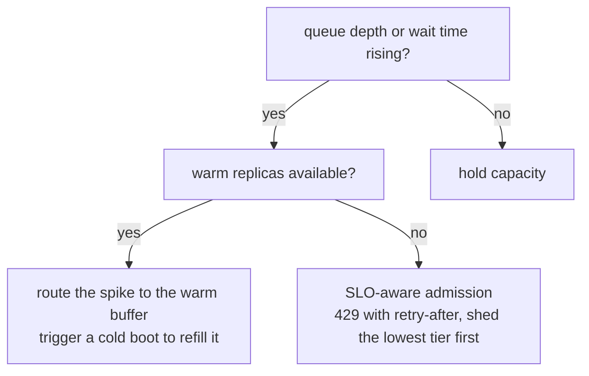

# 6. Autoscaling and cost

Maximizing throughput per GPU only matters if you are not paying for idle GPUs
when load is low, and not letting requests miss their SLO when load spikes.
Autoscaling (automatically adding or removing GPU replicas as load changes) is the bridge. It is also where LLM serving introduces a wrinkle that
CPU services do not face: the cold start is measured in minutes, not milliseconds.

## The cold-start problem

Spinning up a new GPU replica requires scheduling a GPU node (often a scarce
resource pool), pulling a model image (potentially hundreds of gigabytes), loading
weights into HBM, and warming the engine (compiling CUDA graphs, building attention
caches). This can take two to five minutes. A traffic spike that doubles QPS arrives
in seconds. By the time new replicas are ready, the spike may already be over, and
the SLO was broken at the worst possible moment.

The standard autoscaling loop in CPU services reacts to CPU utilization or request
latency after it has already risen. In GPU LLM serving, these signals are lagging:
by the time p99 TTFT has risen, you have already missed SLOs for dozens of
requests and the new replicas are still booting.

## Leading-signal autoscaling

Scale on a **leading signal** that predicts SLO violation before it occurs:

- **Queue depth:** the number of requests waiting to start prefill is the clearest
  predictor of TTFT degradation. If the queue grows faster than the server drains
  it, TTFT will rise. Scale when the queue exceeds a threshold, not when TTFT
  already has.
- **Wait time in queue:** the time a request has spent waiting without beginning
  prefill is a direct predictor of TTFT. Trigger scale-up when mean wait time
  crosses a fraction of the TTFT budget (say, 200 ms of the 500 ms SLO).
- **GPU memory utilization:** KV cache occupancy is a leading indicator for
  throughput saturation. High KV utilization means the scheduler is turning away
  new sequences or preempting existing ones, which will shortly manifest as TTFT
  spikes.

Use CPU or GPU utilization as a secondary check, not the primary signal.

## The warm-buffer pattern

Keep a small number of **pre-warmed idle replicas** at all times. They absorb
traffic spikes while new replicas boot. The trade-off is paying for idle GPU time
during off-peak hours. The right buffer size is a function of spike magnitude,
cold-start duration, and SLO tolerance. If spikes are 3x average and cold start is
3 minutes, you need enough warm capacity to handle the difference for 3 minutes.
Many teams keep one or two warm replicas and accept a modest idle cost.

```python
import numpy as np
def warm_replicas_needed(spike_qps, steady_qps, qps_per_replica):
    # pre-warmed replicas to cover the spike load above steady capacity while cold starts finish
    gap_qps = max(spike_qps - steady_qps, 0)         # extra load a spike adds
    return int(np.ceil(gap_qps / qps_per_replica))   # round up to whole replicas
# warm_replicas_needed(1500, 500, 400) -> 3
```


**Speeding the cold start** reduces how large a warm buffer you need:

- Cache the model image close to the GPUs (local NVMe, regional model registry).
- Stream weights into HBM during warm-up rather than waiting for a full copy.
- Snapshot a warmed process so the next boot can restore from a checkpoint instead
  of reinitializing. Modal's Memory Snapshots claim a 10x cold-start reduction.
- Use aggressive quantization (INT4) just for the cold-start load path: fewer bytes
  to fetch, faster to reach serving state.

Scale to zero only for models that serve cold paths where some latency on the first
request is acceptable. Never for the hot path.

## SLO-aware admission and load shedding

Under saturation, admitting every request makes all of them miss their SLO. The
correct behavior is **controlled load shedding**: when the server is saturated,
reject new requests with a clear 429-style signal and a retry hint rather than
queueing them indefinitely. Requests already admitted keep their slots and their
reserved KV-cache budget; the SLO is protected for those already in flight.

Two things must work together for this to be safe:

**Per-sequence KV reservation:** when a request is admitted, reserve its maximum
KV-cache budget immediately. This prevents a new admission from causing an
out-of-memory event that kills requests already mid-decode. vLLM's PagedAttention
addresses this with block-based allocation; naive contiguous allocation can OOM
mid-stream.

**Priority queues:** in a two-tier system (paid and free), maintain separate queues
or token budgets. Paid-tier requests are admitted first and see a lower effective
utilization ceiling; free-tier requests are the first to be shed. Assign the
guaranteed capacity slice before accepting anything from the lower tier.

## Cost per million output tokens

Throughput per GPU directly determines cost. The formula is:

$$\text{cost per million tokens} = \frac{\text{GPU hourly rate} \times 10^6}{\text{tokens/s/GPU} \times 3600}$$

For an H100 at \$3 per GPU-hour and 80 tokens/s/GPU throughput:

$$\text{cost} = \frac{3 \times 10^6}{80 \times 3600} \approx 10.4 \text{ USD per million tokens}$$

```python
def cost_per_million_tokens(gpu_hourly_rate, tokens_per_sec_per_gpu):
    # tokens/hour per GPU = tokens/s * 3600; cost = rate per that many tokens, scaled to 1e6
    tokens_per_hour = tokens_per_sec_per_gpu * 3600
    return gpu_hourly_rate * 1e6 / tokens_per_hour  # USD per million output tokens
# cost_per_million_tokens(3, 80) -> 10.416666666666666
```

Doubling throughput per GPU halves cost. This is why continuous batching,
quantization, and speculative decoding have disproportionate business impact: each
raises the denominator of the above formula.

## Serving is a provider choice, not just a model choice

For a model you do not self-host, the same weights are served by many providers,
and they are not interchangeable: output tokens per second and price per token vary
several-fold across hosts for the identical open model, because each runs a
different engine, batching policy, quantization, and hardware. Do not quote a
single "the model costs X"; benchmark the **median (p50) speed and price per
provider** over a rolling window, since a one-shot measurement is noisy. Independent
trackers such as [Artificial Analysis](https://artificialanalysis.ai/) publish
exactly this, per-provider p50 output speed and price for each model, and it is the
right number to bring to a build-versus-buy or provider-selection decision. The
practical rule: choose the provider on the speed-and-price frontier that meets your
latency SLO, and re-check it periodically, because the frontier moves.

## The metrics matrix: quality, cost, safety (offline vs online)

A serving change is not judged on throughput alone. It sits on three axes (quality,
cost, safety), each with an offline proxy you measure before shipping and an online
signal you confirm on real traffic. This is why a quantization win that lifts tokens
per second still has to clear a quality gate before it goes out.

| Axis | Offline | Online |
| --- | --- | --- |
| Quality | Task-eval score after a precision or engine change (for example accuracy holding when dropping to INT8 or INT4) on a golden set | Output edit rate, thumbs up/down, and quality-regression alerts on live traffic |
| Cost | Tokens/s/GPU and cost per million tokens $= \frac{\text{GPU hourly rate} \times 10^6}{\text{tokens/s/GPU} \times 3600}$ at a target batch size | p99 TTFT and TPOT under real load, GPU-hours billed, per-provider p50 speed and price |
| Safety | Load-shedding and admission behavior verified under simulated saturation; no OOM killing in-flight requests | 429 rate, SLO-violation rate, and preemption or OOM incidents observed under real spikes |

A serving config that is cheap and fast but silently regresses quality or drops
requests under load does not ship, so all three axes gate a launch, not cost alone.

## Bottlenecks table

| Bottleneck | First sign | Root cause | Fix |
|---|---|---|---|
| Low GPU utilization | tokens/s/GPU well below roofline | Static batching or small effective batch size | Continuous (iteration-level) batching |
| TPOT spikes under mixed load | Inter-token latency spikes when new requests arrive | Long prefills blocking in-flight decode steps | Chunked prefill or disaggregated serving |
| KV cache OOM at high concurrency | Requests preempted or rejected mid-decode | KV cache fills HBM before compute is saturated | Paged KV, KV quantization, reduce max-sequence budget |
| Model does not fit on one GPU | Cannot start serving without sharding | Weights plus activation memory exceed HBM | Tensor parallelism within a node |
| Decode latency floor | Per-token latency irreducible even at batch 1 | One token per expensive target-model pass | Speculative decoding; verify acceptance before enabling |
| Tail latency under overload | p99 TTFT explodes at high QPS | Admitting all requests into a saturated queue | SLO-aware admission with 429 backpressure |
| Spike latency | New replicas not ready during a QPS surge | Cold-start duration longer than spike rise time | Warm buffer, leading-signal autoscaling, fast weight load |
| Memory bandwidth on decode | Throughput below bandwidth roofline even at large batch | Full-precision weight reads per step | Weight and KV quantization (FP8, INT8) |

Two details worth internalizing from this table. First, the "low GPU utilization"
and "KV cache OOM" rows pull in opposite directions: the iteration-level batching
that fixes the first (continuous batching, from Orca, OSDI 2022) admits more
concurrent sequences, which is exactly what fills HBM with KV cache and triggers the
second. The paged KV fix (PagedAttention, from vLLM at UC Berkeley, 2023) is what
lets you push batch size up without the fragmentation waste that would otherwise
force OOM sooner, so the two fixes are designed to be deployed together, not chosen
between. Second, the "decode latency floor" row has a precondition often skipped:
speculative decoding (Google and DeepMind, 2023) only lowers the floor when
per-workload acceptance is high enough that the verified-token yield beats the draft
overhead; on low-acceptance free-form traffic it raises the floor instead, so
measure acceptance before enabling it rather than treating it as a free win.

## Implementation and training pitfalls

The bottlenecks table above is about steady-state serving; the failures below are
the operational ones that show up the first time real traffic swings. Most trace
back to treating a GPU fleet like a stateless CPU service.

| Problem | Symptom | Fix |
|---|---|---|
| Scaling on a lagging signal | replicas start booting only after p99 TTFT has already breached the SLO | scale on a leading signal (queue depth, mean wait time in queue, KV occupancy), not on CPU or latency after the fact |
| Scale-to-zero on the hot path | the first request after an idle period eats the full multi-minute cold start | keep a warm buffer on interactive paths; only scale to zero cold paths where first-request latency is acceptable |
| Autoscaler flapping | replicas are added and removed rapidly, paying repeated cold starts and thrashing capacity | add a scale-down cooldown and a stabilization window, and use hysteresis (scale up faster than you scale down) |
| Retry storms under overload | a saturated fleet gets hit with client retries that amplify the load and deepen the outage | return 429 with a retry-after hint, require exponential backoff with jitter on clients, add a circuit breaker |
| No per-sequence KV reservation | a new admission triggers an out-of-memory event that kills requests already mid-decode | reserve each request's maximum KV budget at admission time with paged (block-based) allocation |
| Cost target met by quantizing blind | cost per token drops but output quality silently regresses in production | eval-gate every precision drop; keep INT8 as a fallback before dropping to INT4 |
| Cold start dominated by image and weight load | new replicas take minutes, forcing an oversized warm buffer | cache the model image on local NVMe, stream weights into HBM during warm-up, restore from a warmed process snapshot |
| Quoting one provider as "the model cost" | real speed and price vary several-fold across hosts of the same open model and drift over time | benchmark p50 output speed and price per provider over a rolling window, re-check periodically |

A quick decision flow for the scale-up moment, which is where leading signals and
the warm buffer have to work together:



The through-line: react before the SLO signal moves, protect requests already in
flight over new admissions, and never let a cost target ship a quality regression
without an eval gate in front of it.
