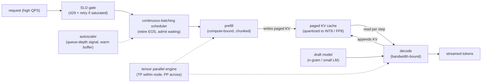

# 9. Summary

## One-page recap

- **Decode is bandwidth-bound; prefill is compute-bound.** Every optimization must
  start from the roofline. Decode throughput grows with batch size because the
  fixed weight-read cost is amortized across more tokens per step; it plateaus at
  the bandwidth ceiling or when KV cache fills HBM. Prefill is already
  compute-saturated; it benefits less from batching.

- **Continuous batching is the baseline, not an optimization.** Reshaping the
  batch every token step keeps the GPU saturated without waiting for the longest
  sequence to finish. PagedAttention eliminates KV cache fragmentation. Together
  these are the floor; every other lever builds on them.

- **TTFT and TPOT are different SLOs with different levers.** A long prefill
  running on a shared pool spikes TPOT for in-flight decodes. Chunked prefill
  distributes that cost across several steps. Disaggregated serving isolates the
  two phases into separate pools for the cases where chunked prefill is not enough.

- **Speculative decoding breaks the one-token-per-pass limit, but only when
  acceptance is high.** The speedup follows
  $(1-\alpha^{k+1})/((1-\alpha)(1+ck))$;
  it goes net-negative at low $\alpha$. Measure acceptance per workload before
  enabling; n-gram drafting excels when output echoes the input.

- **Parallelism is a prerequisite for large models, not a throughput option.**
  A 70B model in BF16 requires at minimum tensor parallelism across two H100s.
  TP within a node for latency and to fit the model; PP across nodes to scale
  further; replicate once a single copy fits.

- **Quantization pays because decode is bandwidth-bound.** Fewer bytes per weight
  means fewer bytes read per step, which directly translates to more tokens per
  second. FP8 on H100 is the recommended first step; always gate a precision drop
  behind a quality eval.

- **Autoscale on a leading signal.** Queue depth or wait time predicts TTFT
  violation before it happens. Keep a warm buffer. Under saturation, shed load
  rather than admitting requests that will miss their SLO anyway.

## The system on one page

## Test yourself

1. Why does decode throughput grow with batch size but prefill throughput does not,
   and where does the growth stop for decode?
2. A request with a 32k-token prompt arrives while 40 shorter requests are
   mid-decode. What happens to those 40 requests under static batching vs.
   continuous batching with chunked prefill?
3. You enable speculative decoding with $k=4$ and measure acceptance $\alpha=0.35$.
   Using the speedup formula with overhead $c=0.12$, is this a net win?
4. A team wants to serve a 70B dense model on H100s. What is the minimum number of
   GPUs required before any traffic can be served, and which parallelism mode do
   you apply first?
5. Your p99 TTFT is fine at steady state but blows up during the morning traffic
   peak. Walk through the leading-signal autoscaling design you would put in place
   and what you would shed if the spike arrives before new replicas are ready.
6. You quantize the KV cache from BF16 to INT8. What two effects does this have
   on serving, and what must you verify before shipping?

## Further reading

- Dense reference with all math, case studies, and the "when to use which" tables:
  [topics/04-inference-serving-at-scale.md](../../topics/04-inference-serving-at-scale.md).
- Per-system teardowns (Anyscale, Character.AI, LinkedIn, NVIDIA, Together, Fireworks, Modal):
  [tools/teardowns/04.md](../../tools/teardowns/04.md).
- Side-by-side comparison of all serving systems and the math that separates them:
  [tools/comparisons/04.md](../../tools/comparisons/04.md).
