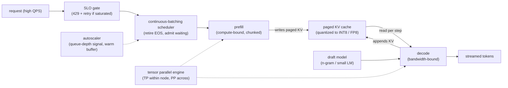

# 9. Summary

## One-page recap

- **Decode is bandwidth-bound; prefill is compute-bound.** Every optimization must
  start from the roofline. Decode throughput grows with batch size because the
  fixed weight-read cost is amortized across more tokens per step; it plateaus at
  the bandwidth ceiling or when KV cache fills HBM. Prefill is already
  compute-saturated; it benefits less from batching.

- **Continuous batching is the baseline, not an optimization.** Reshaping the
  batch every token step keeps the GPU saturated without waiting for the longest
  sequence to finish. PagedAttention eliminates KV cache fragmentation. Together
  these are the floor; every other lever builds on them.

- **TTFT and TPOT are different SLOs with different levers.** A long prefill
  running on a shared pool spikes TPOT for in-flight decodes. Chunked prefill
  distributes that cost across several steps. Disaggregated serving isolates the
  two phases into separate pools for the cases where chunked prefill is not enough.

- **Speculative decoding breaks the one-token-per-pass limit, but only when
  acceptance is high.** The speedup follows
  $(1-\alpha^{k+1})/((1-\alpha)(1+ck))$;
  it goes net-negative at low $\alpha$. Measure acceptance per workload before
  enabling; n-gram drafting excels when output echoes the input.

- **Parallelism is a prerequisite for large models, not a throughput option.**
  A 70B model in BF16 requires at minimum tensor parallelism across two H100s.
  TP within a node for latency and to fit the model; PP across nodes to scale
  further; replicate once a single copy fits.

- **Quantization pays because decode is bandwidth-bound.** Fewer bytes per weight
  means fewer bytes read per step, which directly translates to more tokens per
  second. FP8 on H100 is the recommended first step; always gate a precision drop
  behind a quality eval.

- **Autoscale on a leading signal.** Queue depth or wait time predicts TTFT
  violation before it happens. Keep a warm buffer. Under saturation, shed load
  rather than admitting requests that will miss their SLO anyway.

## The system on one page

```mermaid
flowchart LR
  REQ["request (high QPS)"] --> GATE["SLO gate<br/>(429 + retry if saturated)"]
  GATE --> SCHED["continuous-batching scheduler<br/>(retire EOS, admit waiting)"]
  SCHED --> PRE["prefill<br/>(compute-bound, chunked)"]
  PRE -->|"writes paged KV"| KV["paged KV cache<br/>(quantized to INT8 / FP8)"]
  KV -->|"read per step"| DEC["decode<br/>(bandwidth-bound)"]
  DEC -->|"appends KV"| KV
  DRAFT["draft model<br/>(n-gram / small LM)"] --> DEC
  DEC --> OUT["streamed tokens"]
  AUTO["autoscaler<br/>(queue-depth signal, warm buffer)"] -.-> SCHED
  TP["tensor parallel engine<br/>(TP within node, PP across)"] -.-> PRE
  TP -.-> DEC
```

**How it works.** A request first meets the SLO gate, which admits it or sheds it with a 429 and retry hint when the system is already saturated, protecting tail latency instead of letting the queue grow without bound. Admitted work flows into the continuous-batching scheduler, which retires sequences that hit EOS and admits waiting ones every step so the batch stays full without waiting for the slowest member. Prefill is compute-bound and runs in chunks, writing the prompt's keys and values into the paged KV cache; decode is bandwidth-bound and reads that cache once per step, appending the new token's KV back into it, which is why the arrows between decode and the cache point both ways. The optional draft model feeds decode for speculative decoding, while the dotted arrows show the control-plane and sharding concerns: the autoscaler watches queue depth to add replicas before latency blows up, and the tensor-parallel engine splits both prefill and decode across GPUs within a node. The output is a stream of tokens rather than a single blocking response, so the user sees the first token as soon as prefill completes.

## Test yourself

Answers are collapsed. Attempt each question before opening one.

1. Why does decode throughput grow with batch size but prefill throughput does not,
   and where does the growth stop for decode?

   

Answer

   The two phases sit on opposite sides of the roofline. **Decode is
   bandwidth-bound**: every step reads the full weight matrix out of HBM just to
   emit one token, so arithmetic intensity is near 1 and adding sequences amortizes
   that fixed weight read across more tokens per step, which is nearly free
   throughput. **Prefill is already compute-bound**: it processes every prompt token
   in one parallel pass, the GPU is already busy doing math, and a bigger batch adds
   work without unlocking idle capacity. Growth stops at whichever of two ceilings
   arrives first. The **bandwidth ceiling**: once all HBM bandwidth is spent, more
   sequences no longer raise tokens/s/GPU. The **KV cache ceiling**: the per-step
   cost is $P \cdot b_w + N \cdot \text{KV}_{\text{bytes}}$, and as $N$ grows the KV
   term fills HBM until the scheduler starts preempting, at which point throughput
   falls rather than plateaus, because each victim is swapped over PCIe or
   recomputed with a redundant prefill (sections
   [2](02-the-throughput-problem.md) and [3](03-batching.md)).

   

2. A request with a 32k-token prompt arrives while 40 shorter requests are
   mid-decode. What happens to those 40 requests under static batching vs.
   continuous batching with chunked prefill?

   

Answer

   Under **static batching** the 40 hold their slots until the entire batch retires,
   so a sequence that finished in 10 tokens keeps its slot while the longest member
   runs another 800, and the GPU burns those steps on held-but-finished slots. The
   32k request cannot start prefill at all until the batch turns over, so its TTFT is
   set by the slowest member, and when it finally runs, the whole 32k prefill lands
   in one step. Under **continuous batching with chunked prefill** the scheduler
   admits it at the next token step and slices the prefill into chunks (512 tokens is
   the section's example, so roughly 64 of them) interleaved with ongoing decode
   steps. The 40 in-flight requests then absorb a small slowdown spread over many
   iterations instead of one full stall; without chunking, section
   [8](08-interview-qa.md) puts a 32k prefill near 400 ms, which every other user
   sees as a 400 ms gap in their token stream. The cost is a slightly worse TTFT for
   the 32k request itself, plus real KV pressure: at about 320 KB per token in BF16
   that prompt is roughly 10 GB of cache, so admission must reserve headroom or the
   pool tips into preemption (sections [2](02-the-throughput-problem.md) and
   [3](03-batching.md)).

   

3. You enable speculative decoding with $k=4$ and measure acceptance $\alpha=0.35$.
   Using the speedup formula with overhead $c=0.12$, is this a net win?

   

Answer

   Technically yes, but by so little that it is not worth shipping. Substituting into
   $\text{speedup} = \frac{1 - \alpha^{k+1}}{(1 - \alpha)(1 + ck)}$: the numerator is
   $1 - 0.35^5 \approx 0.995$, divided by $1 - 0.35 = 0.65$ gives about **1.53
   expected tokens per target pass**, and the denominator is
   $1 + 0.12 \times 4 = 1.48$, so the speedup is about **1.03x**. That is a 3 percent
   gain for a second model to host, tune, and monitor, and it sits right next to the
   regime where Fireworks measured a generic draft at $\alpha \approx 0.29$ and got a
   1.5x *slowdown*. The fix is to raise acceptance, not $k$: increasing $k$ at low
   $\alpha$ adds draft cost $ck$ without buying extra accepted tokens. Use a
   workload-specialized draft (Fireworks reached $\alpha = 0.76$ and a 2x speedup) or
   n-gram prompt-lookup drafting when output echoes the input (LinkedIn got nearly
   4x that way). Also check the batch regime first, because at a compute-saturated
   packed batch the spare compute that verification rides on does not exist
   (sections [4](04-speculative-decoding.md) and [8](08-interview-qa.md)).

   

4. A team wants to serve a 70B dense model on H100s. What is the minimum number of
   GPUs required before any traffic can be served, and which parallelism mode do
   you apply first?

   

Answer

   **Two H100s, and tensor parallelism is the first mode.** A 70B dense model in
   BF16 is about 140 GB of weights against 80 GB of HBM per H100, so sharding is a
   prerequisite to serving anything, not a throughput option. TP is first because it
   splits each layer's matrices across GPUs, cutting both per-GPU memory and
   per-token latency, which the 50 ms TPOT SLO needs; keep it inside one NVLink node,
   since the all-reduce fires at every layer for every token. PP is the wrong first
   move here: it only buys you more GPUs than fit in a node and adds a pipeline
   bubble that hurts single-request latency. Treat two as a floor rather than a plan,
   because 140 GB across 160 GB leaves almost nothing for KV cache; the capstone
   build commits **TP=8 in one node**, where FP8 weights take about 70 GB (roughly
   9 GB per GPU) and leave the bulk of the node's 640 GB for KV. Scale past that by
   replicating the whole TP unit behind a load balancer, not by widening TP across
   nodes (sections [1](01-clarifying-requirements.md),
   [5](05-parallelism-and-quantization.md), and [10](10-putting-it-together.md)).

   

5. Your p99 TTFT is fine at steady state but blows up during the morning traffic
   peak. Walk through the leading-signal autoscaling design you would put in place
   and what you would shed if the spike arrives before new replicas are ready.

   

Answer

   The symptom says you are scaling on a **lagging signal**: p99 TTFT only moves
   after the queue has been building for many seconds, and the cold start is two to
   five minutes while the spike arrives in seconds. Scale on **queue depth and mean
   queue wait time** instead, triggering when wait crosses 200 ms of the 500 ms TTFT
   budget, with KV occupancy as a secondary indicator and CPU or GPU utilization only
   as a sanity check. Size a **warm buffer** for the gap the cold start cannot cover:
   at 500 QPS steady, 3x spikes, and about 400 QPS per replica, that is
   $\lceil (1500 - 500)/400 \rceil = 3$ warm replicas. Shrink the cold start itself
   by caching the model image on local NVMe, streaming weights into HBM during
   warm-up, and restoring from a warmed process snapshot (Modal claims a 10x
   reduction), and add a scale-down cooldown plus hysteresis so the autoscaler does
   not flap and pay repeated boots. If the spike still beats the boot, shed
   deliberately: return 429 with a retry-after hint and require exponential backoff
   with jitter so clients do not turn it into a retry storm, drop the **free tier
   first** while the paid tier keeps its reserved capacity slice, and never shed
   requests already in flight, since each holds a reserved KV budget and killing them
   wastes work already done (sections [6](06-autoscaling-and-cost.md) and
   [8](08-interview-qa.md)).

   

6. You quantize the KV cache from BF16 to INT8. What two effects does this have
   on serving, and what must you verify before shipping?

   

Answer

   Both effects come from moving fewer KV bytes. First, **concurrency**: KV bytes per
   token halve, so a 70B with 80 layers, 8 GQA KV heads, and 128 head dim goes from
   about 320 KB to about 160 KB per token, and the same HBM holds roughly twice the
   live sequences, which lets continuous batching sustain a larger batch and raises
   tokens/s/GPU (and therefore lowers cost per million output tokens, since
   throughput is the denominator). Second, **per-step bandwidth**: decode reads
   $N \cdot \text{KV}_{\text{bytes}}$ every step alongside the weights, so halving the
   KV term shortens the step and buys TPOT directly. Both matter most when long
   contexts, like the 8k-token RAG prompts in this chapter's scenario, make the cache
   rather than the weights the binding limit on HBM. Before shipping, gate it on
   quality: run the task eval on a golden set, confirm the score holds, and watch the
   online signals (output edit rate, thumbs, regression alerts) after rollout, exactly
   as you would for any precision drop. Also confirm you are only quantizing the
   cache: attention-structure changes such as MQA, GQA, or cross-layer KV sharing
   must be trained in, because query heads that were never optimized to read from a
   shared or averaged KV subspace attend to the wrong tokens (sections
   [5](05-parallelism-and-quantization.md), [6](06-autoscaling-and-cost.md), and
   [8](08-interview-qa.md)).

   

## Further reading

- The capstone: [the complete build](10-putting-it-together.md), where every
  choice in this chapter is committed once for the scenario, costed, rebuilt
  under two other constraint sets, and compressed into a runnable one-file
  batching scheduler.
- Dense reference with all math, case studies, and the "when to use which" tables:
  [topics/04-inference-serving-at-scale.md](../../topics/04-inference-serving-at-scale.md).
- Per-system teardowns (Anyscale, Character.AI, LinkedIn, NVIDIA, Together, Fireworks, Modal):
  [tools/teardowns/04.md](../../tools/teardowns/04.md).
- Side-by-side comparison of all serving systems and the math that separates them:
  [tools/comparisons/04.md](../../tools/comparisons/04.md).
