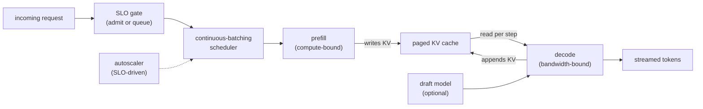

# LLM Inference Serving at Scale

An interviewer rarely says "implement continuous batching." They say **"we are
serving an LLM API at high QPS and GPU costs are climbing. Walk me through the
serving stack."** That question is about throughput engineering, not model design.
The whole game is packing as many tokens as possible into each GPU step without
letting tail latency slip past the SLO. Those two goals pull against each other in
ways that determine every architectural choice in this chapter.

This chapter builds the serving system end to end and shows how Anyscale, Character.AI,
LinkedIn, NVIDIA, Together AI, Fireworks, Moonshot, and others actually ship it.

## Sections

1. [Clarifying the requirements](01-clarifying-requirements.md) - the dialogue that scopes the problem and the two consequences that follow.
2. [The throughput problem](02-the-throughput-problem.md) - prefill vs. decode, the memory wall, TTFT vs. inter-token latency.
3. [Batching](03-batching.md) - continuous batching, chunked prefill, and disaggregated serving.
4. [Speculative decoding](04-speculative-decoding.md) - draft-and-verify, the speedup formula, and when it helps.
5. [Parallelism and quantization](05-parallelism-and-quantization.md) - tensor, pipeline, and expert parallelism; weight and KV precision.
6. [Autoscaling and cost](06-autoscaling-and-cost.md) - leading-signal autoscaling, cold starts, and cost per million tokens.
7. [How teams do it in production](07-how-teams-do-it-in-production.md) - named companies, where they diverge, and first-party write-ups.
8. [Interview Q and A](08-interview-qa.md) - commonly asked, tricky, and commonly answered wrong.
9. [Summary](09-summary.md) - one-page recap, the system on one page, and self-test questions.

## The whole system on one page

Read the sections in order the first time; they build on each other. Each opens
with the question an interviewer actually asks, then answers it.
