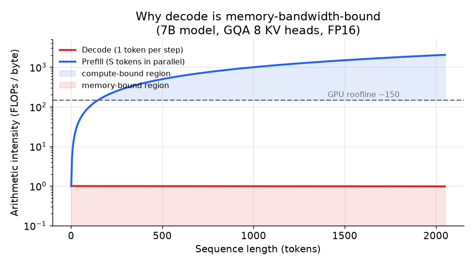

# 2. The cost model

Say this part out loud in the interview. The rest of the design is commentary on it.

## Prefill vs decode: two problems with opposite solutions

Serving a transformer has two phases that are fundamentally different in what is
expensive.

**Prefill** processes the entire prompt in a single parallel forward pass. Every
prompt token is computed at once, so the same weight read is amortized across all
of them. The result is high arithmetic intensity: many FLOPs per byte read from
memory. Prefill is **compute-bound**. It sets your first-token latency and is
relatively cheap per token.

**Decode** generates one output token per step. Each step reads the entire model
from GPU memory and the entire KV cache, just to emit a single token and append
one new key-value pair to the cache. The ratio of work done to bytes read is tiny.
Decode is **memory-bandwidth-bound**. It sets your inter-token latency and
dominates cost for any output longer than a few tokens.

The arithmetic makes this concrete. For a decode step with a 7B model in FP16:

$$I_{\text{decode}} \approx \frac{2 N_{\text{active}}}{2 N_{\text{active}} + \text{kv-bytes}} \quad \text{FLOPs/byte}$$

When the KV cache is small, $I_{\text{decode}} \approx 1$ FLOPs/byte. A modern GPU
needs roughly 150 FLOPs/byte of memory bandwidth to stay compute-bound. Decode
never gets there; it is always in the memory-bound zone. For prefill processing
$S$ tokens at once:

$$I_{\text{prefill}} \approx S \cdot \frac{2 N_{\text{active}}}{2 N_{\text{active}}} = S \quad \text{FLOPs/byte}$$

At $S = 200$ tokens the arithmetic intensity already crosses the roofline.
At $S = 4000$ tokens prefill is heavily compute-bound.



*Decode (red) stays far below the GPU roofline regardless of sequence length:
it is always memory-bandwidth-bound. Prefill (blue) rises with S and crosses into
the compute-bound region above the dashed roofline. The chart assumes a 7B model in
FP16 with GQA (8 KV heads). Illustrative.*

## The attention computation the cache serves

The cache exists because of one operation. Each layer projects its input into
queries, keys, and values, scores every query against every key, and takes a
softmax-weighted sum of the values. Causal masking sets the scores for future
positions to $-\infty$ so a token can only attend to itself and the past:

$$\text{Attention}(Q,K,V) = \text{softmax}\!\left(\frac{QK^{\top}}{\sqrt{d_{\text{head}}}} + M\right)V, \qquad M_{ij} = \begin{cases} 0 & j \le i \\ -\infty & j > i \end{cases}$$

```python
# x: (batch, seq, d_model);  n_head heads of size d_head = d_model / n_head
def causal_self_attention(x, Wq, Wk, Wv, Wo, n_head):
    B, S, _ = x.shape
    q, k, v = x @ Wq, x @ Wk, x @ Wv                 # each (B, S, d_model)
    q, k, v = [t.view(B, S, n_head, -1).transpose(1, 2) for t in (q, k, v)]  # (B, n_head, S, d_head)
    scores = (q @ k.transpose(-2, -1)) / k.shape[-1] ** 0.5   # (B, n_head, S, S)
    mask = torch.triu(torch.ones(S, S, dtype=bool), diagonal=1)
    scores = scores.masked_fill(mask, float("-inf"))          # block future positions
    out = scores.softmax(-1) @ v                              # (B, n_head, S, d_head)
    return out.transpose(1, 2).reshape(B, S, -1) @ Wo         # (B, S, d_model)
```

The `k` and `v` for past tokens are identical on every future step, so recomputing
them is pure waste. Caching them is what turns per-step attention from $O(S^2)$
recompute into $O(S)$ lookup, and the tensor you cache is exactly the `k, v` above,
which motivates the size formula next.

## What the KV cache is and why it dominates

When the transformer generates tokens one at a time, it must attend over every
token it has ever seen. Rather than recompute the keys and values for past tokens
on every step, it stores them: that stored tensor is the **KV cache**. It grows by
one entry per layer per generated token, and it never shrinks until the session ends.

The size formula is worth memorizing because it is the diagnosis for every
long-context memory problem:

$$\text{kv-bytes} \approx 2 \cdot L \cdot S \cdot h_{\text{kv}} \cdot d_{\text{head}} \cdot b \cdot B$$

where:

| Symbol | Meaning | Typical value |
|---|---|---|
| $L$ | number of transformer layers | 32 |
| $S$ | sequence length (prompt plus output tokens so far) | 32 000 |
| $h_{\text{kv}}$ | number of KV heads | 8 (GQA) to 32 (MHA) |
| $d_{\text{head}}$ | head dimension | 128 |
| $b$ | bytes per element | 2 (FP16) |
| $B$ | batch size (concurrent sequences on one GPU) | 32 |

The factor of 2 at the front is for K and V.

**Worked example.** $L=32$, $S=100\,000$ tokens, $h_{\text{kv}}=8$ (GQA),
$d_{\text{head}}=128$, $b=2$ (FP16), $B=1$ sequence:

$$\text{kv-bytes} = 2 \times 32 \times 100\,000 \times 8 \times 128 \times 2 \approx 13.1 \text{ GB}$$

A single 100k-token session costs more than 13 GB of KV cache. At 100 concurrent
sessions that is 1.3 TB: far beyond any single GPU. And the model weights for a
7B model in FP16 are only 14 GB. **The cache, not the weights, is the binding
constraint for long-context serving.**

The levers all attack this formula. They either shrink $h_{\text{kv}}$ (GQA,
MQA), replace the whole $h_{\text{kv}} \cdot d_{\text{head}}$ term with a smaller
latent (MLA), shrink $b$ (KV quantization), or reduce the effective $S$ per
request by reusing cached work across requests (prefix caching).
