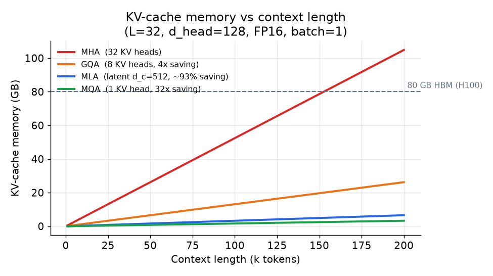
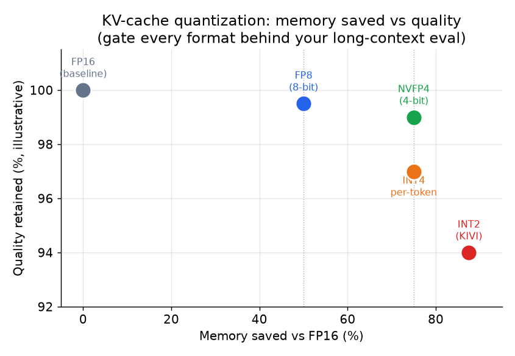

# 3. Shrinking the cache

With the cost model in hand, the question becomes: which term of the
$\text{kv-bytes}$ formula do we attack? This section covers the two families:
attention-architecture changes (train-time, attack $h_{\text{kv}}$ or replace it)
and quantization (serving-time, attack $b$).

## The attention-architecture family

All four variants in this section are training-time choices. You cannot bolt them
onto a fixed model after the fact (except GQA, which can be uptraining from an MHA
checkpoint at about 5% of pretraining cost).

### Multi-head attention (MHA): the baseline

Every query head has its own dedicated key head and value head. If a model has
$h_q = 32$ query heads, it also has $h_{kv} = 32$ KV heads. This gives the richest
attention pattern and the largest KV cache. It is the reference the others optimize
against.

### Grouped-query attention (GQA): the safe default

GQA shares one KV head across a group of $g = h_q / h_{\text{kv}}$ query heads.
With $h_q = 32$ and $h_{\text{kv}} = 8$, each group of 4 query heads reads from the
same key and value:

$$r_{\text{GQA}} = \frac{h_{\text{kv}}}{h_q} = \frac{8}{32} = \frac{1}{4}$$

The KV cache shrinks to one quarter of MHA's with negligible quality loss on most
benchmarks. This is why GQA is the default in Llama 3, Mistral, Gemma, and most
production models: the group size $g = h_q / h_{\text{kv}}$ is a direct
quality-versus-memory dial, and GQA converts cheaply from an MHA checkpoint via
a short uptraining run (see Ainslie et al., GQA paper). If you do nothing else,
do this.

Implemented, GQA is just MHA where the cache holds only $h_{kv}$ heads and each is
repeated to match the $h_q$ query heads at attention time (so nothing extra is
stored):

```python
def gqa_attention(q, k, v):
    # q: (B, Hq, S, d);  k, v: (B, Hkv, S, d)  <- only Hkv heads live in the KV cache
    B, Hq, S, d = q.shape
    g = Hq // k.shape[1]                       # query heads sharing one KV head
    k = k.repeat_interleave(g, dim=1)          # expand Hkv -> Hq (a view, cache unchanged)
    v = v.repeat_interleave(g, dim=1)
    scores = (q @ k.transpose(-2, -1)) / d ** 0.5
    return scores.softmax(-1) @ v              # (B, Hq, S, d)
```

The cache stores `k, v` with `Hkv` heads, which is the whole saving: at `Hq=32`,
`Hkv=8` the stored tensor is one quarter the MHA size, and the `repeat_interleave`
happens on the fly during compute, costing memory only for the transient expanded
view, never in the cache.

### Multi-query attention (MQA): the aggressive cut

MQA is GQA taken to the extreme: $h_{\text{kv}} = 1$, one shared KV head across
all query heads. The cache shrinks by $h_q$, often 32x compared to MHA. The cost
is a measurable quality drop, especially on tasks that require fine-grained
contextual discrimination. Character.AI uses MQA stacked with other techniques and
gates it behind evaluation. It is a valid choice only when memory is the hard wall
and quality headroom exists.

### Multi-head latent attention (MLA): the architecture of DeepSeek-V2/V3

MLA takes a different path. Instead of reducing the number of KV heads, it
**replaces** the cached keys and values with a single low-rank **latent vector**
per token:

1. At each token, a down-projection maps the hidden state to a small latent
   $c \in \mathbb{R}^{d_c}$ (typically $d_c = 512$ for a model with
   $h_{\text{kv}} \cdot d_{\text{head}} = 32 \times 128 = 4096$).
2. Only $c$ is cached, not the full KV tensors.
3. At attention time, an up-projection reconstructs the per-head keys and values
   from $c$.

The compression ratio is:

$$r_{\text{MLA}} = \frac{d_c}{2 \cdot h_{\text{kv}} \cdot d_{\text{head}}}
  \approx \frac{512}{2 \times 32 \times 128} \approx 0.063 \quad (\approx 93\% \text{ smaller})$$

The tradeoff: a small matrix multiply is paid every decode step to expand the
latent. In practice this cost is small relative to the memory bandwidth saved.

**The RoPE wrinkle worth naming.** Rotary position embeddings (RoPE) are applied
per-position to keys. But the cached latent is position-free (it is the
down-projected hidden state, not yet expanded into keys), so RoPE cannot be applied
before caching. DeepSeek's answer is to split the head dimension into two parts: a
RoPE-carrying sub-dimension computed the normal way, and a latent-compressed
sub-dimension that goes through the down/up-projection. Both are concatenated back
into the full head. Most casual diagrams of DeepSeek-V3 quietly skip or get this
wrong; naming it correctly signals real depth.

### Putting the variants side by side



*Memory consumed by the KV cache as context length grows, for a 32-layer FP16 model
with $d_{\text{head}} = 128$ and batch size 1. MHA (red) fills an 80 GB H100 long
before 200k tokens. GQA at 8 heads (orange) uses a quarter of that. MLA's latent
(blue) is roughly 6% of MHA's. MQA (green) with one head gives the smallest cache
but the highest quality risk. Illustrative.*

**When to use which attention variant.**

| Reach for | When | Skip it when |
|---|---|---|
| MHA | Quality is paramount, context is short, cache is not the constraint | Largest cache of the four; skip for long-context or high-concurrency serving |
| GQA (Llama 3, Mistral) | You want a safe default at most model sizes: near-MHA quality, 4x to 8x smaller cache, cheap to uptrain | Cache ratio is fixed at training time; switch to MLA when memory is truly the wall |
| MQA | Extreme concurrency and cost targets where one KV head per layer is acceptable | Quality risk is real; validate on your evals before shipping |
| MLA (DeepSeek-V2/V3) | You control training and the KV cache is the binding long-context constraint | Train-time change plus the RoPE split-head fix; not a serving-time bolt-on |

**Provenance.** MHA is the original multi-head attention from the Transformer
(Google, 2017); MQA (Google, 2019) collapsed to a single shared KV head; GQA
(Google, 2023) is the middle ground now used as the default in most open models; MLA
(DeepSeek, 2024) compresses KV into a shared low-rank latent. The RoPE split-head
detail MLA needs comes from RoPE (Su et al., 2021).

## Quantized KV cache: the serving-time lever

If you are serving a model you cannot retrain, quantizing the KV cache is the
only architectural lever available. The stored keys and values are represented in
fewer bits; attention is computed in higher precision after dequantization.

The memory reduction is:

$$r_{\text{quant}} = \frac{b_{\text{low}}}{b_{\text{high}}} \quad \Rightarrow \quad
  \frac{4}{8} = \frac{1}{2} \Rightarrow 2\times \text{ context, batch, or concurrency (FP8 to NVFP4)}$$



*Memory saved (x-axis) versus quality retained (y-axis) for common KV formats.
FP8 cuts memory in half with near-zero quality loss. NVFP4 (NVIDIA's 4-bit format)
gives another 2x on top of that at under 1% loss on standard benchmarks.
INT2 (KIVI scheme) approaches 88% memory saving but requires careful per-channel
key scaling and a full-precision recent-token window to limit degradation. Gate
every format behind your own long-context eval. Illustrative.*

**Practical notes.** Keys are often more sensitive than values; quantizing them
asymmetrically or to a higher bit width than values can recover most of the quality
gap. Keeping a full-precision window for the most recent tokens (the part the model
attends to most heavily) reduces error on retrieval-style tasks. NVIDIA's NVFP4
dequantizes to FP8 before the attention matmul, which protects accuracy while
still halving memory versus an FP8 cache.

**When to use which quantization.**

| Reach for | When | Skip it when |
|---|---|---|
| FP8 KV (Character.AI, native) | Native FP8 training pipeline; zero post-hoc cost | Post-training FP8 PTQ needs per-channel scales and custom kernels |
| NVFP4 (NVIDIA TensorRT-LLM) | Long-context memory is the wall and you passed a long-context eval | Quality headroom is thin; sub-1% loss is benchmark-dependent |
| INT4 per-token (Hugging Face) | Fixed model you cannot retrain; memory budget is tight | Shipping on vibes; measure perplexity and retrieval on your own data first |
| INT2 (KIVI) | Extremely aggressive memory budget; research setting | Per-channel key scaling plus full-precision window adds serving complexity |

**Provenance.** Unlike the attention variants above, these are serving-time formats
rather than architectural changes. NVFP4 ships in TensorRT-LLM (NVIDIA); the FP8 KV,
INT4 per-token, and INT2 (KIVI) approaches are attributed inline to Character.AI,
Hugging Face, and the KIVI scheme respectively.
