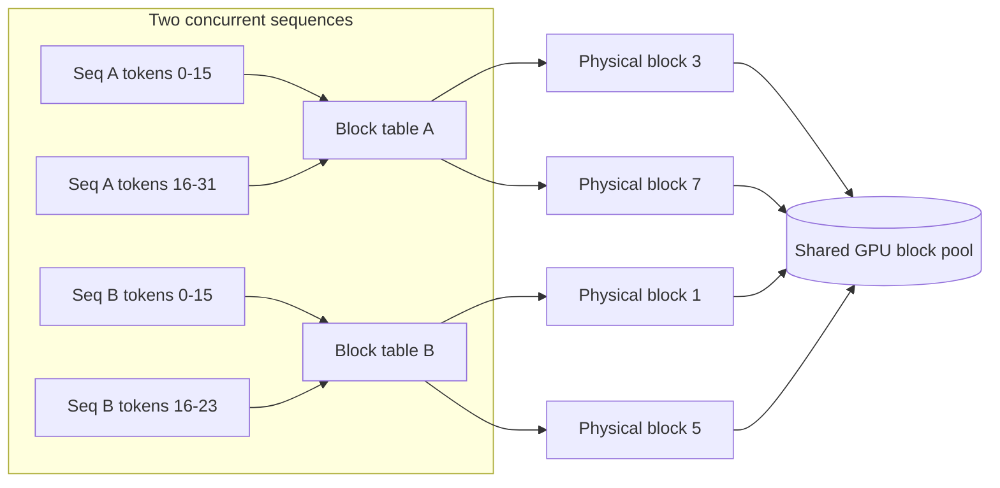
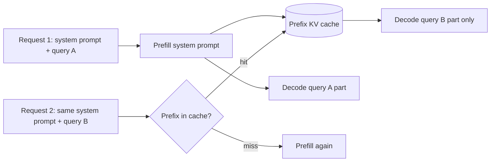

# 4. Paged and shared

Shrinking each KV entry addresses one dimension of the problem: the per-token
cost. The next dimension is fragmentation and reuse: how to pack more sequences
into the same memory, and how to avoid recomputing the cache for identical prefixes
across requests.

## PagedAttention: virtual memory for the KV cache

In a naive serving system, each sequence's KV cache is one contiguous buffer
reserved at request arrival. Two kinds of waste arise. First, the sequence might
not use all the space (internal fragmentation: the tail of the buffer sits empty).
Second, freed buffers leave gaps that cannot accommodate other sizes (external
fragmentation). Under a mixed workload of varying lengths this fragmentation can
waste 20% to 40% of GPU memory.

**PagedAttention** (the idea at the core of vLLM) solves this by managing the KV
cache exactly as an operating system manages virtual memory:

- The cache is divided into fixed-size **blocks** (say, 16 or 32 tokens each).
- A per-sequence **block table** maps logical token positions to physical blocks
  scattered anywhere in GPU memory.
- Sequences share blocks when they share content; a reference-counted copy-on-write
  scheme handles divergence.
- When a sequence ends, its blocks are released one by one back to the pool,
  leaving no unusable gaps.

The result: 2x to 4x higher throughput at matched latency compared to
FasterTransformer-style contiguous allocation, because the same GPU memory fits
more concurrent sequences. PagedAttention does **not** speed up a single
request; it raises aggregate concurrency and token throughput. Report it in tokens
per second across the fleet, not in per-request latency.

## Prefix caching: skip the prefill for repeated prefixes

In a RAG system with a fixed 4k system prompt, every request starts by rebuilding
the same KV cache for those 4000 tokens. That is pure waste. **Prefix caching**
(also called prompt caching) stores the KV block sequence for a completed prefix
and reuses it across requests that share the same prefix. The prefill phase is
skipped entirely for the matching tokens; the model jumps straight to decoding the
unique part of each request.

Gains are workload-dependent. Databricks measured 2.5x higher per-replica
input-token throughput and 3x lower P50 latency at a 30% cache hit rate. Anthropic
reports up to 90% cost reduction and 85% latency reduction when the cached context
is very large.

**Exact-prefix matching** is the critical constraint. A single different token at
any position in the prefix forces a full cache miss from that token onward. The
implication: always put the stable content (system prompt, shared document) at the
very beginning of the prompt, before any per-request variable content. The common
mistake is placing user-specific variables early, which defeats the cache for
every request.

For multi-turn chat, prefix caching can be applied turn by turn: each exchange
extends the prefix and can be cached for the next turn. Character.AI implements
this with a rolling-hash LRU tree keyed by conversation prefix, achieving about
95% hit rates across their fleet.

## RadixAttention: prefix caching for branching trees

When multiple requests share not just one fixed prefix but a **branching tree** of
prefixes (few-shot prompts with many examples, agentic workflows where a base
context fans out into many parallel sub-tasks), a flat prefix cache only matches
a single chain. A radix tree captures the full branching structure.

**RadixAttention** (SGLang) organizes the KV-block pool as a radix tree where each
edge is a sequence of tokens and each node is a cached KV block. Any new request
is routed down the tree, following edges that match its tokens and branching to a
new edge at the first mismatch. Eviction under memory pressure uses LRU, preserving
the most recently accessed paths. Cross-request cache sharing happens automatically
without any user API change.

**When to use which paging or sharing technique.**

| Reach for | When | Skip it when |
|---|---|---|
| PagedAttention (vLLM, TGI, SGLang) | Fragmentation is the binding constraint; requests vary widely in length | Block indirection adds a lookup cost; fuse it into the attention kernel |
| Prefix caching (vLLM, Databricks, Anthropic) | A large fixed system prompt or document repeats across requests | Context is all-unique per request; the cache never hits |
| RadixAttention (SGLang) | Requests share branching prefixes: few-shot, agent trees, parallel chains | Prefix diversity collapses cache benefit; LRU thrashes under highly varied traffic |
| Per-turn chat caching (Character.AI rolling hash) | Long-conversation product with heavy turn reuse; 100+ turn histories | Short or ephemeral conversations where reuse is low |
